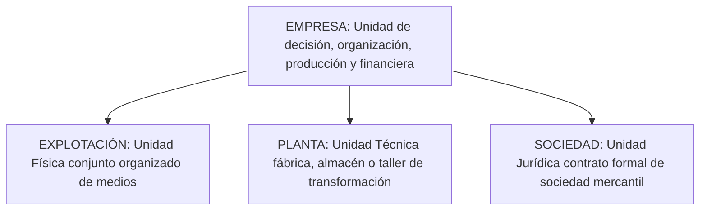
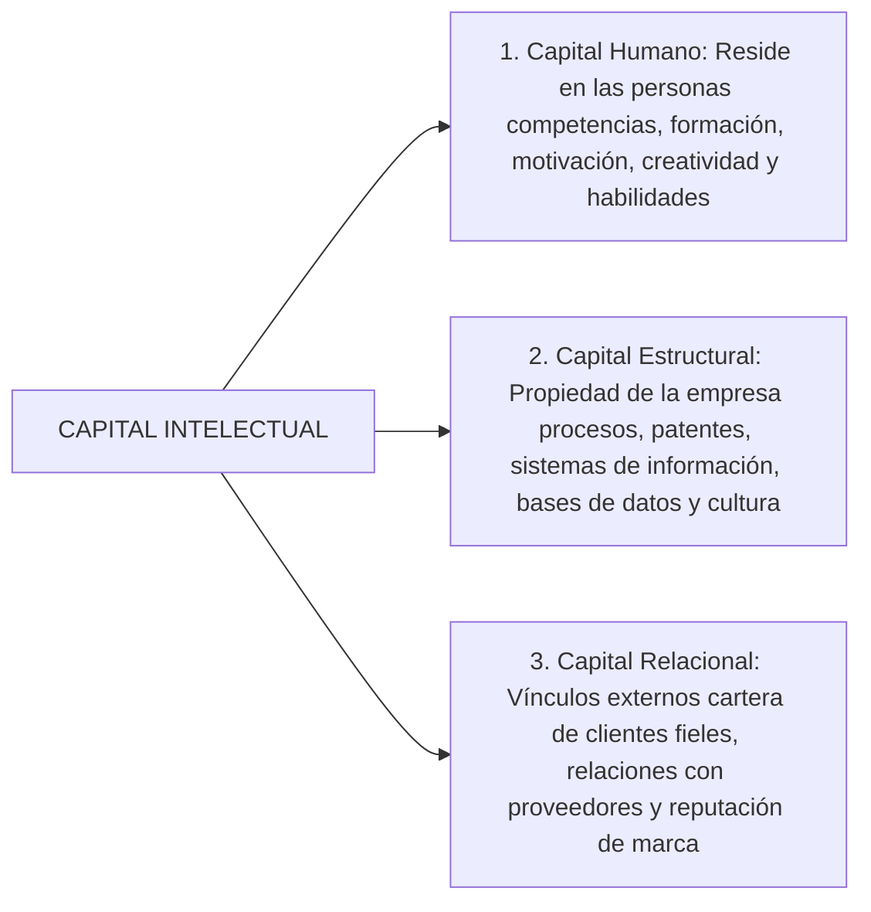
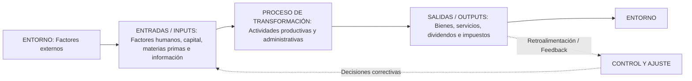
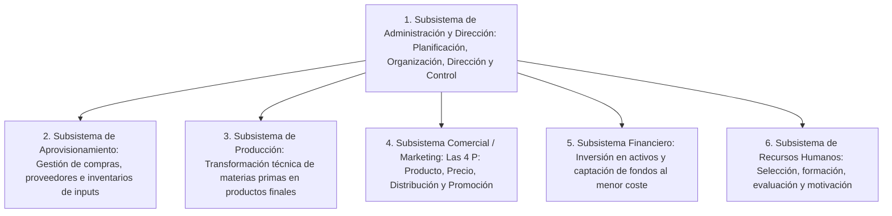

# 🏢 Administración de Empresas — Tema 1: La Empresa

- **Asignatura:** Administración de Empresas (Cód. 2345)
- **Titulación:** Grado en ADE — Facultad de Economía y Empresa (Universidad de Murcia)
- **Profesor:** Jorge Monllor Domínguez ([jmonllor@um.es](mailto:jmonllor@um.es))
- **Tema:** Tema 1 — La Empresa: Concepto, Elementos, Funciones, Tipologías y la Empresa como Sistema
- **Material de Referencia:** Diapositivas Oficiales UMU (`ADMINISTRACION_DE_EMPRESA_Tema 1n ADE.pdf`)

---

## 📑 Índice de Contenidos

1. [Concepto de Empresa y su Evolución Histórica](#1-concepto-de-empresa-y-su-evolución-histórica)
   - 1.1. [La Empresa en el Marco de la Ciencia Económica](#11-la-empresa-en-el-marco-de-la-ciencia-económica)
   - 1.2. [Perspectiva Económica vs. Perspectiva Administrativa](#12-perspectiva-económica-vs-perspectiva-administrativa)
   - 1.3. [Distinciones Clave: Empresa, Explotación, Planta y Sociedad](#13-distinciones-clave-empresa-explotación-planta-y-sociedad)
   - 1.4. [Evolución Histórica de los Modelos de Empresa (De la Empresa Primitiva a la Inteligente)](#14-evolución-histórica-de-los-modelos-de-empresa)
2. [Elementos de la Empresa](#2-elementos-de-la-empresa)
   - 2.1. [Elementos Humanos, Materiales e Inmateriales](#21-elementos-humanos-materiales-e-inmateriales)
   - 2.2. [El Capital Intelectual: Capital Humano, Estructural y Relacional](#22-el-capital-intelectual)
3. [Funciones de la Empresa](#3-funciones-de-la-empresa)
   - 3.1. [Funciones Directas e Indirectas](#31-funciones-directas-e-indirectas)
   - 3.2. [Creación de Valor y Generación de Sinergias](#32-creación-de-valor-y-generación-de-sinergias)
4. [Tipología y Clasificación de las Empresas](#4-tipología-y-clasificación-de-las-empresas)
   - 4.1. [Criterios de Clasificación](#41-criterios-de-clasificación)
   - 4.2. [Clasificación por Tamaño (Criterios Oficiales UE / IPYME)](#42-clasificación-por-tamaño)
   - 4.3. [Clasificación por Forma Jurídica (Autónomo, CB, S.L. y S.A.)](#43-clasificación-por-forma-jurídica)
5. [Trámites para la Constitución y Puesta en Marcha](#5-trámites-para-la-constitución-y-puesta-en-marcha)
   - 5.1. [Fase de Constitución Formal](#51-fase-de-constitución-formal)
   - 5.2. [Fase de Puesta en Marcha y Ejercicio de la Actividad](#52-fase-de-puesta-en-marcha)
6. [Principios Económicos Básicos y Fórmulas de Eficiencia](#6-principios-económicos-básicos-y-fórmulas-de-eficiencia)
   - 6.1. [Economicidad](#61-economicidad)
   - 6.2. [Productividad Técnica (Factorial y Global)](#62-productividad-técnica)
   - 6.3. [Rentabilidad Financiera y Económica (ROA, ROE y Margen sobre Ventas)](#63-rentabilidad-financiera-y-económica)
7. [La Empresa como Sistema (Teoría General de Sistemas)](#7-la-empresa-como-sistema)
   - 7.1. [Características de los Sistemas Abiertos](#71-características-de-los-sistemas-abiertos)
   - 7.2. [Modelo Socio-Técnico y Subsistemas Funcionales](#72-modelo-socio-técnico-y-subsistemas-funcionales)

---

## 1. Concepto de Empresa y su Evolución Histórica

### 1.1. La Empresa en el Marco de la Ciencia Económica

La **Economía** es la ciencia que estudia la asignación óptima de recursos escasos susceptibles de usos alternativos para satisfacer las necesidades humanas ilimitadas. Dentro de ella se diferencian:
- **Macroeconomía:** Analiza el comportamiento de los agregados globales (PIB, inflación, desempleo, balanza de pagos).
- **Microeconomía:** Estudia el comportamiento individual de los agentes elementales (consumidores y empresas) y los mercados.
- **Economía de la Empresa / Administración de Empresas:** Surge en las primeras décadas del siglo XX (Tarragó, 1989) para estudiar de forma científica la **empresa como unidad económica de producción**, su estructura interna, toma de decisiones y administración racional.

---

### 1.2. Perspectiva Económica vs. Perspectiva Administrativa

> 💡 **Dos formas complementarias de definir la empresa (Bueno, 2004):**
> 1. **Perspectiva de la Teoría Económica (Unidad de Producción):**  
>    *"Agente que organiza y combina con eficiencia los factores económicos (realiza el proceso de transformación añadiendo valor) para producir bienes y servicios destinados al mercado con el ánimo de alcanzar objetivos definidos."*
> 2. **Perspectiva Administrativa (Unidad Organizativa):**  
>    *"Conjunto de elementos humanos, técnicos y financieros ordenados según una determinada jerarquía o estructura organizativa y que dirige una función directiva o empresario."*

---

### 1.3. Distinciones Clave: Empresa, Explotación, Planta y Sociedad

Es frecuente confundir estos términos en el lenguaje coloquial; en ADE tienen significados rigurosamente distintos:



* **Empresa:** Es la unidad global de decisión económica y financiera dotada de personalidad propia.
* **Explotación:** Concepto **físico**; conjunto de instalaciones y medios materiales organizados para un fin productivo concreto (ej. una explotación agrícola o minera).
* **Planta:** Concepto **técnico-productivo**; lugar físico o taller donde se realiza la transformación técnica de los inputs (ej. la fábrica de envasado en Molina de Segura).
* **Sociedad:** Concepto **jurídico**; contrato mercantil (SA, SL) por el que dos o más personas se obligan a poner en común dinero, bienes o industria para obtener lucro.
> 📌 *Una empresa puede estar formada por una o varias sociedades mercantiles (grupo societario), y operar múltiples explotaciones y plantas industriales.*

---

### 1.4. Evolución Histórica de los Modelos de Empresa

Siguiendo la clasificación clásica de Bueno, Cruz y Durán (2002):

| Sistema Económico | Etapa Histórica | Modelo de Empresa | Estructura Básica | Definición y Rasgos Clave |
| :--- | :--- | :--- | :--- | :--- |
| **Feudalismo** | Época medieval | **Empresa primitiva** | Simple, de base familiar | **Unidad técnica:** Trueque, trabajo manual del artesano, coincidencia total de propiedad y gestión, mercados locales. |
| **Capitalismo Mercantilista** | Siglos XVII – XVIII | **Empresa comercial** | Simple, organizada, familiar o societaria | **Unidad técnico-económica:** Gran expansión del comercio marítimo internacional, economía monetaria y fiduciaria, primeras sociedades personalistas. |
| **Capitalismo Industrial** | Finales s. XVIII – s. XIX | **Empresa industrial** | Compleja, societaria y funcional | **Unidad económica de producción:** 1.ª Revolución Industrial (máquina de vapor), producción fabril en serie, surgimiento de grandes sociedades de capitales. |
| **Capitalismo Financiero** | Finales s. XIX – s. XX | **Empresa financiera / Corporación** | Compleja, multisocietaria, divisional y multinacional | **Unidad financiera y de decisión:** 2.ª Revolución Industrial, grandes monopolios, separación entre **propiedad (accionistas)** y **gestión (tecnoestructura / directivos)**. |
| **Sociedad de la Información** | Finales s. XX – Actualidad | **Empresa inteligente** | Red descentralizada, flexible y global | **Unidad de gestión del conocimiento:** 3.ª y 4.ª Rev. Industrial, TICs, ventaja competitiva basada en **activos intangibles**, innovación continua y talento humano. |

---

## 2. Elementos de la Empresa

Toda empresa se compone de tres categorías de elementos (Bueno, Cruz y Durán, 2002):

1. **Elementos Humanos:**
   - *Propietarios del capital (accionistas o socios):* Aportan el dinero y asumen el riesgo patrimonial.
   - *Administradores y directivos:* Planifican, organizan, lideran y toman decisiones estratégicas.
   - *Trabajadores / Empleados:* Ejecutan operativamente las tareas asignadas a cambio de un salario.
2. **Elementos Materiales (Bienes Económicos):**
   - *Activos No Corrientes (Estructura fija):* Maquinaria, edificios, instalaciones técnicas, vehículos, ordenadores.
   - *Activos Corrientes (Circulante):* Materias primas, mercaderías en almacén, tesorería.
3. **Elementos Inmateriales:**
   - La organización y estructura jerárquica.
   - La cultura empresarial, los valores y el estilo de liderazgo.
   - El *Know-How* (saber hacer, experiencia técnica, recetas, patentes).
   - La imagen de marca y fidelidad de los clientes.
   - **El Fondo de Comercio (*Goodwill*):** Valor añadido intangible que confiere a la empresa un valor superior a la simple suma matemática de sus bienes materiales.

---

### 2.2. El Capital Intelectual

El Capital Intelectual es la habilidad de la organización para transformar el conocimiento tácito y los activos intangibles en fuentes sostenibles de riqueza (Euroforum, 1998; Bueno, 2001):

$$\mathbf{\text{Capital Intelectual} = \text{Capital Humano} + \text{Capital Estructural} + \text{Capital Relacional}}$$



---

## 3. Funciones de la Empresa

### 3.1. Funciones Directas e Indirectas

```
                            FUNCIONES DE LA EMPRESA
┌───────────────────────────────────────┬───────────────────────────────────────┐
│     FUNCIONES DIRECTAS (Internas)     │     FUNCIONES INDIRECTAS (Entorno)    │
├───────────────────────────────────────┼───────────────────────────────────────┤
│ • Aprovisionamiento y compras         │ • Creación de rentas y salarios       │
│ • Producción y transformación técnica │ • Anticipación del producto social    │
│ • Comercialización y Marketing        │ • Asunción del riesgo económico       │
│ • Financiación e Inversión            │ • Función social: creación de empleo  │
│ • Gestión de Recursos Humanos         │ • Responsabilidad social corporativa  │
│ • Investigación, Desarrollo e Innov.  │   y motor de la actividad económica   │
└───────────────────────────────────────┴───────────────────────────────────────┘
```

### 3.2. Creación de Valor y Generación de Sinergias

La función nuclear de la empresa es **crear valor** combinando factores de modo que el resultado final supere con creces a las partes individuales:
$$\mathbf{\text{Efecto Sinergia: } 2 + 2 = 5}$$
El valor generado por los subsistemas coordinados de forma integrada es superior a la suma aislada de sus componentes individuales.

---

## 4. Tipología y Clasificación de las Empresas

### 4.1. Criterios de Clasificación
- **Por la propiedad del capital:** Privadas (particulares), Públicas (Estado/AAPP) y Mixtas.
- **Por el sector de actividad:** Primario (agricultura, pesca, minería), Secundario (industria y construcción) y Terciario (comercio, banca, transportes, servicios).
- **Por el ámbito geográfico:** Locales, Regionales, Nacionales y Multinacionales.
- **Por el número de productos:** Monoproductoras vs. Multiproductoras (diversificadas).
- **Por la tecnología del proceso (Woodward):** Por unidades o lotes pequeños, producción en masa (grandes lotes), producción continua (refinerías).

---

### 4.2. Clasificación por Tamaño (Criterios Oficiales UE / IPYME)

Para calificar a una empresa según la normativa de la Unión Europea y el Ministerio de Industria (*ipyme.org*), deben cumplirse el criterio de plantilla y al menos uno de los dos financieros:

| Categoría de Empresa | Número de Empleados | Volumen de Negocio Anual | Balance General Total (Activos) |
| :--- | :---: | :---: | :---: |
| **Microempresa** | $< 10$ trabajadores | $\le 2$ millones de € | $\le 2$ millones de € |
| **Pequeña Empresa** | $10 \le \text{Empleados} < 50$ | $2 < \text{Ventas} \le 10$ M€ | $2 < \text{Activo} \le 10$ M€ |
| **Mediana Empresa** | $50 \le \text{Empleados} < 250$ | $10 < \text{Ventas} \le 50$ M€ | $10 < \text{Activo} \le 43$ M€ |
| **Gran Empresa** | $\ge 250$ trabajadores | $> 50$ millones de € | $> 43$ millones de € |

> 📌 *El conjunto de Microempresas, Pequeñas y Medianas empresas conforma las **PYMES** ($< 250$ trabajadores).*

---

### 4.3. Clasificación por Forma Jurídica

| Característica | Empresario Individual (Autónomo) | Comunidad de Bienes (C.B.) | Sociedad Limitada (S.L.) | Sociedad Anónima (S.A.) |
| :--- | :--- | :--- | :--- | :--- |
| **Personalidad Jurídica** | Persona física | **No tiene** personalidad jurídica propia | Persona jurídica propia mercantil | Persona jurídica propia mercantil |
| **Responsabilidad** | **Ilimitada:** Con todos sus bienes presentes y futuros | **Ilimitada y solidaria** entre comuneros | **Limitada** al capital aportado | **Limitada** al capital aportado |
| **Capital Mínimo** | No legalmente requerido | No requerido | **1 €** *(Ley 18/2022 Crea y Crece)* | **60.000 €** |
| **Desembolso Inicial** | — | — | 100% en la constitución | Mínimo **25%** en la constitución |
| **División del Capital** | No dividido | Cuotas porcentuales proindiviso | **Participaciones** (no cotizables) | **Acciones** (títulos negociables) |
| **Tributación** | IRPF (Rendimientos actividad) | Atribución de rentas en IRPF | **Impuesto sobre Sociedades (IS)** | **Impuesto sobre Sociedades (IS)** |
| **Órganos de Gobierno** | El propio empresario | Comuneros según contrato privado | Junta General de Socios y Admin. | Junta de Accionistas y Consejo |

---

## 5. Trámites para la Constitución y Puesta en Marcha

Para crear una empresa en España deben completarse dos fases consecutivas (a través de la plataforma CIRCE / PAE o por vía tradicional):

### 5.1. Fase de Constitución Formal (Sociedades Mercantiles)
1. **Registro Mercantil Central:** Obtención del *Certificado Negativo de Denominación Social* (acredita que el nombre no está ocupado).
2. **Entidad Bancaria:** Ingreso del capital social en una cuenta y obtención del resguardo de depósito.
3. **Notaría:** Firma de la *Escritura Pública de Constitución* que aprueba los Estatutos Sociales.
4. **Consejería de Hacienda de la CCAA:** Liquidación del *Impuesto sobre Transmisiones Patrimoniales y Actos Jurídicos Documentados (ITP-AJD)* (actualmente exento de pago para constitución).
5. **Agencia Tributaria (AEAT):** Solicitud del *Número de Identificación Fiscal (NIF)* provisional.
6. **Registro Mercantil Provincial:** Inscripción formal de la sociedad para adquirir plena personalidad jurídica.

---

### 5.2. Fase de Puesta en Marcha y Ejercicio de la Actividad
1. **Agencia Tributaria (AEAT):** Alta en el censo de obligados tributarios (Modelo 036 o 037) y alta en el *Impuesto de Actividades Económicas (IAE)* (exentas las empresas los 2 primeros ejercicios).
2. **Ayuntamiento:** Solicitud de licencia de obras (si procede), licencia ambiental y de apertura, e inscripción en el IBI.
3. **Tesorería General de la Seguridad Social (TGSS):** Inscripción de la empresa, alta del código de cuenta de cotización, afiliación de socios trabajadores/administradores (RETA o Régimen General) y alta de los trabajadores antes de iniciar la actividad.
4. **Consejería de Empleo / Trabajo de la CCAA:** Comunicación preceptiva de la apertura del centro de trabajo en el plazo de 30 días.
5. **Inspección de Trabajo:** Obtención del calendario laboral y tramitación de los libros de visitas oficiales.

---

## 6. Principios Económicos Básicos y Fórmulas de Eficiencia

Toda empresa debe orientar sus operaciones bajo tres principios rectores:

### 6.1. Economicidad
Principio de racionalidad económica: entre todas las combinaciones alternativas posibles de factores para lograr un fin, elegir siempre aquella que suponga el menor coste monetario.

---

### 6.2. Productividad Técnica (Eficiencia Técnica)

1. **Productividad de un Factor ($P_f$):**  
   Mide la producción obtenida por cada unidad física empleada de un factor determinado (horas de trabajo, kilos de materia prima):
   $$\mathbf{P_f = \frac{\text{Unidades Físicas Producidas (Outputs)}}{\text{Unidades Físicas de Factor Empleadas (Inputs)}}}$$

2. **Productividad Global ($PG$):**  
   Mide la relación monetaria total entre el valor de todos los productos fabricados y el coste de todos los factores consumidos:
   $$\mathbf{PG = \frac{\text{Valor Monetario de la Producción Obtenida } (\sum P_i \cdot Q_i)}{\text{Valor Monetario de los Factores Empleados } (\sum f_j \cdot X_j)}}$$

---

### 6.3. Rentabilidad Financiera y Económica (Eficiencia Económica)

Compara los resultados o beneficios obtenidos con el capital invertido:

1. **Margen sobre Ventas (Rentabilidad Comercial):**
   $$\mathbf{R_{\text{ventas}} = \frac{\text{BAIT}}{\text{Ventas Netas}}}$$
   *(BAIT = Beneficio Antes de Intereses e Impuestos).*

2. **Rentabilidad Económica (ROA - Return on Assets):**  
   Mide la capacidad de los activos totales de la empresa para generar beneficios con independencia de cómo estén financiados:
   $$\mathbf{\text{Rentabilidad Económica} = \frac{\text{BAIT}}{\text{Activo Total}}}$$

3. **Rentabilidad Financiera (ROE - Return on Equity):**  
   Mide el rendimiento obtenido sobre los fondos propios aportados por los socios:
   $$\mathbf{\text{Rentabilidad Financiera} = \frac{\text{Beneficio Neto (BN)}}{\text{Recursos Propios (Patrimonio Neto)}}}$$
   $$\text{Donde } \text{Beneficio Neto} = \text{BAIT} - \text{Intereses Financieros} - \text{Impuesto sobre Sociedades}$$

---

## 7. La Empresa como Sistema (Teoría General de Sistemas)

> 🔬 **Definición de Sistema (Ludwig von Bertalanffy):**  
> *"Conjunto de elementos relacionados entre sí, que influyen mutuamente y que actúan coordinadamente para alcanzar un objetivo común."*

La empresa es un **sistema socio-técnico abierto, transformador y autorregulado (mediante retroalimentación / feedback)**:



### 7.1. Características de los Sistemas Abiertos

1. **Finalidad:** Existe una meta u objetivo común que orienta las acciones del sistema.
2. **Globalidad / Sinergia:** Cualquier cambio en un elemento afecta a los demás. El sistema actúa como un todo integrado donde el total supera a la suma de las partes.
3. **Entropía Negativa (Negentropía):** Capacidad del sistema para importar energía e información del entorno con el fin de contrarrestar el desgaste, la obsolescencia y el desorden natural.
4. **Homeostasis:** Tendencia del sistema a la autorregulación y adaptación activa ante las perturbaciones y cambios del entorno para mantener su equilibrio interno.
5. **Equifinalidad:** Posibilidad de alcanzar el mismo estado final o meta por diferentes caminos o configuraciones de recursos.

---

### 7.2. Modelo Socio-Técnico y Subsistemas Funcionales

La empresa se analiza a través de dos clasificaciones complementarias de subsistemas:

#### A) Modelo Socio-Técnico
1. **Subsistema Psicosocial:** Integrado por las personas, relaciones interpersonales, clima laboral, motivación, estatus y liderazgo.
2. **Subsistema Físico/Técnico:** Compuesto por la tecnología, maquinaria, instalaciones y procedimientos operativos.
3. **Subsistema de Administración:** Dirige y coordina la organización fijando objetivos, planificando estrategias, estructurando tareas y controlando resultados.

#### B) Modelo de Subsistemas Funcionales


