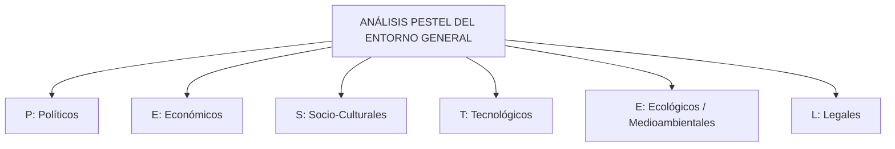
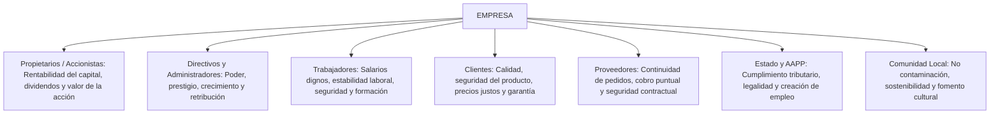

# 🏢 Administración de Empresas — Tema 2: La Empresa y su Entorno

- **Asignatura:** Administración de Empresas (Cód. 2345)
- **Titulación:** Grado en ADE — Facultad de Economía y Empresa (Universidad de Murcia)
- **Profesor:** Jorge Monllor Domínguez ([jmonllor@um.es](mailto:jmonllor@um.es))
- **Tema:** Tema 2 — El Entorno de la Empresa: Entorno General (PESTEL), Entorno Específico (5 Fuerzas de Porter) y Responsabilidad Social Corporativa (RSC)
- **Material de Referencia:** Diapositivas Oficiales UMU (`ADMINISTARCION_EMPRESA_TEMA_2_ADE.pdf`)

---

## 📑 Índice de Contenidos

1. [Concepto y Tipologías de Entorno](#1-concepto-y-tipologías-de-entorno)
   - 1.1. [Definición y Relevancia Estratégica (Oportunidades y Amenazas)](#11-definición-y-relevancia-estratégica)
   - 1.2. [Dimensiones del Entorno (Bueno, Cruz y Durán)](#12-dimensiones-del-entorno)
   - 1.3. [Niveles de Incertidumbre: Entornos Estables, Reactivos y Turbulentos](#13-niveles-de-incertidumbre)
2. [Metodología de Análisis del Entorno](#2-metodología-de-análisis-del-entorno)
3. [Análisis del Entorno General: El Modelo PEST / PESTEL](#3-análisis-del-entorno-general-el-modelo-pest--pestel)
   - 3.1. [Factores Político-Legales](#31-factores-político-legales)
   - 3.2. [Factores Económicos](#32-factores-económicos)
   - 3.3. [Factores Socio-Culturales y Demográficos](#33-factores-socio-culturales-y-demográficos)
   - 3.4. [Factores Tecnológicos](#34-factores-tecnológicos)
   - 3.5. [Factores Ecológicos / Medioambientales](#35-factores-ecológicos--medioambientales)
   - 3.6. [Ámbitos Territoriales (Local, Regional, Nacional y Global)](#36-ámbitos-territoriales)
4. [Análisis del Entorno Específico: El Sector y las 5 Fuerzas de Porter](#4-análisis-del-entorno-específico-las-5-fuerzas-de-porter)
   - 4.1. [Concepto de Sector y Clasificación CNAE](#41-concepto-de-sector-y-clasificación-cnae)
   - 4.2. [Fuerza 1: Rivalidad entre Competidores Actuales](#42-fuerza-1-rivalidad-entre-competidores-actuales)
   - 4.3. [Fuerza 2: Amenaza de Entrada de Nuevos Competidores (Barreras de Entrada)](#43-fuerza-2-amenaza-de-nuevos-competidores)
   - 4.4. [Fuerza 3: Amenaza de Productos y Servicios Sustitutivos](#44-fuerza-3-amenaza-de-productos-sustitutivos)
   - 4.5. [Fuerza 4: Poder Negociador de los Clientes](#45-fuerza-4-poder-negociador-de-los-clientes)
   - 4.6. [Fuerza 5: Poder Negociador de los Proveedores](#46-fuerza-5-poder-negociador-de-los-proveedores)
   - 4.7. [El Papel de la Administración Pública como Fuerza Competitiva](#47-el-papel-de-la-administración-pública)
5. [Responsabilidad Social Corporativa (RSC) y Ética Empresarial](#5-responsabilidad-social-corporativa-rsc-y-ética-empresarial)
   - 5.1. [Impacto Social de la Empresa: Costes Sociales y Externalidades](#51-impacto-social-de-la-empresa)
   - 5.2. [Los Tres Enfoques de Compromiso Social (Claver et al., 2002)](#52-los-tres-enfoques-de-compromiso-social)
   - 5.3. [Grupos de Interés (*Stakeholders*) y sus Expectativas](#53-grupos-de-interés-stakeholders)
   - 5.4. [Niveles de Responsabilidad según la ONU y la Agenda 2030 (ODS)](#54-niveles-de-responsabilidad-y-agenda-2030)

---

## 1. Concepto y Tipologías de Entorno

### 1.1. Definición y Relevancia Estratégica

En el Tema 1 se constató que la empresa es un **sistema abierto** que no opera aislada en el vacío, sino en constante intercambio con su medio exterior:

> 🎯 **Definición de Entorno (Guerras y Navas, 2007):**  
> *"Conjunto de factores y fuerzas externas a la empresa que influyen de forma significativa en su comportamiento, funcionamiento y resultados, y sobre los cuales la empresa no tiene control directo."*

El entorno condiciona los resultados empresariales generando dos tipos de impactos (base del análisis DAFO):
- **Oportunidades:** Factores del entorno que, de ser aprovechados a tiempo, pueden suponer ventajas competitivas y crecimiento.
- **Amenazas:** Acontecimientos externos desfavorables que pueden poner en riesgo la viabilidad, márgenes o cuota de mercado de la empresa si no se anticipan medidas correctoras.

---

### 1.2. Dimensiones del Entorno

Siguiendo a Bueno, Cruz y Durán (2002), el entorno se caracteriza según 5 criterios estructurales:

| Dimensión | Criterio de Medida | Extremo Favorable / Simple | Extremo Desfavorable / Complejo |
| :--- | :--- | :--- | :--- |
| **Dinamismo** | Velocidad y frecuencia a la que se suceden los cambios en los factores. | **Estable:** Factores casi no cambian; evolución predecible. | **Dinámico:** Cambios continuos, veloces y difíciles de anticipar. |
| **Complejidad** | Nivel de conocimientos técnicos y comprensión que exige entender los factores. | **Simple:** Factores fáciles de interpretar con conocimientos estándar. | **Complejo:** Requiere conocimientos científicos o tecnológicos muy sofisticados. |
| **Diversidad** | Variedad y heterogeneidad de clientes, productos y mercados atendidos. | **Integrado:** Producto único o mercado muy homogéneo. | **Diversificado:** Múltiples gamas, clientes dispares y mercados globales. |
| **Hostilidad** | Severidad e impacto negativo de las condiciones sobre la supervivencia. | **Munificente (Favorable):** Mercado en expansión, recursos abundantes. | **Hostil:** Fuerte competencia, recesión, escasez de recursos o guerra de precios. |
| **Incertidumbre** | Grado de desconocimiento sobre la evolución futura y los riesgos. | **Cierto:** Información transparente y pronósticos fiables. | **Incierto:** Falta total de información y alto riesgo. |

---

### 1.3. Niveles de Incertidumbre

De la combinación de estas variables surgen tres tipologías básicas de entornos empresariales:

```
[1. Entorno Estable]  ──> Factores estables, simples, integrados y munificentes (Baja incertidumbre)
         │
[2. Entorno Reactivo] ──> Factores con cambios periódicos y cierta hostilidad competitiva (Media incertidumbre)
         │
[3. Entorno Turbulento]─> Factores dinámicos, complejos, diversificados, hostiles e inciertos (Máxima incertidumbre)
```

> ⚠️ *En la actualidad, la inmensa mayoría de las empresas operan en entornos **turbulentos** (entornos VUCA: Volátiles, Inciertos, Complejos y Ambiguos) impulsados por la digitalización acelerada y la globalización.*

---

## 2. Metodología de Análisis del Entorno

Para que el análisis sea riguroso y útil para la toma de decisiones, la dirección de la empresa debe seguir 3 etapas metodológicas:

1. **Identificar los factores clave relevantes:** Seleccionar aquellas variables del entorno general y del sector que realmente inciden en la operativa del negocio.
2. **Analizar la situación actual y su tendencia evolutiva:** Recabar datos cuantitativos y cualitativos sobre cómo están variando dichas variables (previsiones de PIB, cambios legislativos, movimientos de competidores).
3. **Evaluar el impacto estratégico:** Determinar si cada factor representa una **Oportunidad** a explotar o una **Amenaza** a neutralizar dentro del análisis DAFO.

Para ello se desdobla el entorno en dos niveles analíticos:
- **Entorno General (Macroentorno):** Marco global común a todas las empresas de un país o región. Se analiza con el modelo **PESTEL**.
- **Entorno Específico (Microentorno / Sector):** Conjunto de fuerzas que operan en la industria concreta de la empresa. Se analiza con las **5 Fuerzas de Porter**.

---

## 3. Análisis del Entorno General: El Modelo PEST / PESTEL

El análisis PESTEL examina las seis grandes dimensiones macroeconómicas que configuran el marco de actuación de las organizaciones:



### 3.1. Factores Político-Legales
- **Políticos:** Estabilidad institucional del gobierno, acuerdos comerciales internacionales, nivel de tensión geopolítica, posición y peso sindical.
- **Legales:** Marco normativo mercantil (Ley de Sociedades de Capital), legislación laboral (reformas del estatuto de los trabajadores, salario mínimo), normativa fiscal (tipos impositivos del IRPF, IVA e Impuesto sobre Sociedades) y normativa de seguridad de los productos.

### 3.2. Factores Económicos
- Tasa de crecimiento del PIB y ciclo económico (expansión o recesión).
- Tipos de interés fijados por el Banco Central Europeo (influyen en el coste del crédito para inversiones).
- Tasa de inflación (erosión del poder adquisitivo y encarecimiento de materias primas).
- Nivel de desempleo y tasa de renta disponible de las familias.
- Costes de la energía, electricidad y combustibles.

### 3.3. Factores Socio-Culturales y Demográficos
- Pirámide demográfica: envejecimiento poblacional en Europa, tasa de natalidad y flujos migratorios.
- Cambios en los estilos de vida: auge de la alimentación saludable, hábitos de consumo ecológico y sostenibilidad.
- Incorporación de la mujer al mercado de trabajo y nuevos modelos familiares.
- Nivel formativo y educativo general de la población.

### 3.4. Factores Tecnológicos
- Presupuesto público y privado destinado a I+D+i.
- Infraestructuras científico-tecnológicas (despliegue de fibra óptica, redes 5G, computación en la nube).
- Ritmo de obsolescencia tecnológica y adopción de Inteligencia Artificial y automatización.

### 3.5. Factores Ecológicos / Medioambientales
- Normativas sobre descarbonización y reducción de la huella de carbono.
- Gestión de residuos, reciclaje y economía circular.
- Sensibilidad social y penalización pública a las empresas contaminantes.

---

### 3.6. Ámbitos Territoriales

El entorno general no es idéntico en todas las ubicaciones; debe analizarse a cuatro niveles concéntricos:
$$\text{Entorno Local (Municipio)} \longrightarrow \text{Regional (CCAA)} \longrightarrow \text{Nacional (España)} \longrightarrow \text{Internacional / Global}$$

---

## 4. Análisis del Entorno Específico: Las 5 Fuerzas de Porter

El **Entorno Específico** se refiere a las empresas que operan dentro del mismo **sector de actividad**.

> 🏭 **Definición de Sector Industrial:**  
> Conjunto de empresas que desarrollan la misma actividad principal o que fabrican bienes o servicios que son sustitutivos cercanos entre sí (en España clasificados formalmente según la **CNAE** — Clasificación Nacional de Actividades Económicas).

En 1982, **Michael E. Porter** formuló su modelo de las **5 Fuerzas Competitivas**, que demuestra que el nivel de rentabilidad y el atractivo medio de un sector dependen de la interacción de cinco fuerzas:

```
                          ┌────────────────────────────┐
                          │   COMPETIDORES POTENCIALES │
                          │ (Amenaza nuevos entrantes) │
                          └─────────────┬──────────────┘
                                        │
                                        ▼
┌───────────────────────────┐     ┌───────────┐     ┌───────────────────────────┐
│   PODER NEGOCIADOR DE     │ ──> │ RIVALIDAD │ <── │   PODER NEGOCIADOR DE     │
│     LOS PROVEEDORES       │     │ DEL SECTOR│     │       LOS CLIENTES        │
└───────────────────────────┘     └─────┬─────┘     └───────────────────────────┘
                                        ▲
                                        │
                          ┌─────────────┴──────────────┐
                          │    PRODUCTOS SUSTITUTIVOS  │
                          │   (Amenaza de sustitución) │
                          └────────────────────────────┘
```

---

### 4.2. Fuerza 1: Rivalidad entre Competidores Actuales

Mide la intensidad de las batallas competitivas entre las empresas ya establecidas en el sector.  
La rivalidad será **MAYOR (mayor amenaza y menores márgenes)** cuando:
1. **Existen muchos competidores** o son de tamaño y capacidad similar.
2. **Crecimiento de la demanda bajo o nulo:** Si el mercado no crece, la única forma de que una empresa venda más es arrebatándole clientes a sus rivales directos.
3. **Productos estandarizados (poca diferenciación):** El cliente compra exclusivamente por precio.
4. **Costes fijos elevados:** Obligan a producir a gran escala para amortizar instalaciones, empujando a guerras de precios ante caídas puntuales de demanda.
5. **Barreras de Salida elevadas:** Dificultad para abandonar el sector cuando va mal:
   - *Activos muy especializados* sin valor alternativo en otro negocio.
   - *Costes fijos de liquidación* (indemnizaciones laborales a trabajadores).
   - *Restricciones legales y políticas*.
   - *Causas emocionales o apego familiar*.

---

### 4.3. Fuerza 2: Amenaza de Entrada de Nuevos Competidores

La entrada de nuevos competidores añade capacidad productiva al sector, presiona los precios a la baja y reduce los beneficios de los incumbentes.  
La facilidad de entrada depende directamente de la existencia de **Barreras de Entrada**:

1. **Economías de Escala:** Disminución del coste medio unitario conforme se incrementa el volumen de producción acumulada. Las empresas ya instaladas operan a costes mucho menores que un nuevo entrante que comience con poca producción.
2. **Necesidades Elevadas de Capital Inicial:** Exigencia de cuantiosas inversiones previas en infraestructuras, maquinaria o tecnología (ej. sector automovilístico o telecomunicaciones).
3. **Diferenciación de Producto e Imagen de Marca:** La fidelidad del cliente hacia marcas consagradas obliga al nuevo aspirante a gastar fortunas en publicidad y promociones para ser conocido.
4. **Acceso a Canales de Distribución:** Los lineales de los supermercados o las redes de distribución comercial suelen estar copados por los líderes históricos.
5. **Políticas Gubernamentales y Barreras Legales:** Necesidad de licencias administrativas, homologaciones sanitarias o concesiones públicas.
6. **Reacción Esperada de las Empresas Existentes:** Si los operadores actuales cuentan con fuerte tesorería, capacidad de represalia y tradición de bajar precios ante nuevos rivales.

---

### 4.4. Fuerza 3: Amenaza de Productos y Servicios Sustitutivos

> 🔄 **Concepto de Producto Sustitutivo:**  
> Aquel bien o servicio producido por empresas de **otro sector distinto**, pero que satisface exactamente la misma necesidad básica del consumidor (ej. el tren de alta velocidad AVE frente al puente aéreo de Iberia; el azúcar frente a los edulcorantes o la sacarina).

La amenaza de los sustitutivos será **MAYOR** cuando:
- La relación **calidad-prestaciones / precio** del producto sustitutivo sea superior a la del producto del sector.
- Los **costes de cambio** para el cliente al pasar del producto original al sustitutivo sean bajos o nulos.

---

### 4.5. Fuerza 4: Poder Negociador de los Clientes

Los clientes presionan para que bajen los precios, demandan mayor calidad y reclaman más servicios postventa.  
El poder de negociación de los clientes será **ALTO (amenaza)** si:
1. **Los clientes están muy concentrados** o realizan compras de grandes volúmenes (ej. una cadena de supermercados comprando a un pequeño productor hortofrutícola).
2. **Los productos del sector son estándar o indiferenciados.**
3. **Existen productos sustitutivos disponibles en el mercado.**
4. **Los costes de cambiar de proveedor son muy bajos para el cliente.**
5. **El cliente tiene información completa** y transparente sobre costes y precios del sector.
6. **Amenaza creíble de integración vertical hacia atrás:** El cliente amenaza con fabricar él mismo el producto en vez de comprarlo.

---

### 4.6. Fuerza 5: Poder Negociador de los Proveedores

Los proveedores intentan imponer precios más altos, exigir plazos de pago más cortos o reducir las cantidades suministradas.  
El poder de negociación de los proveedores será **ALTO (amenaza)** si:
1. **Existen muy pocos proveedores** o el mercado de suministro está altamente concentrado (ej. el mercado de microprocesadores dominado por Intel o TSMC).
2. **El insumo o producto suministrado es altamente diferenciado** o vital para el proceso de la empresa.
3. **No existen sustitutivos viables** para la materia prima.
4. **Los costes de cambiar de proveedor son muy altos** para la empresa compradora.
5. **Amenaza creíble de integración vertical hacia adelante:** El proveedor amenaza con montar su propia red de comercialización y convertirse en competidor directo de sus propios clientes.

---

### 4.7. El Papel de la Administración Pública

La Administración Pública actúa como un agente de influencia transversal en el sector a través de:
- Compra y contratación pública (cliente de gran envergadura).
- Fijación de leyes, reglamentos y normativas de seguridad laboral.
- Concesión de subvenciones, subsidios o desgravaciones fiscales.
- Fijación de normas ambientales y penalizaciones por contaminación.

---

## 5. Responsabilidad Social Corporativa (RSC) y Ética Empresarial

### 5.1. Impacto Social de la Empresa: Costes Sociales y Externalidades

La empresa ejerce una doble influencia sobre la sociedad:
- **Efectos Positivos (Fuerza impulsora):** Generación de riqueza y rentas, creación de empleo estable, innovación tecnológica y aumento del nivel de vida.
- **Efectos Negativos (Costes Sociales / Externalidades negativas):** Contaminación ambiental, ruido, agotamiento de recursos no renovables, especulación y deslocalización laboral.

---

### 5.2. Los Tres Enfoques de Compromiso Social (Claver et al., 2002)

| Enfoque | Postura Básica | Objetivo Declarado | Justificación |
| :--- | :--- | :--- | :--- |
| **A) Enfoque Negativo** *(Clásico / Milton Friedman)* | **Maximizar el beneficio económico** respetando estrictamente el marco legal formal mínimo. | Rentabilidad pura del accionista. | La única responsabilidad social del directivo es usar los recursos de los accionistas para maximizar su beneficio económico; lo demás corresponde al Estado. |
| **B) Enfoque Favorable** *(Social / Proactivo)* | **Alto compromiso voluntario** con los valores sociales, medioambientales y laborales. | Sostenibilidad y rentabilidad a largo plazo. | Asumir compromisos éticos mejora la reputación de marca, fideliza a los clientes, atrae talento y genera mayor rentabilidad sostenible en el tiempo. |
| **C) Enfoque Intermedio** *(Negociador)* | La responsabilidad social surge de la **negociación y equilibrio de intereses** entre los distintos grupos afectados. | Satisfacer un umbral mínimo aceptable de cada grupo. | Evitar conflictos abiertos buscando un compromiso razonable entre accionistas, trabajadores, clientes y comunidad local. |

---

### 5.3. Grupos de Interés (*Stakeholders*) y sus Expectativas



---

### 5.4. Niveles de Responsabilidad y Agenda 2030 (ODS)

El **Comité para el Desarrollo Económico de la ONU** estructura la responsabilidad empresarial en tres niveles concéntricos:

1. **Responsabilidad Básica:** Producir bienes y servicios demandados, crear puestos de trabajo y generar crecimiento económico.
2. **Responsabilidad de Prioridad Social:** Prevenir accidentes laborales, asegurar relaciones laborales justas, conservar el medio ambiente e informar lealmente al consumidor.
3. **Responsabilidad de Cambio Social:** Contribuir al desarrollo cultural, urbanístico, erradicación de la pobreza y regeneración del tejido comunitario.

> 🌍 **Definición de RSC de Naciones Unidas:**  
> *"Conjunto de iniciativas voluntarias de las empresas, más allá de sus obligaciones legales estrictas, que les permiten lograr mejoras en su entorno y responder al desafío del desarrollo sostenible (satisfacer las necesidades del presente sin comprometer las capacidades de las generaciones futuras), garantizando el equilibrio entre el cuidado medioambiental, el bienestar social y el crecimiento económico equilibrado."*
> 
> En 2015, los estados miembros de la ONU aprobaron la **Agenda 2030** integrada por los **17 Objetivos de Desarrollo Sostenible (ODS)**, que comprometen al sector privado en la acción por el clima, la reducción de desigualdades, la igualdad de género y el trabajo decente.
