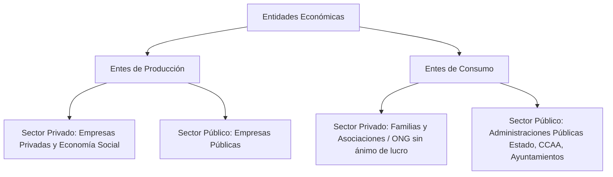
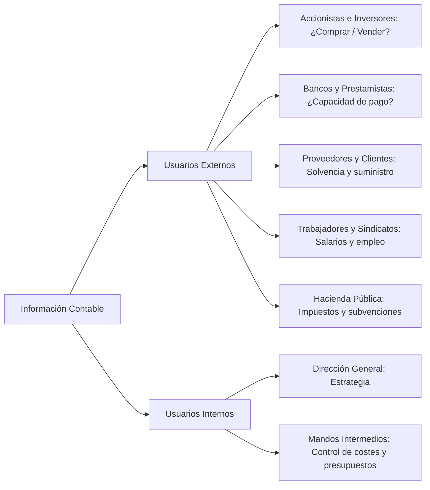

# 📊 Contabilidad Financiera I — Tema 1: La Contabilidad como Sistema de Información

- **Asignatura:** Contabilidad Financiera I (Cód. 2344)
- **Titulación:** Grado en ADE — Facultad de Economía y Empresa (Universidad de Murcia)
- **Tema:** Tema 1 — La Contabilidad y la Información Económica
- **Material de Referencia:** Diapositivas Oficiales UMU (`TEMA_1_ADE_CFI_alumnos.pdf`)
- **Enfoque:** Guía teórica exhaustiva explicada con rigor conceptual y ejemplos reales (Inditex, banca, creación de empresas).

---

## 📑 Índice de Contenidos

1. [La Contabilidad y la Información Económica](#1-la-contabilidad-y-la-información-económica)
2. [Entidades sobre las que Informa la Contabilidad](#2-entidades-sobre-las-que-informa-la-contabilidad)
   - 2.1. [El Criterio del Coste Histórico](#21-el-criterio-del-coste-histórico)
   - 2.2. [El Concepto de Entidad Separada](#22-el-concepto-de-entidad-separada)
3. [Tipos de Empresas por su Forma Jurídica](#3-tipos-de-empresas-por-su-forma-jurídica)
4. [Tipos de Empresas por su Actividad Económica](#4-tipos-de-empresas-por-su-actividad-económica)
   - 4.1. [Ciclo de Operaciones: Financiación, Inversión y Explotación](#41-ciclo-de-operaciones-financiación-inversión-y-explotación)
5. [Usuarios de la Información Contable](#5-usuarios-de-la-información-contable)
   - 5.1. [Contabilidad Financiera (Externa) vs. Contabilidad de Gestión (Interna)](#51-contabilidad-financiera-externa-vs-contabilidad-de-gestión-interna)
6. [El Proceso Contable](#6-el-proceso-contable)
7. [Los Estados Financieros: Las Cuentas Anuales](#7-los-estados-financieros-las-cuentas-anuales)
8. [Requisitos de la Información Contable (Marco Conceptual del PGC)](#8-requisitos-de-la-información-contable-marco-conceptual-del-pgc)
9. [Definición Formal de Contabilidad](#9-definición-formal-de-contabilidad)

---

## 1. La Contabilidad y la Información Económica

En el mundo económico cotidiano nos enfrentamos constantemente a dilemas de asignación de recursos:
- *¿Compro una vivienda para alquilarla o adquiero acciones de una empresa cotizada?*
- *¿Invierto en Inditex o en Bodegas Riojanas?*
- *Si somos un banco: ¿le concedemos un préstamo a una sociedad mercantil? ¿Podrá devolverlo con intereses?*
- *Si buscamos empleo: ¿es solvente esta compañía para garantizar estabilidad laboral y pago de salarios?*

> 💡 **La Razón de Ser de la Contabilidad:**  
> Ninguna de estas decisiones puede tomarse a ciegas o por intuición. **La contabilidad es el sistema de información cuantitativo y cualitativo que capta, elabora y suministra datos económicos fiables para permitir una toma de decisiones racional y fundamentada.**

---

## 2. Entidades sobre las que Informa la Contabilidad

La contabilidad no es exclusiva de las grandes multinacionales cotizadas. Cualquier organización que gestione recursos escasos necesita contabilidad:



### Organizaciones Lucrativas vs. No Lucrativas
- **Empresas Privadas (Con ánimo de lucro):** Como *Inditex*, *ElPozo Alimentación* o una panadería de barrio. Su objetivo prioritario es **crear valor añadido** y maximizar el beneficio para incrementar la riqueza de sus propietarios (accionistas o socios).
- **Entidades Sin Ánimo de Lucro (No lucrativas / ONG):** Como *Médicos Sin Fronteras*, *Cruz Roja* o fundaciones benéficas. No tienen como fin la rentabilidad económica ni el reparto de dividendos, sino un fin social o humanitario. Sin embargo, **precisan de la contabilidad** para que los socios, donantes y administraciones verifiquen cómo se han empleado los fondos y aportaciones recibidas.

### El Concepto de Valor Añadido
Las empresas nacen para transformar factores productivos (*inputs*) en productos finales o servicios (*outputs*) con un valor de mercado superior a la suma de los recursos empleados:
$$\text{Valor Añadido (Beneficio Bruto)} = \text{Precio de Venta del Producto} - \text{Coste de los Inputs Empleados}$$

---

### 2.1. El Criterio del Coste Histórico

Para registrar los bienes y servicios en contabilidad, es imprescindible asignarles un precio objetivo. La normativa española (PGC) adopta con carácter general el **Coste Histórico**:

1. **Precio de Adquisición (Bienes comprados al exterior):**  
   Es el importe facturado por el vendedor (deducidos los descuentos comerciales o rebajas) **más todos los gastos adicionales** necesarios hasta que el bien se encuentre en condiciones de funcionamiento (transporte, seguros, instalación, aranceles, montaje, etc.).
   $$\text{Precio de Adquisición} = \text{Importe Facturado} - \text{Descuentos} + \text{Gastos Adicionales (Transporte, Seguro, Montaje...)}$$
   > 📌 **Ejemplo:** Compramos una máquina por $1.200$ €. El transporte cuesta $20$ € y la instalación $15$ €.  
   > Su precio de adquisición contable es $1.200 + 20 + 15 = 1.235$ €.  
   > *Nota:* Las condiciones de pago (si se paga al contado, a 6 meses o a 2 años) **no alteran** el precio de adquisición del activo. Lo relevante es lo que costó adquirirlo.

2. **Coste de Producción (Bienes elaborados por la propia empresa):**  
   Se obtiene sumando el precio de adquisición de las materias primas y consumibles utilizados, la mano de obra directamente imputable y la parte razonable de costes indirectos de fabricación.

#### ¿Por qué Coste Histórico y Principio de Empresa en Funcionamiento?
- **Fiabilidad y Objetividad:** El coste histórico está respaldado por facturas y documentos legales verificables, evitando valoraciones subjetivas o especulativas.
- **Principio de Empresa en Funcionamiento:** La contabilidad asume que la empresa continuará operando en el futuro previsible. Salvo que esté en proceso de quiebra o liquidación, los activos no se valoran a su hipotético precio de liquidación inmediata en el mercado, sino al coste incurrido para utilizarlos en la explotación.

---

### 2.2. El Concepto de Entidad Separada

> [!IMPORTANT]
> **Principio de Entidad Separada:**  
> La empresa posee una personalidad contable e identidad **independiente y separada** de la de sus dueños, socios o administradores.  
> Los patrimonios personales de los socios jamás deben mezclarse con el patrimonio de la empresa. La contabilidad registra exclusivamente los hechos que afectan a la entidad jurídica de la empresa.

---

## 3. Tipos de Empresas por su Forma Jurídica

| Característica | Empresario Individual (Autónomo) | Sociedad Limitada (S.L. / S.R.L.) | Sociedad Anónima (S.A.) |
| :--- | :--- | :--- | :--- |
| **Personalidad Jurídica** | Persona física | Persona jurídica propia | Persona jurídica propia |
| **Responsabilidad** | **Ilimitada y universal:** Responde con todos sus bienes presentes y futuros (Art. 1911 CC). | **Limitada:** El socio responde únicamente hasta el límite de su aportación. | **Limitada:** El accionista responde únicamente hasta el límite de su aportación. |
| **Capital Social Mínimo** | No existe mínimo legal | **1 €** *(Tras la Ley 18/2022 de Creación y Crecimiento de Empresas)* | **60.000 €** *(desembolsado al menos el 25% al constituirse)* |
| **División del Capital** | No dividido | **Participaciones sociales** (no negociables en bolsa) | **Acciones** (títulos valores negociables en bolsa) |
| **Condición de Socio** | Titular único | Al comprar o suscribir participaciones | Al poseer una o más acciones |
| **Perfil Típico** | Pequeños comercios y profesionales | Pequeñas y medianas empresas familiares | Grandes empresas y sociedades cotizadas |

---

## 4. Tipos de Empresas por su Actividad Económica

1. **Empresas Comerciales:** Compran mercaderías y las venden sin someterlas a transformación sustancial (ej. tiendas de ropa, supermercados, concesionarios).  
   $$\text{Dinero} \longrightarrow \text{Mercaderías} \longrightarrow \text{Clientes (Derechos de cobro)} \longrightarrow \text{Dinero}$$
2. **Empresas Industriales:** Adquieren materias primas y, mediante procesos productivos (mano de obra y maquinaria), las transforman en productos elaborados terminados (ej. fábricas de calzado, automoción, alimentación).  
   $$\text{Dinero} \longrightarrow \text{Materias Primas} \longrightarrow \text{Productos Terminados} \longrightarrow \text{Clientes} \longrightarrow \text{Dinero}$$
3. **Empresas de Servicios:** Comercializan actividades intangibles o asistenciales (ej. hostelería, transporte, consultoría, clínicas, banca y seguros).

---

### 4.1. Ciclo de Operaciones: Financiación, Inversión y Explotación

Toda empresa lleva a cabo 3 grandes tipos de operaciones:

```
[Operaciones de Financiación] ──> Obtención de fondos (Capital de socios, préstamos bancarios)
             │
             ▼
[Operaciones de Inversión]    ──> Compra de activos fijos (Maquinaria, naves, ordenadores)
             │
             ▼
[Operaciones de Explotación]  ──> Ciclo operativo corriente (Comprar suministros, fabricar, vender, cobrar)
```

1. **Operaciones de Financiación:** Captación y restitución de recursos financieros.
   - *Propias:* Aportaciones de capital social de socios, retención de beneficios (reservas).
   - *Ajenas:* Préstamos bancarios a devolver con intereses, emisión de obligaciones.
2. **Operaciones de Inversión:** Aplicación de fondos en bienes de uso duradero (Activo No Corriente: compra de locales, camiones, patentes, software).
3. **Operaciones de Explotación:** Flujo diario del negocio (compra de existencias, pago de nóminas, consumos de luz y agua, venta de productos, cobro a clientes).

---

## 5. Usuarios de la Información Contable

La información contable es demandada por múltiples agentes para evaluar riesgos y tomar decisiones:



---

### 5.1. Contabilidad Financiera (Externa) vs. Contabilidad de Gestión (Interna)

| Criterio | Contabilidad Financiera (Externa) | Contabilidad de Gestión / Costes (Interna) |
| :--- | :--- | :--- |
| **Destinatarios** | Usuarios externos (inversores, bancos, Hacienda, acreedores) y dirección. | Exclusivamente usuarios internos (directivos, gerentes, jefes de planta). |
| **Regulación** | **Altamente regulada y normalizada** (Código de Comercio, Ley de Sociedades de Capital, PGC). | **Libre y no regulada:** Se adapta a las necesidades particulares de la gerencia. |
| **Obligatoriedad** | **Obligatoria por ley** para todas las empresas. | **Opcional / Voluntaria** (herramienta de gestión interna). |
| **Publicidad** | **Pública:** Se deposita anualmente en el Registro Mercantil. | **Estrictamente confidencial y secreta:** Ventaja competitiva empresarial. |
| **Nivel de detalle** | Información sintética y agregada de la empresa en su conjunto. | Información altamente detallada por productos, departamentos, líneas o secciones. |
| **Horizonte temporal** | Se refiere a hechos pasados (históricos) y se cierra periódicamente (anual/trimestral). | Enfocada al presente y futuro (presupuestos, previsiones operativas, desviaciones). |

> 🎯 *En esta asignatura (Contabilidad Financiera I) estudiamos el marco de la **Contabilidad Financiera Externa** regulada por el Plan General de Contabilidad.*

---

## 6. El Proceso Contable

Para transformar los acontecimientos económicos en información comprensible y verificable, la contabilidad ejecuta un proceso sistemático en 3 fases:

1. **Identificación:** Seleccionar qué hechos tienen naturaleza económica y afectan directa y cuantificablemente al patrimonio de la empresa.  
   *(Ej: Comprar un ordenador SÍ es un hecho contable; recibir un folleto publicitario o contratar a un empleado sin pagarle aún la nómina NO altera el patrimonio en ese instante).*
2. **Registro y Valoración:** Cuantificar monetariamente la transacción aplicando las normas del PGC (coste histórico) e inscribirla formalmente en el Libro Diario y el Libro Mayor mediante la técnica de la partida doble.
3. **Elaboración y Comunicación:** Sintetizar la información acumulada en los Estados Financieros (Cuentas Anuales) para que los destinatarios puedan interpretarla y evaluar la solvencia y rentabilidad.

---

## 7. Los Estados Financieros: Las Cuentas Anuales

El artículo 34 del Código de Comercio y la 1.ª Parte del PGC establecen que al cierre de cada ejercicio económico la empresa debe formular sus **Cuentas Anuales**, cuyo objetivo primordial es:

$$\mathbf{\text{Reflejar la IMAGEN FIEL del patrimonio, de la situación financiera y de los resultados de la empresa}}$$

Un juego completo de Cuentas Anuales está integrado por 5 documentos interrelacionados:

```text
CUENTAS ANUALES (PGC)
├── 1. El Balance de Situación           --> Foto del patrimonio (Activo, Pasivo y Neto) a fecha de cierre
├── 2. La Cuenta de Pérdidas y Ganancias --> Película económica: Ingresos - Gastos = Resultado del ejercicio
├── 3. La Memoria                        --> Amplía, aclara y comenta la información cuantitativa de los demás estados
├── 4. El Estado de Flujos de Efectivo   --> Explicación de entradas y salidas de tesorería (cobros y pagos)
└── 5. El Estado de Cambios en el PN     --> Variaciones del patrimonio neto (ampliaciones, dividendos, reservas)
```

*(Nota: Las empresas que presentan modelos abreviados de PYMES pueden quedar exentas de presentar el Estado de Flujos de Efectivo).*

---

## 8. Requisitos de la Información Contable (Marco Conceptual del PGC)

Para que las Cuentas Anuales alcancen la **Imagen Fiel**, la 1.ª Parte del PGC exige el cumplimiento de requisitos cualitativos rigurosos:

### Requisitos Primarios

1. **Relevancia:**  
   La información es relevante cuando resulta verdaderamente útil para la toma de decisiones económicas; es decir, cuando ayuda a evaluar acontecimientos pasados, presentes o futuros, o a confirmar y corregir evaluaciones previas.  
   *Debe mostrar con nitidez los riesgos significativos a los que se enfrenta la empresa.*
2. **Fiabilidad:**  
   La información es fiable cuando está libre de errores materiales y es neutral (ausente de sesgos o manipulaciones interesadas), permitiendo a los usuarios confiar plenamente en que representa con exactitud la realidad económica.

### Requisitos Derivados y Adicionales

3. **Integridad:**  
   Consecuencia directa de la fiabilidad. La información financiera debe incluir, de forma completa y sin omisiones significativas, todos los datos que pudieran influir en el juicio de los destinatarios.
4. **Comparabilidad:**  
   Debe permitir contrastar la evolución de una misma empresa a lo largo de sucesivos ejercicios temporales (comparabilidad intertemporal) y contrastar la situación y rentabilidad entre distintas empresas del mismo sector en un periodo homogéneo.
5. **Claridad:**  
   Implica que, contando con un conocimiento razonable de las finanzas y la actividad empresarial, un usuario diligente pueda formarse un criterio fundado mediante la lectura de los estados financieros presentados.

---

## 9. Definición Formal de Contabilidad

> 📖 **Definición Académica Cátedra UMU:**  
> *"La Contabilidad es una ciencia económica cuyo objeto de estudio es la realidad económica de los entes económicos, configurando sistemas de información que captan, elaboran y comunican informes útiles para los usuarios internos y externos, con el fin de proporcionar un marco adecuado que permita la toma de decisiones en las mejores condiciones."*
