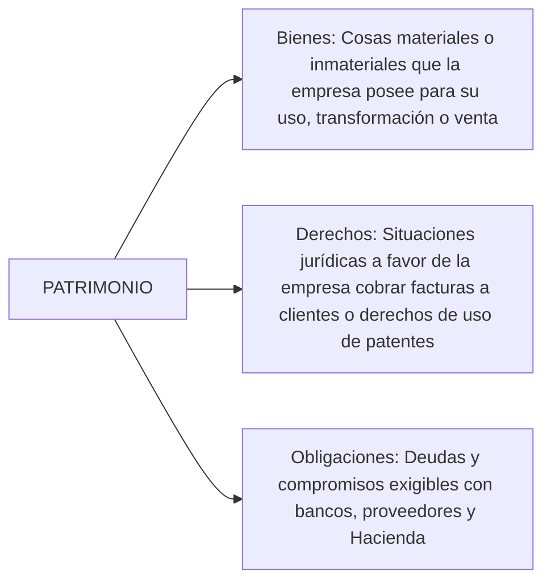
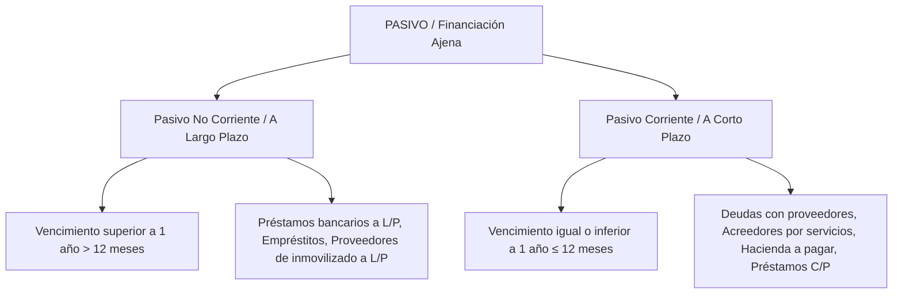

# 📊 Contabilidad Financiera I — Tema 2: El Patrimonio y la Ecuación Fundamental

- **Asignatura:** Contabilidad Financiera I (Cód. 2344)
- **Titulación:** Grado en ADE — Facultad de Economía y Empresa (Universidad de Murcia)
- **Tema:** Tema 2 — Teoría del Patrimonio, Masas Patrimoniales y el Equilibrio Contable
- **Material de Referencia:** Diapositivas Oficiales UMU (`Tema_2_ADE_CFI_alumnos.pdf`)
- **Enfoque:** Guía integral: explicación intuitiva paso a paso + rigor técnico oficial del PGC + balances en T + análisis patrimonial.

---

## 📑 Índice de Contenidos

1. [La Riqueza o Patrimonio de la Empresa](#1-la-riqueza-o-patrimonio-de-la-empresa)
2. [Estructura Económica y Estructura Financiera](#2-estructura-económica-y-estructura-financiera)
   - 2.1. [Los Elementos Patrimoniales (Minilista)](#21-los-elementos-patrimoniales)
3. [La Identidad Contable (Ecuación Fundamental)](#3-la-identidad-contable-ecuación-fundamental)
4. [Análisis y Clasificación del ACTIVO](#4-análisis-y-clasificación-del-activo)
   - 4.1. [Activo No Corriente (Estructura Fija / Bienes de Uso)](#41-activo-no-corriente)
   - 4.2. [Activo Corriente (Estructura Circulante / Bienes de Intercambio)](#42-activo-corriente)
   - 4.3. [Criterio de Valoración Inicial: Precio de Adquisición](#43-criterio-de-valoración-inicial)
5. [Análisis y Clasificación del PASIVO](#5-análisis-y-clasificación-del-pasivo)
   - 5.1. [Pasivo No Corriente vs. Pasivo Corriente](#51-pasivo-no-corriente-vs-pasivo-corriente)
6. [Análisis del PATRIMONIO NETO](#6-análisis-del-patrimonio-neto)
   - 6.1. [Patrimonio Neto vs. Fondos Propios](#61-patrimonio-neto-vs-fondos-propios)
7. [El Balance de Situación como Expresión del Equilibrio Patrimonial](#7-el-balance-de-situación-como-expresión-del-equilibrio-patrimonial)
   - 7.1. [Criterios de Ordenación: Liquidez y Exigibilidad Crecientes](#71-criterios-de-ordenación)
   - 7.2. [Criterios de Reconocimiento del Marco Conceptual PGC](#72-criterios-de-reconocimiento)
   - 7.3. [Principio de No Compensación](#73-principio-de-no-compensación)
   - 7.4. [Análisis Básico: Fondo de Maniobra y Ratios Financieros](#74-análisis-básico-fondo-de-maniobra-y-ratios)
8. [Supuesto de Clase Resuelto Paso a Paso (La Furgoneta y el Ordenador)](#8-supuesto-de-clase-resuelto-paso-a-paso)

---

## 1. La Riqueza o Patrimonio de la Empresa

> 🏛️ **Definición Formal:**  
> El **Patrimonio** es el conjunto de **bienes, derechos y obligaciones** pertenecientes a una entidad económica en un momento determinado del tiempo, que constituyen los medios económicos y financieros a través de los cuales puede cumplir sus fines.

Es un **concepto estático**: representa la "fotografía" o estado patrimonial de la empresa en una fecha fija (normalmente a 31 de diciembre o fecha de cierre de ejercicio).

### Los Tres Componentes Esenciales



1. **Bienes:** Elementos tangibles que la empresa posee para:
   - *Uso:* Edificios, maquinaria, ordenadores, furgonetas.
   - *Transformación:* Materias primas (madera, harina, telas).
   - *Venta:* Productos terminados o mercaderías.
2. **Derechos:** Situaciones jurídicas a favor de la empresa:
   - *Derechos de cobro:* Dinero que le deben los clientes por ventas a crédito o depósitos bancarios.
   - *Derechos de uso:* Concesiones administrativas, licencias, propiedad industrial (marcas y patentes).
3. **Obligaciones:** Deudas con terceros contraídas en el pasado que exigirán la entrega de fondos en el futuro (préstamos bancarios, facturas pendientes a proveedores, nóminas, tributos).

---

## 2. Estructura Económica y Estructura Financiera

La contabilidad contempla el patrimonio bajo una **doble perspectiva simultánea**:

```
      ESTRUCTURA ECONÓMICA                  ESTRUCTURA FINANCIERA
    (En qué se ha invertido)                (De dónde vino el dinero)
┌───────────────────────────────┐       ┌───────────────────────────────┐
│                               │       │  FUENTES DE FINANCIACIÓN      │
│            ACTIVO             │  ═══  │  PROPIAS (Patrimonio Neto)    │
│     (Bienes + Derechos)       │       ├───────────────────────────────┤
│                               │       │  FUENTES DE FINANCIACIÓN      │
│                               │       │  AJENAS (Pasivo / Deudas)     │
└───────────────────────────────┘       └───────────────────────────────┘
```

- **Estructura Económica (ACTIVO):** Refleja la totalidad de los medios económicos reales e inversiones que la empresa controla para generar ingresos.
- **Estructura Financiera (PASIVO + PATRIMONIO NETO):** Refleja el origen de los recursos financieros empleados para adquirir dicho activo. Indica a quién y bajo qué concepto debe responder la empresa:
  - *Fuentes Propias:* Aportadas por los socios (Capital) o generadas por el propio negocio (Beneficios no distribuidos / Reservas).
  - *Fuentes Ajenas:* Aportadas por terceros ajenos a los que hay que devolver el dinero (Bancos, Proveedores, Hacienda).

> ⚠️ **Importante Diferencia Conceptual:**  
> En la estructura económica existen bienes reales y tangibles (dinero en efectivo, naves, ordenadores). En la estructura financiera figuran **simples magnitudes abstractas o saldos contables** que cuantifican compromisos con los acreedores o con los socios.

---

### 2.1. Los Elementos Patrimoniales

Para evitar ambigüedades, el PGC estandariza los nombres de cada elemento (la denominada **Minilista** contable):

| Elemento Patrimonial | Cuenta Típica | Masa Patrimonial | Naturaleza |
| :--- | :---: | :--- | :--- |
| Dinero en efectivo físico | **570 Caja, euros** | Activo Corriente (Tesorería) | Bien |
| Dinero en cuenta corriente bancaria | **572 Bancos c/c** | Activo Corriente (Tesorería) | Derecho de cobro inmediato |
| Furgonetas, camiones, coches | **218 Elementos de transporte** | Activo No Corriente (Inm. Material) | Bien de uso |
| Naves, locales, almacenes | **211 Construcciones** | Activo No Corriente (Inm. Material) | Bien de uso |
| Solares y fincas rústicas | **210 Terrenos y bienes naturales**| Activo No Corriente (Inm. Material) | Bien de uso |
| Ordenadores, impresoras, servidores| **217 Equipos para procesos de inf.**| Activo No Corriente (Inm. Material) | Bien de uso |
| Mesas, sillas, estanterías | **216 Mobiliario** | Activo No Corriente (Inm. Material) | Bien de uso |
| Mercancías en almacén para vender | **300 Mercaderías** | Activo Corriente (Existencias) | Bien de venta |
| Deuda de clientes por ventas a plazo | **430 Clientes** | Activo Corriente (Deudores) | Derecho de cobro |
| Letra de cambio aceptada por cliente | **431 Clientes, ef. com. a cobrar**| Activo Corriente (Deudores) | Derecho formal de cobro |
| Aportaciones iniciales de socios | **100 Capital social** | Patrimonio Neto (Fondos Propios) | Financiación propia |
| Beneficios acumulados no repartidos | **112 Reservas legales/voluntarias**| Patrimonio Neto (Fondos Propios) | Financiación autogenerada|
| Préstamo bancario a devolver en 3 años | **170 Deudas a L/P ent. crédito**| Pasivo No Corriente | Obligación a largo plazo |
| Deuda por compra de mercaderías | **400 Proveedores** | Pasivo Corriente | Obligación a corto plazo |
| Letra de cambio emitida a proveedor | **401 Proveedores, ef. com. pagar** | Pasivo Corriente | Obligación formal a corto |
| Deuda por suministros de luz o teléfono| **410 Acreedores por prest. servic.**| Pasivo Corriente | Obligación comercial |
| Nóminas devengadas pendientes de pago | **465 Remuneraciones pend. pago** | Pasivo Corriente | Obligación laboral |

---

## 3. La Identidad Contable (Ecuación Fundamental)

Dado que cada euro invertido en el Activo ha debido provenir necesariamente de alguna fuente de financiación, la igualdad es matemática y permanente:

$$\mathbf{\text{ESTRUCTURA ECONÓMICA} = \text{ESTRUCTURA FINANCIERA}}$$
$$\mathbf{\text{ACTIVO} = \text{PASIVO} + \text{PATRIMONIO NETO}}$$

Despejando el valor que corresponde legítimamente a los propietarios:
$$\mathbf{\text{PATRIMONIO NETO} = \text{ACTIVO} - \text{PASIVO}}$$

---

## 4. Análisis y Clasificación del ACTIVO

El PGC define el **Activo** como:
> *"Bienes, derechos y otros recursos controlados económicamente por la empresa, resultantes de sucesos pasados, de los que se espera que la empresa obtenga beneficios o rendimientos económicos en el futuro."*

### 4.1. Activo No Corriente (Inmovilizado / Fijo)
Bienes y derechos que permanecen en la empresa durante **más de un ejercicio económico (más de 12 meses)**. No están destinados a la venta, sino a servir de soporte duradero a la actividad productiva:

1. **Inmovilizado Material:** Activos tangibles (terrenos, construcciones, maquinaria, elementos de transporte, mobiliario, ordenadores).
2. **Inmovilizado Intangible:** Activos inmateriales sin apariencia física susceptibles de valoración económica (programas informáticos, propiedad industrial / patentes, derechos de traspaso, gastos de I+D).
3. **Inversiones Inmobiliarias:** Inmuebles (terrenos o edificios) que la empresa posee ajenos a su actividad ordinaria para obtener rentas por alquiler o plusvalías en su venta futura.
4. **Inversiones Financieras a Largo Plazo:** Acciones, obligaciones o préstamos concedidos con vencimiento superior a 1 año.

---

### 4.2. Activo Corriente (Circulante)
Elementos vinculados al ciclo de explotación habitual que se renuevan o **se transforman en dinero líquido en un plazo igual o inferior a 12 meses**:

1. **Existencias:** Bienes para vender o consumir en la producción (mercaderías, materias primas, productos terminados).
2. **Deudores Comerciales y Otras Cuentas a Cobrar:** Derechos de cobro surgidos del tráfico ordinario (Clientes, Deudores, Hacienda Pública deudora).
3. **Inversiones Financieras a Corto Plazo:** Títulos valores (acciones de cotización rápida, depósitos bancarios a 3 meses) o créditos concedidos con vencimiento inferior a 1 año.
4. **Efectivo y Otros Activos Líquidos Equivalentes (Tesorería):** Medios de liquidez inmediata (Caja en efectivo y cuentas corrientes bancarias a la vista).

---

### 4.3. Criterio de Valoración Inicial

Todo elemento del activo entra en balance valorado por su **Coste Histórico**:
- Si es adquirido: **Precio de Adquisición** (Factura neta de descuentos + transporte + aranceles + montaje hasta puesta en marcha).
- Si es elaborado: **Coste de Producción** (Materias primas consumidas + mano de obra directa + costes indirectos imputables).

---

## 5. Análisis y Clasificación del PASIVO

El PGC define el **Pasivo** como:
> *"Obligaciones actuales surgidas como consecuencia de sucesos pasados, para cuya extinción la empresa espera desprenderse de recursos que puedan producir beneficios o rendimientos económicos en el futuro."*

### 5.1. Pasivo No Corriente vs. Pasivo Corriente



---

## 6. Análisis del PATRIMONIO NETO

El PGC define el **Patrimonio Neto** como:
> *"La parte residual de los activos de la empresa, una vez deducidos todos sus pasivos."*

### 6.1. ¿Son sinónimos Patrimonio Neto y Fondos Propios?

> [!NOTE]
> **No son estrictamente sinónimos, aunque en este nivel introductorio coincidan con frecuencia.**  
> Los **Fondos Propios** son el núcleo principal del Patrimonio Neto, pero el Patrimonio Neto es un concepto más amplio:
> $$\text{Patrimonio Neto} = \text{Fondos Propios} + \text{Subvenciones y Donaciones no reintegrables} + \text{Ajustes por cambio de valor}$$
> 
> Componentes de los **Fondos Propios:**
> 1. **Capital Social:** Aportaciones directas de los socios.
> 2. **Reservas:** Beneficios retenidos en la empresa por imperativo legal o estatutario.
> 3. **Resultados del Ejercicio:** Pérdidas o ganancias del último año aún pendientes de distribución.

---

## 7. El Balance de Situación como Expresión del Equilibrio Patrimonial

### 7.1. Criterios de Ordenación

En el Balance oficial según el PGC:
- El **ACTIVO** se ordena de **MENOR a MAYOR LIQUIDEZ** (facultad de un activo para transformarse en dinero sin pérdida de valor). Arriba los terrenos e inmuebles (muy ilíquidos); abajo la cuenta corriente bancaria y la caja (liquidez total).
- El **PASIVO Y PATRIMONIO NETO** se ordena de **MENOR a MAYOR EXIGIBILIDAD** (urgencia y cercanía temporal para devolver el fondo). Arriba el capital de los socios (no exigible); en medio las deudas a largo plazo (exigibles a varios años); abajo las deudas con proveedores a 30 días (exigibilidad inmediata).

```
   ACTIVO (Menor a Mayor Liquidez)      |   PASIVO Y PN (Menor a Mayor Exigibilidad)
========================================+==============================================
A) ACTIVO NO CORRIENTE                  |  A) PATRIMONIO NETO
   I.   Inmovilizado Intangible         |     I.   Capital
   II.  Inmovilizado Material           |     II.  Reservas
   III. Inversiones Inmobiliarias       |     III. Resultado del Ejercicio
   IV.  Inversiones Financieras L/P     |
                                        |  B) PASIVO NO CORRIENTE (L/P > 1 año)
B) ACTIVO CORRIENTE                     |     I.   Deudas con entidades de crédito L/P
   I.   Existencias                     |     II.  Proveedores de inmovilizado a L/P
   II.  Deudores comerciales (Clientes) |
   III. Inversiones Financieras C/P     |  C) PASIVO CORRIENTE (C/P <= 1 año)
   IV.  Tesorería (Bancos y Caja)       |     I.   Deudas con entidades de crédito C/P
                                        |     II.  Proveedores y Acreedores comerciales
                                        |     III. Hacienda Pública acreedora
----------------------------------------+----------------------------------------------
TOTAL ACTIVO (A + B)                    |  TOTAL PATRIMONIO NETO Y PASIVO (A + B + C)
```

---

### 7.2. Criterios de Reconocimiento del Marco Conceptual PGC

No basta con que un elemento encaje en la definición de activo o pasivo; para registrarse en balance deben cumplirse **dos condiciones indispensables**:
1. **Probabilidad:** Que sea probable la obtención o el desprendimiento de beneficios o rendimientos económicos futuros.
2. **Fiabilidad en la valoración:** Que el coste o valor del elemento pueda determinarse con razonable fiabilidad y objetividad.

---

### 7.3. Principio de No Compensación

> [!WARNING]
> **Principio de No Compensación (Art. 38 Código de Comercio / PGC):**  
> En ningún caso podrán compensarse las partidas del activo y del pasivo, ni las de gastos e ingresos.  
> *Ejemplo:* Si una empresa tiene $6.000$ € en una cuenta bancaria y simultáneamente adeuda al mismo banco un préstamo de $3.000$ €, **está terminantemente prohibido** poner en activo $3.000$ €. Se debe figurar obligatoriamente un **Activo de 6.000 €** (Bancos) y un **Pasivo de 3.000 €** (Deudas con entidades de crédito).

---

### 7.4. Análisis Básico: Fondo de Maniobra y Ratios Financieros

A partir del balance se evalúa la salud financiera inicial:

1. **Fondo de Maniobra (Capital de Trabajo):**
   $$\mathbf{FM = \text{Activo Corriente} - \text{Pasivo Corriente}}$$
   - Si $FM > 0$: Situación de equilibrio financiero. Los activos que se cobrarán en el año cubren holgadamente las deudas que vencen en el año.
   - Si $FM < 0$: Riesgo inminente de suspensión de pagos o problemas de liquidez a corto plazo.

2. **Ratio de Liquidez:**
   $$\text{Ratio de Liquidez} = \frac{\text{Activo Corriente}}{\text{Pasivo Corriente}} \quad (\text{Valor óptimo de referencia: } \approx 1,5)$$
   - Si $< 1$: Falta de liquidez para atender pagos inmediatos.
   - Si $\gg 2$: Exceso de recursos ociosos no rentabilizados.

3. **Ratio de Endeudamiento:**
   $$\text{Ratio de Endeudamiento} = \frac{\text{Pasivo Total}}{\text{Activo Total}} \quad (\text{Valor óptimo de referencia: } 0,5 - 0,6)$$
   - Si $> 0,7$: Alto riesgo por excesiva dependencia de la financiación ajena.

---

## 8. Supuesto de Clase Resuelto Paso a Paso

> ### 📌 Enunciado Visto en Clase
> 1. La empresa se constituye con un **capital de 90.000 €** ingresado íntegramente en la cuenta bancaria.
> 2. Se adquiere una **furgoneta por 90.000 €** al contado pagando por banco.
> 3. Se compra un **ordenador por 2.000 €** financiado íntegramente mediante un **préstamo bancario a 2 años**.
> 
> *¿Por qué el total del activo sube a 92.000 € pero el Patrimonio Neto se mantiene inalterado en 90.000 €?*

### Cronograma de Balances Sucesivos

#### Momento 0: Constitución
* Activo: Tesorería (Banco c/c) $= +90.000$ €
* Patrimonio Neto: Capital Social $= +90.000$ €
* Total Activo ($90.000$ €) = Total PN + Pasivo ($90.000$ €)

#### Operación 1: Compra de Furgoneta al contado
* Hecho permutativo de activo: Entra Furgoneta ($+90.000$ €), sale Banco ($-90.000$ €).
* El Activo total se mantiene en $90.000$ €.

#### Operación 2: Compra de Ordenador con Préstamo a 2 años
* Entra al Activo No Corriente: Equipos para procesos de información ($+2.000$ €).
* Entra al Pasivo No Corriente: Deudas a L/P con entidades de crédito ($+2.000$ €).
* El Activo Total pasa a **92.000 €** ($90.000$ furgoneta $+ 2.000$ ordenador).
* El Patrimonio Neto **sigue siendo exactamente 90.000 €** ($92.000 - 2.000 = 90.000$ €).

```
   ACTIVO (Estructura Económica)        |   PASIVO Y PATRIMONIO NETO (Financiación)
----------------------------------------+----------------------------------------------
A) ACTIVO NO CORRIENTE                  |  A) PATRIMONIO NETO
   • Elementos de transporte:  90.000 € |     • Capital Social:              90.000 €
   • Equipos informáticos:      2.000 € |
                                        |  B) PASIVO NO CORRIENTE
B) ACTIVO CORRIENTE                     |     • Deudas L/P ent. crédito:      2.000 €
   • Tesorería (Bancos c/c):        0 € |
----------------------------------------+----------------------------------------------
TOTAL ACTIVO:                  92.000 € |  TOTAL PASIVO Y PN:                92.000 €
```
