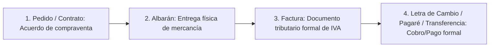
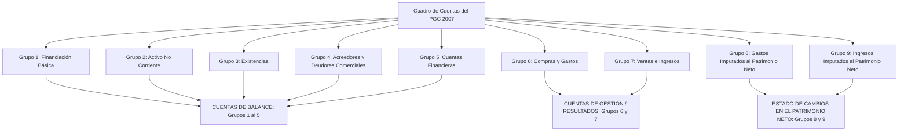

# 📊 Contabilidad Financiera I — Tema 3: El Método Contable y la Partida Doble

- **Asignatura:** Contabilidad Financiera I (Cód. 2344)
- **Titulación:** Grado en ADE — Facultad de Economía y Empresa (Universidad de Murcia)
- **Tema:** Tema 3 — El Método Contable, La Cuenta, El Convenio de Cargo/Abono y el Cuadro de Cuentas del PGC
- **Material de Referencia:** Diapositivas Oficiales UMU (`Tema_3_ADE_CF_I__alumnos.pdf`)
- **Enfoque:** Guía integral con rigor académico, diagramas explicativos, reglas mnemotécnicas y resolución paso a paso de los casos prácticos vistos en clase (*La Puerta Roja*, constitución de sociedades, compras a crédito y cuadros de cuentas).

---

## 📑 Índice de Contenidos

1. [Los Hechos Contables y el Principio de Dualidad](#1-los-hechos-contables-y-el-principio-de-dualidad)
   - 1.1. [¿Qué se registra y qué no se registra?](#11-qué-se-registra-y-qué-no-se-registra)
   - 1.2. [Tipología: Permutativos, Modificativos y Mixtos](#12-tipología-de-hechos-contables)
2. [Los Documentos Contables y Justificantes](#2-los-documentos-contables-y-justificantes)
   - 2.1. [Circuito Documental Mercantil](#21-circuito-documental-mercantil)
   - 2.2. [Contratos, Albaranes, Facturas y Efectos Comerciales](#22-contratos-albaranes-facturas-y-efectos-comerciales)
3. [El Proceso de Registro: La Cuenta](#3-el-proceso-de-registro-la-cuenta)
   - 3.1. [Concepto y Estructura en forma de "T"](#31-concepto-y-estructura-en-forma-de-t)
   - 3.2. [Terminología Oficial Obligatoria (Vocabulario Técnico)](#32-terminología-oficial-obligatoria)
   - 3.3. [El Convenio Fundamental de Cargo y Abono](#33-el-convenio-fundamental-de-cargo-y-abono)
4. [Anotaciones en los Libros Contables: Diario y Mayor](#4-anotaciones-en-los-libros-contables-diario-y-mayor)
   - 4.1. [Estructura del Asiento de Diario](#41-estructura-del-asiento-de-diario)
   - 4.2. [Paso de la Información del Diario al Mayor](#42-paso-de-la-información-del-diario-al-mayor)
   - 4.3. [Casos Prácticos Resueltos en Diario y Mayor](#43-casos-prácticos-resueltos-en-diario-y-mayor)
5. [Caso Práctico Integral: "La Puerta Roja de Maruja Arden" S.L.](#5-caso-práctico-integral-la-puerta-roja)
6. [El Cuadro de Cuentas del Plan General de Contabilidad (PGC 2007)](#6-el-cuadro-de-cuentas-del-pgc-2007)
   - 6.1. [Estructura Decimal y Codificación (Grupo, Subgrupo, Cuenta, Subcuenta)](#61-estructura-decimal-y-codificación)
   - 6.2. [Los 9 Grupos del Cuadro de Cuentas](#62-los-9-grupos-del-cuadro-de-cuentas)
   - 6.3. [Correspondencia Directa entre Grupos del PGC y el Balance de Situación](#63-correspondencia-directa-entre-grupos-del-pgc-y-el-balance)

---

## 1. Los Hechos Contables y el Principio de Dualidad

> 💡 **Definición de Hecho Contable:**  
> Son todos aquellos actos, eventos o transacciones de naturaleza económica que afectan de forma **directa y cuantificable** al patrimonio de la empresa (alterando su cuantía monetaria global o modificando la composición cualitativa de sus elementos).

### Principio de Dualidad (Partida Doble)
Cada hecho contable genera **siempre un doble efecto correlativo** en la ecuación patrimonial. No existe causa sin efecto:
$$\mathbf{\text{ACTIVO} = \text{PASIVO} + \text{PATRIMONIO NETO}}$$

- Si aumenta un Activo ($+A$), necesariamente debe ocurrir:
  - Una disminución de otro Activo ($-A$) $\longrightarrow$ *Comprar un coche al contado*.
  - Un aumento de un Pasivo ($+P$) $\longrightarrow$ *Comprar un coche pidiendo un préstamo*.
  - Un aumento del Patrimonio Neto ($+PN$) $\longrightarrow$ *Aportación inicial de los socios o una venta con beneficio*.

---

### 1.1. ¿Qué se registra y qué no se registra?

| Situación / Evento | ¿Afecta a la Ecuación Contable? | ¿Se registra contablemente? | Criterio Técnico |
| :--- | :---: | :---: | :--- |
| **Comprar un ordenador al contado o a crédito** | **SÍ** | **SÍ** | Hay entrega de un bien y salida de dinero o asunción de una deuda. |
| **Recibir un presupuesto o cotización publicitaria** | **NO** | **NO** | Es una simple propuesta informativa; no genera derecho ni obligación exigible. |
| **Firmar un contrato laboral con un nuevo empleado** | **NO** | **NO** | No surge obligación económica hasta que el empleado devengue días de trabajo (nómina). |
| **Pago mensual de los salarios devengados** | **SÍ** | **SÍ** | Disminuye la tesorería ($-A$) y extingue la deuda con los trabajadores ($-P$). |
| **Pedir un catálogo de precios a un proveedor** | **NO** | **NO** | No hay transmisión patrimonial ni efecto monetario alguno. |

---

### 1.2. Tipología de Hechos Contables

1. **Hechos Permutativos:** Modifican la **composición cualitativa** del patrimonio sin alterar el importe total del Patrimonio Neto.  
   *(Ej: Retirar dinero del banco para ingresarlo en caja; comprar una furgoneta al contado; pagar una deuda bancaria).*
2. **Hechos Modificativos:** Alteran la **cuantía cuantitativa** del Patrimonio Neto (por generación de beneficios / ingresos o pérdidas / gastos).  
   *(Ej: Pago de una multa fiscal que reduce tesorería y reduce neto; cobro de un servicio de asesoramiento con beneficio).*
3. **Hechos Mixtos:** Combinan una permutación de elementos con una variación efectiva en el Patrimonio Neto.  
   *(Ej: Venta de un vehículo por $8.000$ € cuyo coste contable era de $6.000$ €, generando una plusvalía o beneficio de $2.000$ €).*

---

## 2. Los Documentos Contables y Justificantes

Toda anotación contable debe estar amparada por un **justificante formal o soporte documental legítimo** que acredite la veracidad de la transacción ante auditorías, administraciones tributarias y juzgados.



### 2.2. Contratos, Albaranes, Facturas y Efectos Comerciales

1. **Contrato u Órdenes de Pedido:** Acuerdo formal entre comprador y vendedor donde se estipulan las condiciones (artículos, precios, plazos y condiciones de entrega).
2. **Albarán (Nota de Entrega):** Documento físico descriptivo que acompaña a las mercancías durante el transporte. El comprador lo firma para confirmar la recepción conforme del pedido.
3. **Factura Mercantil:** Documento regulado por el Reglamento de Facturación y la **Ley del IVA**. Es el soporte legal indispensable para deducir el gasto y el IVA soportado.  
   *Contenido obligatorio:* Fecha y número correlativo, datos identificativos de emisor y receptor (Nombre/Razón Social y NIF), descripción de la operación, base imponible, tipo de IVA aplicado y total a pagar.
4. **Instrumentos Formales de Giro (Letra de Cambio y Pagaré):** Documentos cambiarios regulados por la *Ley Cambiaria y del Cheque*. Otorgan una garantía ejecutiva privilegiada para exigir el cobro judicial en caso de impago a su vencimiento.

---

## 3. El Proceso de Registro: La Cuenta

### 3.1. Concepto y Estructura en forma de "T"

> 🏛️ **Concepto de Cuenta:**  
> Es el instrumento básico de representación, clasificación y valoración que utiliza la contabilidad para seguir de forma individualizada la **situación inicial y las variaciones sucesivas (aumentos y disminuciones)** de cada elemento patrimonial.

Gráficamente se representa con un esquema en forma de **"T"**:

```
                       TITULO DE LA CUENTA
        DEBE (Parte Izquierda)   │   HABER (Parte Derecha)
    ─────────────────────────────┼─────────────────────────────
                                 │
     (Anotaciones en el Debe)    │    (Anotaciones en el Haber)
                                 │
```

---

### 3.2. Terminología Oficial Obligatoria

En contabilidad universitaria y profesional cada acción tiene un nombre técnico preciso que es imprescindible dominar:

| Término Técnico | Definición Oficial |
| :--- | :--- |
| **Abrir una cuenta** | Asignar el nombre o título a la cuenta y realizar en ella la **primera anotación**, que representará el valor inicial del elemento patrimonial. |
| **Cargar (o Adeudar)** | Realizar una anotación en el **DEBE** (parte izquierda) de la cuenta. |
| **Abonar (o Acreditar)** | Realizar una anotación en el **HABER** (parte derecha) de la cuenta. |
| **Saldo ($\sum D - \sum H$)** | Diferencia matemática entre la suma de todas las anotaciones del Debe y la suma de todas las del Haber: |
| • **Saldo Deudor ($S_d$)** | Cuando la suma del Debe es mayor que la suma del Haber ($\sum D > \sum H$). |
| • **Saldo Acreedor ($S_a$)** | Cuando la suma del Haber es mayor que la suma del Debe ($\sum H > \sum D$). |
| • **Saldo Cero o Nulo ($S_0$)** | Cuando ambas partes suman exactamente lo mismo ($\sum D = \sum H$). |
| **Saldar una cuenta** | Anotar el saldo obtenido en el lado que sume menos, para lograr que la suma del Debe y la suma del Haber queden matemáticamente iguales. |
| **Cerrar una cuenta** | Trazar una doble línea horizontal tras saldar la cuenta, certificando el fin del ejercicio contable. |
| **Reapertura de la cuenta** | Anotar el saldo en el lado original al inicio del siguiente ejercicio económico para continuar con su registro. |

---

### 3.3. El Convenio Fundamental de Cargo y Abono

Para que la ecuación $\text{Activo} = \text{Pasivo} + \text{Patrimonio Neto}$ se conserve intacta en cada registro, se aplica universalmente el siguiente convenio:

```
          CUENTAS DE ACTIVO                       CUENTAS DE PASIVO Y PATRIMONIO NETO
       DEBE (+)        HABER (-)                     DEBE (-)            HABER (+)
──────────────────┬──────────────────        ──────────────────────┬──────────────────
• Valor Inicial   │ • Salidas o              • Salidas o           │ • Valor Inicial
• Entradas o      │   Disminuciones            Disminuciones       │ • Entradas o
  Aumentos        │                            de deudas           │   Aumentos
                  │                                                │
Saldo normal:     │                          Saldo normal:         │
DEUDOR (Sd) o 0   │                          ACREEDOR (Sa) o 0     │
```

> [!IMPORTANT]
> ### 🧠 Regla Mnemotécnica de Oro:
> - **Activo:** Nace y crece por la **izquierda (DEBE)**; disminuye por la **derecha (HABER)**.
> - **Pasivo y Patrimonio Neto:** Nacen y crecen por la **derecha (HABER)**; disminuyen por la **izquierda (DEBE)**.
> - **En todo hecho contable:** $\sum \text{Cargos (Debe)} = \sum \text{Abonos (Haber)}$.

---

## 4. Anotaciones en los Libros Contables: Diario y Mayor

La contabilidad utiliza dos libros principales obligatorios (Art. 28 Código de Comercio):
- **Libro Diario:** Registra las operaciones en **orden cronológico estricto**, día a día, mediante asientos contables.
- **Libro Mayor:** Agrupa sistemáticamente los movimientos de cada cuenta en forma de "T", facilitando el conocimiento del saldo de cada elemento y la elaboración del balance.

### 4.1. Estructura del Asiento de Diario

El formato clásico y estándar del asiento contable es:

```
────────────────────────────────── Fecha ──────────────────────────────────
(Importe en Debe)  (Cuenta Cargada)   a   (Cuenta Abonada)  (Importe en Haber)
                   Concepto o descripción de la operación
───────────────────────────────────────────────────────────────────────────
```

O en el **formato tabular / electrónico (Modelo Italiano)** utilizado en las aplicaciones y exámenes:

| Asiento | Fecha | Cuenta (Debe) | Cuenta (Haber) | DEBE (€) | HABER (€) |
| :---: | :---: | :--- | :--- | :---: | :---: |
| 1 | 01/01/2026 | (570) Caja, euros | | 3.000 | |
| | | | (100) Capital Social | | 3.000 |

---

### 4.2. Casos Prácticos Resueltos en Diario y Mayor

#### Caso 1: Constitución de una sociedad
*Enunciado:* Se constituye una Sociedad Limitada aportando los socios $3.000$ € en efectivo que se ingresan en la caja de la empresa.
- **Análisis:**
  - Entra dinero físico: Activo $\to$ Cuenta *(570) Caja, euros* aumenta ($+A$) $\longrightarrow$ Se anota en el **DEBE**.
  - Aportación de socios: Patrimonio Neto $\to$ Cuenta *(100) Capital Social* aumenta ($+PN$) $\longrightarrow$ Se anota en el **HABER**.

*Asiento en Diario:*
```
3.000  (570) Caja, euros
           a  (100) Capital social              3.000
```

*Representación en Mayor:*
```
       (570) Caja, euros                       (100) Capital social
    DEBE      │     HABER                  DEBE      │     HABER
──────────────┼──────────────          ──────────────┼──────────────
(1) 3.000     │                                      │  3.000 (1)
```

---

#### Caso 2: Concesión de un préstamo bancario
*Enunciado:* La empresa solicita y recibe un préstamo bancario de $500$ € a devolver dentro de 3 años, ingresándose el dinero en la cuenta corriente bancaria de la empresa.
- **Análisis:**
  - Entra dinero en el banco: Activo $\to$ *(572) Bancos c/c* aumenta ($+A$) $\longrightarrow$ **DEBE**.
  - Nueva deuda a devolver en 3 años ($> 1$ año): Pasivo No Corriente $\to$ *(170) Deudas a L/P con entidades de crédito* aumenta ($+P$) $\longrightarrow$ **HABER**.

*Asiento en Diario:*
```
  500  (572) Bancos c/c
           a  (170) Deudas a L/P con ent. crédito 500
```

---

#### Caso 3: Compra de mercaderías al contado
*Enunciado:* Se compran mercaderías para la venta por importe de $500$ €, pagándose en efectivo de la caja.
- **Análisis:**
  - Entran mercaderías en almacén: Activo $\to$ *(300) Mercaderías* aumenta ($+A$) $\longrightarrow$ **DEBE**.
  - Sale dinero en efectivo: Activo $\to$ *(570) Caja, euros* disminuye ($-A$) $\longrightarrow$ **HABER**.

*Asiento en Diario:*
```
  500  (300) Mercaderías
           a  (570) Caja, euros                   500
```

---

#### Caso 4: Traspaso de efectivo al banco
*Enunciado:* El dinero restante que queda en la caja ($3.000 - 500 = 2.500$ €) se ingresa en la cuenta corriente del banco.
- **Análisis:**
  - Entra dinero al banco: Activo $\to$ *(572) Bancos c/c* aumenta ($+A$) $\longrightarrow$ **DEBE**.
  - Sale dinero de la caja: Activo $\to$ *(570) Caja, euros* disminuye ($-A$) $\longrightarrow$ **HABER**.

*Asiento en Diario:*
```
2.500  (572) Bancos c/c
           a  (570) Caja, euros                 2.500
```

*Estado Final de la cuenta (570) Caja, euros en el Mayor:*
```
              (570) Caja, euros
        DEBE          │         HABER
──────────────────────┼──────────────────────
(1)     3.000         │           500  (3)
                      │         2.500  (4)
──────────────────────┼──────────────────────
Total Debe:   3.000   │  Total Haber: 3.000
             Saldo Cero (So) = 0 €
```

---

## 5. Caso Práctico Integral: "La Puerta Roja de Maruja Arden" S.L.

En el temario oficial de la Universidad de Murcia se analiza el caso completo de apertura y operaciones de un centro de bienestar (*spa*):

### Transacciones Cronológicas:

1. **Constitución:** Se constituye la sociedad con un capital de $65.000$ € en efectivo.
   - *Diario:* $65.000$ (570) Caja, euros  **a**  (100) Capital Social $65.000$.
2. **Préstamo Bancario:** BBVA concede préstamo a 6 meses por $100.000$ € ingresado en la cuenta corriente bancaria.
   - *Diario:* $100.000$ (572) Bancos c/c  **a**  (520) Deudas a C/P con entidades de crédito $100.000$.
3. **Adquisición de Terrenos:** Se compran terrenos en un polígono por $200.000$ €. Se pagan $100.000$ € por banco y el resto ($100.000$ €) a pagar dentro de 2 años.
   - *Diario:* $200.000$ (210) Terrenos y bienes naturales  
     **a**  (572) Bancos c/c $100.000$  
     **a**  (173) Proveedores de inmovilizado a L/P $100.000$.
4. **Compra de Mobiliario y Equipamiento:** Mostrador, mesas y camillas por $60.000$ €. Se pagan $45.000$ € en efectivo (caja) y por los $15.000$ € restantes se acepta una letra de cambio a 6 meses.
   - *Diario:* $60.000$ (216) Mobiliario  
     **a**  (570) Caja, euros $45.000$  
     **a**  (525) Efectos a pagar a corto plazo $15.000$.
5. **Amortización parcial de préstamo:** Devuelve $5.000$ € del préstamo en efectivo de caja.
   - *Diario:* $5.000$ (520) Deudas a C/P con ent. crédito  **a**  (570) Caja, euros $5.000$.
6. **Inversión Financiera en Acciones:** Compra acciones de *Bodegas Riojanas* en bolsa al contado por $2.000$ € en efectivo.
   - *Diario:* $2.000$ (540) Inversiones financieras a C/P en instrumentos de patrimonio  **a**  (570) Caja, euros $2.000$.

---

### Balance de Situación Final de "La Puerta Roja"

```
          ACTIVO (Estructura Económica)         |        PASIVO Y PN (Estructura Financiera)
================================================+===================================================
A) ACTIVO NO CORRIENTE                260.000 € | A) PATRIMONIO NETO                        65.000 €
   • Terrenos y bienes naturales:     200.000 € |    • Capital Social:                      65.000 €
   • Mobiliario:                       60.000 € | 
                                                | B) PASIVO NO CORRIENTE (L/P)             100.000 €
B) ACTIVO CORRIENTE                    15.000 € |    • Proveedores de inmovilizado L/P:    100.000 €
   • Inversiones financieras C/P:       2.000 € | 
   • Tesorería (Caja, euros):          13.000 € | C) PASIVO CORRIENTE (C/P)                110.000 €
   • Tesorería (Bancos c/c):                0 € |    • Deudas a C/P con ent. crédito:       95.000 €
                                                |    • Efectos a pagar a corto plazo:       15.000 €
------------------------------------------------+---------------------------------------------------
TOTAL ACTIVO:                         275.000 € | TOTAL PATRIMONIO NETO Y PASIVO:          275.000 €
```

$$\mathbf{\text{Verificación: } 275.000\text{ € (Activo)} = 210.000\text{ € (Pasivo Total)} + 65.000\text{ € (Patrimonio Neto)} \quad \checkmark}$$

---

## 6. El Cuadro de Cuentas del Plan General de Contabilidad (PGC 2007)

El Cuadro de Cuentas (4.ª Parte del PGC) es la guía normalizada que asigna una denominación técnica y un código numérico a cada elemento contable. Aunque es de aplicación facultativa (no obligatoria), es el estándar absoluto adoptado por empresas, asesores y universidades españolas.

### 6.1. Estructura Decimal y Codificación

El PGC sigue un sistema de codificación decimal jerárquico que permite un desglose sistemático:

$$\underbrace{5}_{\text{Grupo}} \longrightarrow \underbrace{52}_{\text{Subgrupo}} \longrightarrow \underbrace{520}_{\text{Cuenta}} \longrightarrow \underbrace{5208}_{\text{Subcuenta}}$$

- **Grupo (1 dígito):** `5` $\longrightarrow$ Cuentas Financieras.
- **Subgrupo (2 dígitos):** `52` $\longrightarrow$ Deudas a corto plazo por préstamos recibidos y otros conceptos.
- **Cuenta (3 dígitos):** `520` $\longrightarrow$ Deudas a corto plazo con entidades de crédito.
- **Subcuenta (4 o más dígitos):** `5208` $\longrightarrow$ Deudas por efectos descontados.

---

### 6.2. Los 9 Grupos del Cuadro de Cuentas



| Grupo | Título Oficial PGC | Contenido Principal | Masa Patrimonial |
| :---: | :--- | :--- | :--- |
| **Grupo 1** | **Financiación Básica** | Recursos propios (Capital, Reservas) y recursos ajenos a largo plazo (Préstamos L/P). | **Patrimonio Neto y Pasivo No Corriente** |
| **Grupo 2** | **Activo No Corriente** | Inmovilizado material, intangible, inversiones inmobiliarias y financieras a L/P. | **Activo No Corriente** |
| **Grupo 3** | **Existencias** | Mercaderías, materias primas, productos en curso y productos terminados. | **Activo Corriente** |
| **Grupo 4** | **Acreedores y Deudores Comerciales** | Deudas y créditos derivados del tráfico operativo habitual (Proveedores, Clientes, AAPP). | **Activo Corriente y Pasivo Corriente** |
| **Grupo 5** | **Cuentas Financieras** | Medios líquidos (Caja, Bancos), deudas financieras a C/P e inversiones temporales. | **Activo Corriente y Pasivo Corriente** |
| **Grupo 6** | **Compras y Gastos** | Aprovisionamientos de materias primas, nóminas de personal, suministros, tributos y amortizaciones. | **Pérdidas y Ganancias (Gasto)** |
| **Grupo 7** | **Ventas e Ingresos** | Ventas de mercaderías, prestaciones de servicios y otros ingresos de gestión. | **Pérdidas y Ganancias (Ingreso)** |
| **Grupo 8** | **Gastos imputados al PN** | Variaciones de valor negativas imputadas directamente a fondos propios. | **Patrimonio Neto** |
| **Grupo 9** | **Ingresos imputados al PN** | Subvenciones no reintegrables e ingresos imputados al patrimonio neto. | **Patrimonio Neto** |

---

### 6.3. Correspondencia Directa entre Grupos del PGC y el Balance

El Balance de Situación se conforma exclusivamente con los **Grupos 1, 2, 3, 4 y 5**:

```
                  ESTRUCTURA DEL BALANCE DE SITUACIÓN
┌──────────────────────────────────────┬──────────────────────────────────────┐
│                ACTIVO                │       PATRIMONIO NETO Y PASIVO       │
├──────────────────────────────────────┼──────────────────────────────────────┤
│ ACTIVO NO CORRIENTE:                 │ PATRIMONIO NETO:                     │
│   • GRUPO 2                          │   • GRUPO 1 (Subgrupos 10, 11, 12, 13)│
│                                      ├──────────────────────────────────────┤
│                                      │ PASIVO NO CORRIENTE (Largo Plazo):   │
│                                      │   • GRUPO 1 (Subgrupos 14, 15, 16, 17)│
├──────────────────────────────────────┼──────────────────────────────────────┤
│ ACTIVO CORRIENTE:                    │ PASIVO CORRIENTE (Corto Plazo):      │
│   • GRUPO 3 (Existencias)            │   • GRUPO 4 (Proveedores, Acreedores)│
│   • GRUPO 4 (Clientes, Deudores)     │   • GRUPO 5 (Deudas financieras C/P) │
│   • GRUPO 5 (Tesorería, Inv. C/P)    │                                      │
└──────────────────────────────────────┴──────────────────────────────────────┘
```
