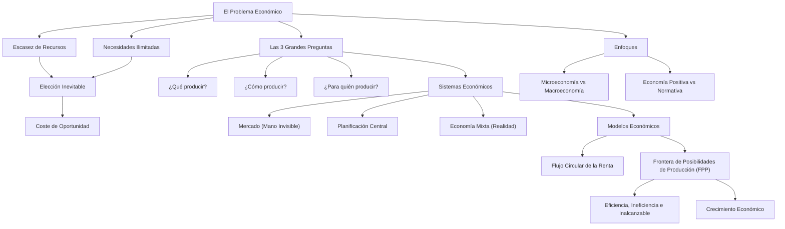

# 🌐 Tema 1: Aspectos Básicos de una Ciencia Social
### Asignatura: Introducción a la Economía I (Cód. 2343) — 1.º Grado en ADE
**Facultad de Economía y Empresa — Universidad de Murcia**  
*Material oficial adaptado con explicaciones pedagógicas, ejemplos intuitivos y esquemas visuales.*

---

## 🧭 Mapa Mental del Tema 1



---

## 1. El Problema Económico Fundamental: Escasez y Elección

### 1.1. ¿Qué es la Economía?
La palabra economía proviene del griego *oikonomos* (el que administra el hogar). Al igual que una familia debe decidir quién cocina, quién limpia y en qué gastar el sueldo, la sociedad debe decidir cómo distribuir sus recursos.

> 💡 **Definición formal:**  
> La **Economía** es la ciencia social que estudia el modo en que la sociedad gestiona sus **recursos escasos** para producir bienes y servicios y distribuirlos entre los diferentes individuos con fines alternativos.

### 1.2. El motor de la economía: Escasez relativa
* **Necesidades humanas ilimitadas:** Los deseos y necesidades de bienes (comida, vivienda, viajes, tecnología, sanidad) no tienen fin.
* **Recursos económicos limitados:** La cantidad de tiempo, trabajadores, tierra fértil, máquinas y materias primas es finita.
* **Resultado:** **La escasez**. Nunca se puede producir todo lo que a la gente le gustaría tener.

### 1.3. La Elección y el Coste de Oportunidad
Dado que los recursos son escasos, **elegir es inevitable**. Al elegir una opción, obligatoriamente debemos renunciar a otra.

> ⭐ **Concepto Clave — Coste de Oportunidad:**  
> El **coste de oportunidad** de una decisión es el **valor de la mejor alternativa a la que se renuncia** para conseguir algo.

#### Ejemplos reales e intuitivos:
1. **Estudiar en la Universidad:** El coste de estudiar ADE no es solo la matrícula y los libros; el coste de oportunidad más grande es el sueldo que dejas de ganar trabajando a jornada completa durante esos 4 años.
2. **El sábado por la tarde:** Si decides salir de fiesta, el coste de oportunidad es la tarde de estudio productivo (o el descanso) que sacrificas.
3. **Decisión empresarial:** Si una empresa destina $50.000$ € a comprar una furgoneta nueva, el coste de oportunidad es la campaña de publicidad o la maquinaria que no pudo comprar con ese dinero.

### 1.4. Los Incentivos
Los seres humanos somos racionales en términos económicos: comparamos los **costes marginales** y los **beneficios marginales** de cada acción.
* *"Los individuos responden a los incentivos"*: Si sube el precio de la gasolina, la gente usa más el transporte público o comparte coche; si el gobierno subvenciona las placas solares, más hogares las instalan.

---

## 2. Las Tres Preguntas Clave y los Sistemas Económicos

Cualquier sociedad humana, desde una tribu ancestral hasta una potencia moderna, debe resolver tres preguntas fundamentales:

| Pregunta Económica | Significado Práctico | Ejemplo |
| :--- | :--- | :--- |
| **1. ¿Qué producir?** | ¿Qué bienes y servicios se van a fabricar y en qué cantidad? | ¿Producimos más hospitales o más autovías? ¿Más comida ecológica o ropa barata? |
| **2. ¿Cómo producir?** | ¿Con qué recursos, técnicas y tecnología se organizará la producción? | ¿Energía solar o nuclear? ¿Mano de obra intensiva o robots automatizados? |
| **3. ¿Para quién producir?** | ¿Cómo se distribuirá el fruto de la producción entre los ciudadanos? | ¿Quién recibe los bienes: quien pueda pagarlos en el mercado o por reparto estatal? |

### Los Tres Sistemas Económicos

```
[ Planificación Central Pura ] <──────── [ Economía Mixta ] ────────> [ Libre Mercado Puro ]
  (Control estatal total)                 (Europa / España)               (Mano invisible sin Estado)
```

#### A. Economía de Mercado (Capitalismo descentralizado)
* **¿Quién decide?** Millones de empresas y familias de forma libre y descentralizada a través del mercado.
* **El mecanismo coordinador:** **Los Precios**. Si un producto es muy deseado, su precio sube, lo que anima a las empresas a producir más. Si nadie lo quiere, su precio cae y se deja de fabricar.
* **Adam Smith y la "Mano Invisible" (1776, *La Riqueza de las Naciones*):** Cuando cada individuo busca de manera egoísta su propio beneficio (el panadero no nos da pan por caridad, sino para ganar dinero), el sistema de precios coordina a todos logrando el bienestar general de la sociedad, como guiados por una mano invisible.

#### B. Economía de Planificación Central (Comunismo / Socialismo soviético)
* **¿Quién decide?** Un órgano central del Gobierno (un planificador central). Decide qué fábricas abren, qué cantidad de zapatos se hacen, qué precio tienen y quién trabaja en cada puesto.
* **¿Por qué fracasó históricamente en la URSS y Europa del Este?**
  1. **Falta de información:** Ningún burócrata puede conocer las necesidades y gustos de millones de personas ni los costes de miles de fábricas sin precios de mercado.
  2. **Ausencia de incentivos:** Si los trabajadores y directivos cobran lo mismo produzcan bien o mal, no hay motivación para innovar, esforzarse ni cuidar la calidad.

#### C. Economía Mixta (El mundo contemporáneo)
* Es la realidad de casi todos los países del mundo (España, UE, etc.).
* La asignación básica se realiza a través del **mercado y los precios**, pero el **Estado interviene** con leyes, impuestos, sanidad/educación pública y regulación para corregir los fallos del mercado y asegurar una red de seguridad social.

---

## 3. El Papel del Estado: Eficiencia vs Equidad y Fallos de Mercado

El economista Arthur Okun comparó la economía con una tarta:
* **Eficiencia:** Propiedad por la que la sociedad aprovecha de la mejor manera posible sus recursos escasos (**hacer la tarta lo más grande posible**).
* **Equidad:** Propiedad por la que la riqueza se distribuye de manera justa entre los miembros de la sociedad (**cómo repartir las porciones de la tarta**).

> ⚖️ **La Disyuntiva Eficiencia vs Equidad:**  
> A menudo, las políticas públicas se enfrentan a un dilema: si cobramos impuestos muy altos a los que más ganan para repartir subsidios a los más pobres (más equidad), reducimos el incentivo a trabajar e invertir, con lo que la producción total disminuye (la tarta se encoge).

### ¿Por qué debe intervenir el Estado en una economía de mercado?

1. **Garantizar los Derechos de Propiedad:** El mercado solo funciona si la ley protege a las personas: un agricultor no sembrará trigo si sabe que se lo robarán sin consecuencias. Hacen falta policía, juzgados y leyes claras.
2. **Fomentar la Equidad:** El mercado libre retribuye según la capacidad de generar valor comercial; una persona enferma, anciana o sin empleo quedaría desamparada sin pensiones o sanidad pública.
3. **Corregir los Fallos de Mercado:** Situaciones donde el mercado libre por sí solo **no asigna los recursos de forma eficiente**:
   * **Poder de mercado (Competencia imperfecta):** Cuando una sola empresa (monopolio) o unas pocas (oligopolio) pueden fijar precios abusivos reduciendo la producción.
   * **Externalidades:** Impactos de una actividad sobre terceros no reflejados en el precio (ej. contaminación de una fábrica = externalidad negativa; investigación médica = externalidad positiva).
   * **Bienes Públicos:** Bienes que no se pueden cobrar individualmente y benefician a todos a la vez (defensa nacional, faros de mar, alumbrado público).
   * **Información Asimétrica:** Cuando una parte sabe mucho más que la otra (coches de segunda mano defectuosos, seguros de salud).

---

## 4. La Ciencia Económica y el Papel de los Modelos

La economía es una **ciencia empírica**: utiliza el método científico (observa la realidad, formula hipótesis, elabora modelos teóricos y contrasta con datos estadísticos reales).

### 4.1. El Papel de los Supuestos y la Cláusula *Ceteris Paribus*
El mundo real es inmensamente complejo. Para poder entenderlo, los economistas utilizan **supuestos simplificadores** que eliminan los detalles accesorios para centrarse en lo esencial.

> 🗺️ **La Metáfora del Mapa de Borges:**  
> Un mapa a escala 1:1 que reproduzca cada árbol y cada piedra de un país sería idéntico a la realidad, pero totalmente inútil para orientarse. Un buen modelo económico es como un mapa de carreteras o de metro: omite edificios y relieves para permitirte ver con claridad la ruta.  
> *"Todos los modelos son falsos (porque son simplificaciones), pero algunos son inmensamente útiles."*

* **Cláusula *Ceteris Paribus*:** Expresión latina que significa *"permaneciendo todo lo demás constante"*. Al estudiar cómo afecta la subida del precio de la gasolina al consumo de combustible, suponemos que la renta de las familias, el precio de los coches y los gustos no cambian.

---

## 5. Dos Modelos Fundamentales

### Modelo 1: El Diagrama del Flujo Circular de la Renta
Muestra cómo interactúan las familias y las empresas en dos mercados distintos:

```text
                  ┌─────────────────────────────────────────┐
                  │    MERCADO DE BIENES Y SERVICIOS        │
                  │  (Empresas venden / Familias compran)   │
                  └────────────────────┬────────────────────┘
                          ▲            │
         Gasto de las     │            │ Bienes y servicios
          familias (€)    │            ▼ comprados
                     ┌────┴────────────┴────┐
                     │       HOGARES        │
                     │     (Familias)       │
                     └────┬────────────▲────┘
        Factores de       │            │ Renta recibida
        producción        │            │ (Salarios, alquileres,
        (Trabajo, Tierra, │            │  beneficios en €)
         Capital)         ▼            │
                  ┌────────────────────┴────────────────────┐
                  │   MERCADO DE FACTORES DE PRODUCCIÓN     │
                  │  (Familias venden / Empresas contratan) │
                  └────────────────────▲────────────────────┘
                          │            │
            Factores de   │            │ Pago a factores (€)
            producción    │            │
            contratados   ▼            │
                     ┌─────────────────┴────┐
                     │       EMPRESAS       │
                     └──────────────────────┘
```

* **Flujo Real (físico):** Los factores productivos van de los hogares a las empresas; los bienes y servicios van de las empresas a los hogares.
* **Flujo Monetario (financiero):** El dinero circula exactamente en **sentido contrario**.

---

### Modelo 2: La Frontera de Posibilidades de Producción (FPP)

> 📈 **Definición:**  
> Gráfico que muestra las **cantidades máximas de producción combinada** que puede obtener una economía con los factores de producción y la tecnología disponibles.

#### El Ejemplo Oficial: Robinson Crusoe en su Isla
Robinson tiene un único factor de producción: su **tiempo de trabajo** (máximo 4 horas al día). Puede producir dos bienes: **Peces** y **Cocos**.

| Opción | Horas Pesca ($H_p$) | Horas Cocos ($H_c$) | Producción Peces | Producción Cocos | Coste de Oportunidad Marginal |
| :---: | :---: | :---: | :---: | :---: | :---: |
| **A** | 0 h | 4 h | **0** | **18** | — |
| **B** | 1 h | 3 h | **1** | **17** | Pasar de 0 a 1 pez cuesta **1 coco** (18 - 17) |
| **C** | 2 h | 2 h | **2** | **14** | Pasar de 1 a 2 peces cuesta **3 cocos** (17 - 14) |
| **D** | 3 h | 1 h | **3** | **9** | Pasar de 2 a 3 peces cuesta **5 cocos** (14 - 9) |
| **E** | 4 h | 0 h | **4** | **0** | Pasar de 3 a 4 peces cuesta **9 cocos** (9 - 0) |

```text
Cocos
 18 ┼─── A
 17 ┼─────── B
    │         \
 14 ┼─────────── C       • P (Punto Inalcanzable con la tecnología actual)
    │             \
  9 ┼─────────────── D
    │                 \
    │      • I         \
    │ (Punto Ineficiente\
    │  - recursos ociosos\
  0 ┼───────────────────── E ──────── Peces
    0    1   2     3       4
```

#### Interpretación de las Zonas de la FPP:
1. **Puntos Sobre la Frontera (A, B, C, D, E):** Son **EFICIENTES**. La economía usa todos los recursos disponibles al 100% con la mejor tecnología posible. Para producir más de un bien, forzosamente hay que renunciar a parte del otro.
2. **Puntos en el Interior (Punto I):** Son **INEFICIENTES**. Hay recursos ociosos (desempleo, fábricas paradas, tierras sin cultivar) o una mala organización técnica. Se puede aumentar la producción de ambos bienes sin renunciar a nada simplemente usando los recursos que estaban parados.
3. **Puntos en el Exterior (Punto P):** Son **INALCANZABLES** en el presente. La economía no tiene suficientes horas de trabajo, recursos o tecnología para llegar a ellos.

#### ¿Por qué la FPP es Cóncava (combada hacia afuera)?
* Se debe a la **Ley de los Costes de Oportunidad Crecientes**: los recursos no son perfectamente adaptables a todos los usos.
* Al principio, Robinson dedica a pescar la hora en que es más fácil pescar (aguas poco profundas); pero para sacar el cuarto pez tiene que dejar de recoger cocos en los mejores árboles y adentrarse en el mar, sacrificando cada vez más cocos (1 coco $\to$ 3 $\to$ 5 $\to$ 9 cocos).
* *Excepción:* Si los recursos fueran perfectamente intercambiables, el coste de oportunidad sería constante y la FPP sería una **línea recta**.

#### Desplazamientos de la FPP (Crecimiento Económico):
La FPP se desplaza hacia afuera (crecimiento) por dos causas:
1. **Aumento de los factores de producción:** Más población activa (inmigración), más inversión en máquinas y capital, o nuevos recursos naturales.
2. **Mejora tecnológica:** Métodos más eficientes (ej. Robinson construye una escalera para coger cocos el doble de rápido, o inventa una red de pesca).

```text
Mejora tecnológica solo en Cocos            Mejora tecnológica en ambos (o más recursos)
Cocos                                       Cocos
  ▲                                           ▲
24├──┐ (Nueva FPP)                          24├──┐ (Nueva FPP)
18├──┼──┐ (FPP Original)                    18├──┼──┐ (FPP Original)
  │  │  │                                     │  │  │
  └──┴──┴────────► Peces                      └──┴──┴────────► Peces
     0  4                                        0  4  6
```

---

## 6. Ramas de la Economía y Tipos de Análisis

### 6.1. Microeconomía vs Macroeconomía

| Criterio | Microeconomía | Macroeconomía |
| :--- | :--- | :--- |
| **Objeto de estudio** | Decisiones individuales de familias, trabajadores y empresas. | Funcionamiento de la economía en su conjunto como sistema integrado. |
| **Variables clave** | Precio de un bien concreto, salario de un sector, cantidad producida por una empresa. | Producto Interior Bruto (PIB), Tasa de Desempleo, Inflación (IPC), Tipos de interés. |
| **Ejemplos ADE** | - ¿Cómo afecta la subida del precio del trigo a las panaderías de Murcia?<br>- ¿Cuánto cobrar por una entrada de cine? | - ¿Qué efecto tiene la subida de tipos del Banco Central Europeo en España?<br>- ¿Cómo reducir el paro juvenil nacional? |

### 6.2. Economía Positiva vs Economía Normativa

* **Economía Positiva (El Científico — "Lo que ES"):**  
  Busca describir y explicar la realidad objetiva mediante causas y efectos. **Puede contrastarse empíricamente con datos**.  
  *Ejemplo:* *"Si el gobierno sube el salario mínimo a 1.500 €, la contratación de jóvenes sin cualificación descenderá un 4%."* (Es una afirmación que se puede medir y comprobar si es cierta o falsa con estadísticas).

* **Economía Normativa (El Asesor Político — "Lo que DEBERÍA SER"):**  
  Emite juicios de valor, opiniones éticas y preferencias políticas sobre cómo reorganizar la sociedad. **No puede demostrarse científicamente**.  
  *Ejemplo:* *"El gobierno debería subir el salario mínimo porque es de justicia social que todos los trabajadores cobren un sueldo digno."* (Es un deseo u opinión ética respetable, pero indemostrable con un experimento físico).

---

## 📌 Resumen Ejecutivo para Repasar en 5 Minutos

1. La **Economía** nace de la contradicción entre recursos limitados y necesidades infinitas (**Escasez**).
2. Todo tiene un **Coste de Oportunidad**: lo que sacrificas al tomar una elección.
3. La **Mano Invisible** de Adam Smith muestra que el mercado libre coordina decisiones mediante precios.
4. El Estado interviene por tres motivos: **Derechos de propiedad**, **Equidad** y **Fallos de mercado** (monopolios, externalidades, bienes públicos).
5. La **FPP** ilustra: escasez, disyuntivas, coste de oportunidad creciente y eficiencia. Puntos dentro = ineficientes (paro); puntos fuera = inalcanzables.
6. **Micro** = partes individuales (precios, empresas); **Macro** = totales (PIB, desempleo, inflación).
7. **Positiva** = describe la realidad (datos); **Normativa** = prescribe cómo debería ser (juicios de valor).
