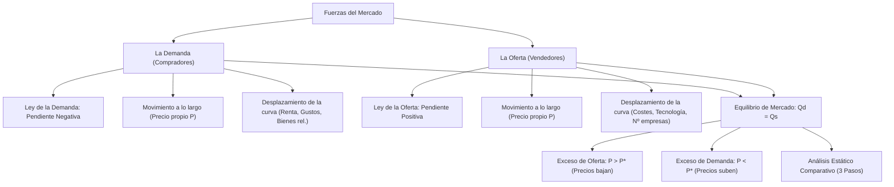

# 📊 Tema 2: Las Fuerzas de Mercado de la Oferta y la Demanda
### Asignatura: Introducción a la Economía I (Cód. 2343) — 1.º Grado en ADE
**Facultad de Economía y Empresa — Universidad de Murcia**  
*Guía conceptual y analítica completa adaptada con explicaciones paso a paso, gráficos explicados y álgebra clara.*

---

## 🧭 Mapa Conceptual del Tema 2



---

## 1. Los Mercados y la Competencia

Un **mercado** es un grupo de compradores y vendedores de un determinado bien o servicio.
* Los **compradores** determinan conjuntamente la **demanda** del producto.
* Los **vendedores** determinan conjuntamente la **oferta** del producto.

### Tipos de Estructuras de Mercado

| Estructura | Número de Empresas | Tipo de Producto | Control sobre el Precio | Ejemplo Real |
| :--- | :---: | :---: | :---: | :--- |
| **Competencia Perfecta** | Muchísimas | Totalmente homogéneo (idéntico) | **Ninguno (Precio-aceptantes)** | Mercado del trigo, lonja de pescado |
| **Monopolio** | **Una sola** | Único sin sustitutivos cercanos | **Total (Fijador de precios)** | Red ferroviaria (Adif), agua corriente local |
| **Oligopolio** | Unas pocas | Homogéneo o diferenciado | **Alto (Interdependencia estratégica)** | Telefonía móvil, refinerías de petróleo |
| **Competencia Monopolística** | Muchas | Diferenciado (marcas, calidad) | Leve sobre su propia marca | Restaurantes, ropa de moda, cafeterías |

> 🏷️ **El Mercado Competitivo (Nuestro modelo base):**  
> Es aquel en el que hay tantos compradores y tantos vendedores que ninguno de ellos de forma individual tiene poder para influir en el precio. Todos toman el precio fijado por el mercado como un dato dado (**precio-aceptantes**).

---

## 2. La Demanda

La **demanda** representa la cantidad de un bien que los compradores están dispuestos y tienen capacidad de comprar a los diferentes precios posibles.

### 2.1. La Ley de la Demanda
> 📉 **Ley de la Demanda:**  
> Manteniéndose todo lo demás constante (*ceteris paribus*), cuando el precio de un bien sube, la cantidad demandada disminuye; y cuando el precio baja, la cantidad demandada aumenta.  
> $$\frac{\Delta Q_d}{\Delta P} < 0$$

* **Causa económica:** Al subir el precio, el bien se vuelve relativamente más caro frente a alternativas (efecto sustitución) y el poder adquisitivo del consumidor se reduce (efecto renta).
* **Gráficamente:** La curva de demanda tiene **pendiente negativa** (decreciente de izquierda a derecha).

```text
Precio (P)
  ▲
6 ┼──┐ (Demanda individual)
5 ┼──┼──┐
4 ┼──┼──┼──┐
3 ┼──┼──┼──┼──┐
  │  │  │  │  │ \
  └──┴──┴──┴──┴──┴─────► Cantidad (Q)
     0  2  4  6  8
```

### 2.2. Demanda Individual vs Demanda de Mercado (Suma Horizontal)
La **demanda de mercado** es la suma de las demandas individuales de todos los consumidores que participan en ese mercado a cada nivel de precio.

* **Ejemplo con 2 consumidores:**
  * Si a $P = 3$ €, María compra $2$ unidades y Luis compra $3$ unidades:
  * A $P = 3$ €, la demanda del mercado es $Q_M = 2 + 3 = 5$ unidades.
* **Regla matemática:** Se suman siempre las **cantidades** ($q$), **nunca los precios**. Primero se despeja la cantidad $q = f(p)$ en cada consumidor y luego se suman:
  $$Q_{\text{Mercado}}(p) = q_1(p) + q_2(p) + \dots + q_n(p)$$

---

### 2.3. DISTINCIÓN CLAVE DE EXAMEN: Movimiento a lo largo vs Desplazamiento

```
                 MOVIMIENTO A LO LARGO                           DESPLAZAMIENTO DE LA CURVA
Precio                           Curva D         Precio                           D1    D2
  ▲                                                ▲                               \     \
P1┼────• A                                         │        • A          • B        \     \
  │     \                                          │         \            \          \     \
P2┼───────• B                                    P*┼──────────┼────────────┼──────────►
  │        \                                       │           \            \
  └─────────┴─────────────► Cantidad               └────────────┴────────────┴─────► Cantidad
       Q1   Q2                                                 Q1           Q2
  Causa: SÓLO una variación en el                  Causa: Cualquier variable distinta del precio
  precio propio del producto (P).                  (Renta, Gustos, Bienes relacionados, etc.)
```

#### Determinantes que Desplazan la Curva de Demanda:

1. **La Renta de los Consumidores:**
   * **Bienes Normales:** Al aumentar la renta, los consumidores compran más (la demanda se desplaza a la **derecha**). Ej. coches nuevos, viajes, cenas en restaurantes.
     * *Subcategoría:* Bienes de primera necesidad (aumentan menos que proporcionalmente) vs Bienes de lujo (aumentan más que proporcionalmente).
   * **Bienes Inferiores:** Al aumentar la renta, los consumidores dejan de comprarlos para cambiarse a productos de mejor calidad (la demanda se desplaza a la **izquierda**). Ej. marcas blancas muy baratas, fideos instantáneos, viajes en autobús de línea interurbana.
2. **Los Precios de Bienes Relacionados:**
   * **Bienes Sustitutivos:** Bienes que satisfacen la misma necesidad. Si sube el precio de uno, aumenta la demanda del otro.
     $$\text{Sube precio del autobús } (P_B \uparrow) \implies \text{Aumenta la demanda de billetes de tren } (D_{\text{Tren}} \to \text{Derecha})$$
   * **Bienes Complementarios:** Bienes que se consumen juntos. Si sube el precio de uno, se reduce la demanda de ambos.
     $$\text{Sube precio de la gasolina } (P_G \uparrow) \implies \text{Disminuye la demanda de coches todoterreno de gran cilindrada } (D_{\text{Coches}} \to \text{Izquierda})$$
3. **Los Gustos y Modas:** Campañas publicitarias exitosas o concienciación saludable desplazan la demanda hacia la derecha.
4. **Las Expectativas de Futuro:** Si la gente espera que el precio de la vivienda suba un 20% el año que viene, aumentará la demanda de compra hoy.
5. **El Número de Compradores:** La llegada de turistas o el crecimiento demográfico desplaza la demanda de mercado hacia la derecha.

---

## 3. La Oferta

La **oferta** muestra la cantidad de un bien que las empresas están dispuestas a fabricar y poner a la venta a cada nivel de precio.

### 3.1. La Ley de la Oferta
> 📈 **Ley de la Oferta:**  
> Manteniéndose todo lo demás constante (*ceteris paribus*), cuando el precio de un bien sube, la cantidad ofrecida por las empresas aumenta; y cuando el precio baja, la cantidad ofrecida disminuye.  
> $$\frac{\Delta Q_s}{\Delta P} > 0$$

* **Causa económica:** A mayor precio, las empresas obtienen un mayor margen de beneficio, lo que les incentiva a contratar más horas extraordinarias y producir más, e induce a nuevas empresas a entrar al sector.
* **Gráficamente:** La curva de oferta tiene **pendiente positiva** (creciente de izquierda a derecha).

```text
Precio (P)
  ▲
6 ┼───────────/ (Oferta de mercado)
5 ┼─────────/
4 ┼───────/
3 ┼─────/
  │   /
  └──┴──┴──┴──┴─────► Cantidad (Q)
     0  2  4  6
```

### 3.2. Determinantes que Desplazan la Curva de Oferta

* **Precio de los factores de producción (Costes):** Si sube el precio del gas, del acero o de los salarios, producir es más caro y el margen de beneficio se reduce: la oferta disminuye (**se desplaza hacia la izquierda/arriba**).
* **Tecnología:** Una máquina más eficiente o un chip más potente reduce los costes unitarios: la oferta aumenta (**se desplaza hacia la derecha/abajo**).
* **Expectativas:** Si un productor de trigo espera que el precio se duplique en dos meses, puede retener grano en silos hoy, reduciendo la oferta presente.
* **Número de empresas vendedoras:** Si abren nuevas pizzerías en la ciudad, la curva de oferta total de pizzas se desplaza a la derecha.

---

## 4. El Equilibrio del Mercado

El mercado alcanza el **equilibrio** en el punto exacto donde se cruzan la curva de oferta y la curva de demanda.

```text
Precio (P)
  ▲
  │        Oferta (S)
P1┼───• Exceso de Oferta (Excedente)
  │    \       /
P*┼─────►  E  ◄────── Punto de Equilibrio: Qd = Qs
  │    /       \
P2┼───• Exceso de Demanda (Escasez)
  │  /           \
  └─┴─────────────┴─────► Cantidad (Q)
                  Q*
```

### 4.1. Las Dos Situaciones de Desequilibrio y el Ajuste Automático

1. **Exceso de Oferta (Excedente) cuando $P > P^*$:**
   * A ese precio alto, los productores quieren vender mucho ($Q_s$), pero los consumidores quieren comprar poco ($Q_d$).
   * Se acumulan existencias sin vender en las estanterías y almacenes.
   * **Respuesta del mercado:** Los vendedores, para no perderlo todo, empiezan a hacer rebajas y **bajar los precios**. Al bajar el precio, la demanda aumenta y la oferta disminuye hasta llegar exactamente a $P^*$.
2. **Exceso de Demanda (Escasez) cuando $P < P^*$:**
   * A ese precio artificialmente bajo, los consumidores quieren comprar mucho ($Q_d$), pero a los fabricantes no les sale rentable producir tanto ($Q_s$).
   * Aparecen colas, racionamiento y estanterías vacías.
   * **Respuesta del mercado:** Los compradores que se han quedado sin producto compiten entre sí ofreciendo pagar más; las empresas detectan la escasez y **suben los precios**. Al subir el precio, la demanda se frena y la oferta aumenta hasta restablecer el equilibrio en $P^*$.

---

## 5. El Análisis Estático Comparativo en Tres Pasos

Cuando ocurre un acontecimiento económico en el mundo real (una guerra, un temporal, una innovación técnica), seguimos rigurosamente **tres pasos**:

1. **Paso 1:** Identificar si el suceso afecta a los compradores (**Demanda**), a los vendedores (**Oferta**) o a ambos.
2. **Paso 2:** Determinar la dirección del desplazamiento (**Derecha = Aumento**; **Izquierda = Disminución**).
3. **Paso 3:** Dibujar el gráfico y comparar el punto de equilibrio inicial con el nuevo para ver cómo han cambiado el **Precio ($P^*$)** y la **Cantidad ($Q^*$)**.

### Tabla Maestra de Desplazamientos del Equilibrio

| Suceso | Desplazamiento | Efecto en Precio ($P^*$) | Efecto en Cantidad ($Q^*$) |
| :--- | :---: | :---: | :---: |
| **Aumento de la Demanda** | Demanda $\to$ Derecha | **Sube ($\uparrow$)** | **Sube ($\uparrow$)** |
| **Disminución de la Demanda** | Demanda $\to$ Izquierda | **Baja ($\downarrow$)** | **Baja ($\downarrow$)** |
| **Aumento de la Oferta** | Oferta $\to$ Derecha | **Baja ($\downarrow$)** | **Sube ($\uparrow$)** |
| **Disminución de la Oferta** | Oferta $\to$ Izquierda | **Sube ($\uparrow$)** | **Baja ($\downarrow$)** |

#### ¿Qué ocurre cuando se desplazan ambas curvas simultáneamente?

* **Regla de oro:** Siempre hay una variable cuyo efecto es **seguro** y otra cuyo efecto queda **indeterminado/ambiguo** (dependerá de qué curva se desplace con más fuerza):

| Desplazamientos Simultáneos | Efecto Seguro | Efecto Ambiguo (Depende de magnitudes) |
| :--- | :--- | :--- |
| **Demanda $\uparrow$ y Oferta $\uparrow$** | **Cantidad $Q^* \uparrow$ (Sube seguro)** | Precio $P^*$ es indeterminado |
| **Demanda $\downarrow$ y Oferta $\downarrow$** | **Cantidad $Q^* \downarrow$ (Baja seguro)** | Precio $P^*$ es indeterminado |
| **Demanda $\uparrow$ y Oferta $\downarrow$** | **Precio $P^* \uparrow$ (Sube seguro)** | Cantidad $Q^*$ es indeterminada |
| **Demanda $\downarrow$ y Oferta $\uparrow$** | **Precio $P^* \downarrow$ (Baja seguro)** | Cantidad $Q^*$ es indeterminada |
