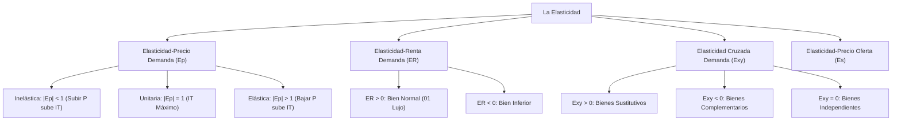

# 📈 Tema 3: La Elasticidad y sus Aplicaciones
### Asignatura: Introducción a la Economía I (Cód. 2343) — 1.º Grado en ADE
**Facultad de Economía y Empresa — Universidad de Murcia**  
*Guía matemática y conceptual completa con fórmulas explicadas, relación con ingresos y análisis de decisiones empresariales.*

---

## 🧭 Mapa Conceptual del Tema 3



---

## 1. ¿Qué es la Elasticidad y por qué es Vital en ADE?

En el Tema 2 aprendimos el análisis cualitativo: *"si el precio sube, la cantidad demandada baja"*. Pero como directivo o economista, necesitas saber: **¿cuánto baja exactamente?**
* Si subes el precio de un billete de autobús un 10%, ¿los viajeros caerán un 2% o un 30%?
* Si caen un 2%, tus ingresos subirán; si caen un 30%, te arruinarás.

> 💡 **Definición:**  
> La **elasticidad** es una medida cuantitativa del grado de respuesta o sensibilidad de una variable económica (como la cantidad demandada u ofrecida) ante la variación de uno de sus factores determinantes (como el precio o la renta).

---

## 2. La Elasticidad-Precio de la Demanda ($\varepsilon_p$)

Mide la variación porcentual que experimenta la cantidad demandada de un bien cuando su precio varía un $1\%$.

### 2.1. Fórmulas de Cálculo

#### A. Fórmula Básica y en Punto:
$$\varepsilon_p = -\frac{\%\Delta Q_d}{\%\Delta P} = -\frac{\frac{\Delta Q}{Q}}{\frac{\Delta P}{P}} = -\frac{\Delta Q}{\Delta P} \cdot \frac{P}{Q}$$
*(Por convenio, en economía se añade el signo negativo delante o se toma el valor absoluto $|\varepsilon_p|$ para trabajar con números positivos).*

#### B. Método del Punto Medio (Elasticidad Arco):
Si el precio pasa de $P_1$ a $P_2$ y la cantidad de $Q_1$ a $Q_2$, para evitar que el porcentaje dependa de si el movimiento es ascendente o descendente, se divide entre el promedio de ambos valores:
$$\varepsilon_p = \frac{\frac{Q_2 - Q_1}{(Q_1 + Q_2)/2}}{\frac{P_2 - P_1}{(P_1 + P_2)/2}}$$

---

### 2.2. Clasificación de la Demanda según su Elasticidad

| Tipo de Demanda | Valor de $\|\varepsilon_p\|$ | Interpretación | Forma de la Curva | Ejemplo Real |
| :--- | :---: | :--- | :--- | :--- |
| **Perfectamente Inelástica** | **$\|\varepsilon_p\| = 0$** | La cantidad no varía ante ningún cambio de precio | Línea **Vertical** | Insulina para diabéticos |
| **Inelástica (Rígida)** | **$\|\varepsilon_p\| < 1$** | La cantidad varía en menor proporción que el precio ($\%\Delta Q < \%\Delta P$) | Muy **empinada** | Tabaco, gasolina CP, agua, electricidad |
| **Elasticidad Unitaria** | **$\|\varepsilon_p\| = 1$** | La cantidad varía exactamente en la misma proporción ($\%\Delta Q = \%\Delta P$) | Hipérbola / Punto medio | — |
| **Elástica** | **$\|\varepsilon_p\| > 1$** | La cantidad varía en mayor proporción que el precio ($\%\Delta Q > \%\Delta P$) | Muy **plana** | Entradas de cine, billetes de avión, refrescos |
| **Perfectamente Elástica** | **$\|\varepsilon_p\| = \infty$** | A un precio dado los consumidores compran todo; a un céntimo más, compran cero | Línea **Horizontal** | Trigo de un agricultor individual |

```text
Perfectamente Inelástica (Ep = 0)         Elástica (Ep > 1)            Perfectamente Elástica (Ep = ∞)
P                                         P                            P
 ▲    Demanda                               ▲                            ▲
 │      │                                   │ \  Demanda                 │
 │      │                                   │   \                        P*├──────────────── Demanda
 │      │                                   │     \                      │
 └──────┴────────► Q                        └──────┴────────► Q          └──────────────────► Q
        Q0
```

---

### 2.3. La Elasticidad a lo Largo de una Demanda Lineal (Recta)

> ⚠️ **TRAMPA FRECUENTE DE EXAMEN:**  
> En una curva de demanda rectilínea ($Q = a - bp$), la pendiente es constante, **pero la elasticidad NO lo es**:
> * **Parte alta (Precios altos, cantidades bajas):** La demanda es **ELÁSTICA** ($|\varepsilon_p| > 1$).
> * **Punto medio exacto de la recta:** La demanda tiene **ELASTICIDAD UNITARIA** ($|\varepsilon_p| = 1$).
> * **Parte baja (Precios bajos, cantidades altas):** La demanda es **INELÁSTICA** ($|\varepsilon_p| < 1$).

```text
Precio (P)
  ▲
a/b ┼─── Tramo Elástico (|Ep| > 1)
    │     \
    │       • Punto Medio: |Ep| = 1  <─── ¡AQUÍ EL INGRESO TOTAL ES MÁXIMO!
    │         \
    │           Tramo Inelástico (|Ep| < 1)
  0 ┼─────────────┴─────────────► Cantidad (Q)
    0            a/2            a
```

---

## 3. Relación entre la Elasticidad y los Ingresos Totales ($IT = P \times Q$)

El **Ingreso Total** de una empresa es el dinero que ingresa por vender sus productos:
$$\text{Ingreso Total } (IT) = \text{Precio } (P) \times \text{Cantidad } (Q)$$

Cuando una empresa sube el precio ($P \uparrow$), se producen dos efectos contrarios:
1. **Efecto Precio:** Cobra más por cada unidad vendida ($\uparrow IT$).
2. **Efecto Cantidad:** Vende menos unidades ($\downarrow IT$).

¿Qué efecto gana? **Depende exclusivamente de la elasticidad-precio de la demanda**:

```
                       REGLA DE DECISIÓN EMPRESARIAL
                       
      Demanda INELÁSTICA (|Ep| < 1)           Demanda ELÁSTICA (|Ep| > 1)
     (Los clientes no huyen fácil)          (Los clientes son hipersensibles)
     
        Sube el Precio  (P ↑)                   Baja el Precio  (P ↓)
                 │                                       │
                 ▼                                       ▼
        Ingreso Total SUBE (IT ↑)               Ingreso Total SUBE (IT ↑)
```

### Tabla Resumen de Estrategia de Precios

| Si la Demanda es... | Al SUBIR el Precio ($P \uparrow$) | Al BAJAR el Precio ($P \downarrow$) | Recomendación de Gestión |
| :--- | :---: | :---: | :--- |
| **Inelástica ($|\varepsilon_p| < 1$)** | **Ingreso SUBE ($IT \uparrow$)** | Ingreso BAJA ($IT \downarrow$) | **Subir el precio** (ganas más por unidad y apenas pierdes ventas). |
| **Elástica ($|\varepsilon_p| > 1$)** | Ingreso BAJA ($IT \downarrow$) | **Ingreso SUBE ($IT \uparrow$)** | **Bajar el precio / promociones** (las ventas se disparan y compensan con creces). |
| **Unitaria ($|\varepsilon_p| = 1$)** | Ingreso NO cambia | Ingreso NO cambia | **Ingresos en su punto MÁXIMO**. |

---

## 4. Determinantes de la Elasticidad-Precio de la Demanda

1. **Disponibilidad de bienes sustitutivos cercanos:** Cuantos más sustitutos existan en el mercado, más elástica será la demanda (ej. billetes de avión a Madrid tienen sustituto en AVE o coche $\implies$ elástica; la sal de mesa no tiene sustituto $\implies$ inelástica).
2. **Bienes necesarios vs Bienes de lujo:** Los bienes necesarios (visitas al médico, pan, luz) tienen demanda inelástica; los bienes de lujo (relojes de alta gama, cruceros) tienen demanda muy elástica.
3. **Definición del mercado:** Cuanto más estrecha y concreta sea la definición, más elástica es la demanda. La categoría "comida" es inelástica (tienes que comer); pero la demanda de "helado de vainilla de la marca X" es muy elástica (puedes cambiar de marca o de sabor).
4. **Porcentaje del presupuesto dedicado al bien:** Bienes insignificantes en el sueldo (sal, clips, cerillas) son inelásticos; compras que comprometen gran parte del salario (coche, vivienda, alquiler) son muy elásticas.
5. **Horizonte temporal:** A **corto plazo** la demanda es más **inelástica** porque la gente no puede cambiar sus hábitos de la noche a la mañana. A **largo plazo** se vuelve más **elástica** (si la gasolina se mantiene cara durante 5 años, la gente comprará coches eléctricos o se mudará cerca del trabajo).

---

## 5. Otras Dos Elasticidades Fundamentales

### 5.1. La Elasticidad-Renta de la Demanda ($\varepsilon_R$)
Mide cómo varía porcentualmente la cantidad demandada de un bien cuando varía la renta de los consumidores:
$$\varepsilon_R = \frac{\%\Delta Q_d}{\%\Delta R}$$

* **Bienes Normales ($\varepsilon_R > 0$):** Al subir la renta, la gente compra más.
  * **Bienes de Primera Necesidad ($0 < \varepsilon_R \le 1$):** El consumo crece menos que proporcionalmente a la renta (leche, ropa básica). La proporción del presupuesto destinada a ellos disminuye al enriquecerse el país.
  * **Bienes de Lujo o Superiores ($\varepsilon_R > 1$):** El consumo se dispara más que proporcionalmente al crecer los ingresos (turismo internacional, coches de gama alta).
* **Bienes Inferiores ($\varepsilon_R < 0$):** Al subir la renta, los consumidores abandonan estos productos (marcas blancas de mala calidad, mortadela barata, viajes en autobús de línea lenta).

---

### 5.2. La Elasticidad-Precio Cruzada de la Demanda ($\varepsilon_{xy}$)
Mide la respuesta de la cantidad demandada del bien $X$ ante variaciones en el precio de otro bien distinto $Y$:
$$\varepsilon_{xy} = \frac{\%\Delta Q_x}{\%\Delta P_y}$$

* **Bienes Sustitutivos ($\varepsilon_{xy} > 0$):**  
  Al subir el precio de $Y$, sube la demanda de $X$.  
  *Ejemplo:* Sube el precio del aceite de palma $\implies$ la gente compra más mantequilla ($\varepsilon_{xy} > 0$).
* **Bienes Complementarios ($\varepsilon_{xy} < 0$):**  
  Al subir el precio de $Y$, baja la demanda de $X$.  
  *Ejemplo:* Sube el precio de las entradas de cine $\implies$ se compran menos palomitas en el cine ($\varepsilon_{xy} < 0$).
* **Bienes Independientes ($\varepsilon_{xy} = 0$):**  
  El precio de los libros de texto no influye en la demanda de raquetas de tenis.

---

## 6. La Elasticidad-Precio de la Oferta ($\varepsilon_s$)

Mide la respuesta porcentual de la cantidad ofrecida por las empresas cuando varía el precio del producto:
$$\varepsilon_s = \frac{\%\Delta Q_s}{\%\Delta P}$$

* **Determinante clave:** La flexibilidad técnica de los productores para alterar la producción:
  * Suelo edificable en primera línea de playa: oferta **perfectamente inelástica** ($\varepsilon_s = 0$, no se puede fabricar más tierra).
  * Productos manufacturados (libros, camisetas, coches): oferta **elástica** ($\varepsilon_s > 1$).
* **El tiempo:** A corto plazo las empresas tienen capacidad fija (oferta inelástica); a largo plazo pueden abrir nuevas plantas de fabricación (oferta muy elástica).
