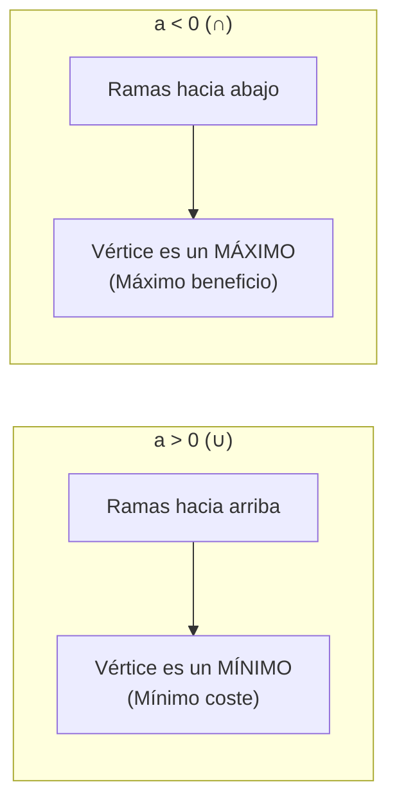

# 📖 Conceptos Básicos UMU — 08: Rectas y Parábolas

- **Asignatura:** Matemáticas para la Empresa I (Cód. 2350)
- **Titulación:** Grado en ADE — Facultad de Economía y Empresa (Universidad de Murcia)
- **Bloque Aula Virtual:** **PARTE 2 — Tema 8: Rectas y parábolas**
- **Documento fuente:** *Presentación Rectas y Parábolas* (Proyecto de Innovación Educativa, UMU)
- **Archivo original:** [Rectas+y+parabolas_presentacion.pdf](./Rectas+y+parabolas_presentacion.pdf)
- **Enfoque de este apunte:** Ecuación de la recta, pendientes, rectas paralelas/perpendiculares, y vértice de parábolas aplicado a máximos de beneficio en ADE.

---

## 1. La Recta en el Plano: $y = mx + n$

* **$m$ (Pendiente):** Grado de inclinación:
  $$m = \frac{\Delta y}{\Delta x} = \frac{y_2 - y_1}{x_2 - x_1}$$
  - $m > 0 \implies$ Creciente (ej: Función de oferta $Q_s = 2P - 4$).
  - $m < 0 \implies$ Decreciente (ej: Función de demanda $Q_d = 50 - 3P$).
  - $m = 0 \implies$ Recta horizontal (ej: Coste fijo).
* **$n$ (Ordenada en el origen):** Punto de corte con el eje vertical $Y$: $(0, n)$.

### Paralelismo y Perpendicularidad:
* **Paralelas:** Misma pendiente ($m_1 = m_2$).
* **Perpendiculares:** Pendientes opuestas e inversas ($m_1 \cdot m_2 = -1$).

---

## 2. Parábolas: Funciones Cuadráticas $y = ax^2 + bx + c$

### Vértice de la parábola:
$$x_v = -\frac{b}{2a} \qquad y_v = f(x_v)$$

> [!TIP]
> ### 💡 Ejemplo de Examen ADE: Máximo Beneficio
> Beneficio: $B(q) = -2q^2 + 80q - 300$.  
> 1. Como $a = -2 < 0$, la parábola tiene un **máximo**.
> 2. Cantidad óptima: $q^* = -\frac{80}{2 \cdot (-2)} = \mathbf{20 \text{ uds}}$.
> 3. Beneficio máximo: $B(20) = -2(20)^2 + 80(20) - 300 = \mathbf{500 \text{ u.m.}}$.
