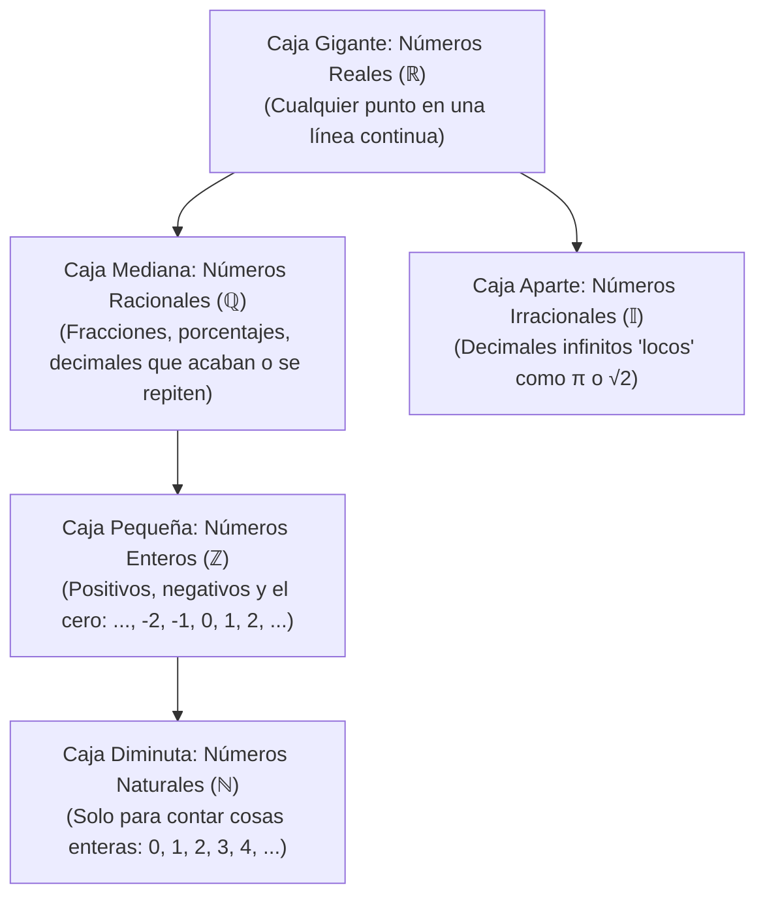

# 📖 Matemáticas para la Empresa I — Tema 0: Conjuntos Numéricos y Operaciones Básicas

- **Asignatura:** Matemáticas para la Empresa I (Cód. 2350)
- **Titulación:** Grado en ADE — Facultad de Economía y Empresa (Universidad de Murcia)
- **Documento fuente:** *Conjuntos numéricos* (Proyecto de Innovación Educativa, UMU)
- **Archivo original:** [Conjuntos_presentacion+def.pdf](./Conjuntos_presentacion+def.pdf)
- **Enfoque de este apunte:** Explicación desde cero, paso a paso y sin jerga incomprensible, ideal si llevas tiempo sin estudiar matemáticas.

---

## 🧭 Diccionario Rápido: De Símbolos Raros a Lenguaje Humano

Si llevas años sin tocar mates, es normal ver estos apuntes como si estuvieran en otro idioma. Esta tabla te traduce cada símbolo a palabras sencillas:

| Símbolo | Cómo se lee | Qué significa de verdad (Ejemplo fácil) |
| :---: | :--- | :--- |
| $\in$ | "pertenece a" | Indica que un número está dentro de ese grupo. Ej: $3 \in \mathbb{N}$ (*"el 3 es un número natural"*). |
| $\notin$ | "no pertenece a" | No está en el grupo. Ej: $-5 \notin \mathbb{N}$ (*"el -5 no es natural porque tiene signo menos"*). |
| $\subset$ | "está contenido en" | Un grupo pequeño está metido dentro de otro más grande, como muñecas rusas: $\mathbb{N} \subset \mathbb{Z}$. |
| $\ne$ | "distinto de" | No puede ser ese valor. Ej: $b \ne 0$ (*"el número de abajo de una fracción jamás puede ser cero"*). |
| $\cup$ | "unión" | Juntar dos grupos en uno solo: $\mathbb{R} = \mathbb{Q} \cup \mathbb{I}$ (*"los reales son todos los racionales más todos los irracionales"*). |
| $\cap$ | "intersección" | Lo que tienen en común dos grupos. Si $\mathbb{Q} \cap \mathbb{I} = \emptyset$, significa que no comparten nada. |
| $\emptyset$ | "conjunto vacío" | Una bolsa vacía, no hay ningún elemento. |
| $\iff$ | "equivale a" / "si y solo si" | Dos afirmaciones que son exactamente lo mismo en ambas direcciones. |
| $\implies$ | "por lo tanto" / "entonces" | Consecuencia lógica: *"si pasa esto $\implies$ entonces ocurre esto otro"*. |
| $\dots$ | "puntos suspensivos" | La lista sigue con el mismo patrón hasta el infinito. |

---

## 🪆 La Analogía de las Muñecas Rusas (Los Conjuntos Numéricos)

Los matemáticos fueron inventando los números a medida que los necesitaban para resolver problemas de la vida real. Piensa en ellos como cajas que se van metiendo unas dentro de otras:

$$\mathbb{N} \subset \mathbb{Z} \subset \mathbb{Q} \subset \mathbb{R}$$

---

## 1. Conoce a la Familia de Números

### 1.1. Números Naturales ($\mathbb{N}$)
* **¿Qué son?:** Los que usamos con los dedos de la mano para contar cosas reales (personas en clase, coches producidos, paquetes en almacén).
  $$\mathbb{N} = \{0, 1, 2, 3, 4, 5, \dots\}$$
* **Detalles clave:**
  - En la Universidad de Murcia se incluye el $0$ dentro de los naturales.
  - Tienen principio (el $0$), pero **no tienen final** (son infinitos).
  - Están ordenados: dados dos números, siempre sabes cuál es más grande.

---

### 1.2. Números Enteros ($\mathbb{Z}$)
* **¿Por qué surgieron?:** Porque en el comercio y la vida hacen falta las deudas y las temperaturas bajo cero.
  $$\mathbb{Z} = \{\dots, -4, -3, -2, -1, 0, 1, 2, 3, 4, \dots\}$$
* **Detalles clave:**
  - Incluyen a los naturales más todos sus negativos.
  - **No tienen principio ni fin**.
  - Siguen siendo números "enteros", aquí no hay comas ni trozos.

#### 🔍 Divisibilidad y Mínimo Común Múltiplo (Sin misterios)
1. **¿Qué es ser divisible?:** Decimos que $a$ es divisible por $b$ si la división da un resultado exacto, sin decimales ni restos.  
   *Ejemplo:* $20$ es divisible por $5$ porque $20 = 5 \cdot 4$ (da $4$ clavado).
2. **Número Primo:** Aquel que solo se puede dividir de forma exacta entre sí mismo y entre el $1$ (ejemplos: $2, 3, 5, 7, 11, 13\dots$). El $2$ es el único primo par.
3. **Número Compuesto:** El que se puede fabricar multiplicando números primos (como piezas de Lego).  
   *Ejemplo con el $20$:*
   $$\text{Divisores de } 20 = \{1, 2, 4, 5, 10, 20\}$$
   $$\text{Sus primos son solo } 2 \text{ y } 5 \implies \text{Descomposición: } 20 = 2^2 \cdot 5$$
4. **Mínimo Común Múltiplo ($\text{m.c.m.}$):**  
   *¿Para qué sirve de verdad?:* Para cuando tengas que sumar fracciones con distinto número abajo, necesitas encontrar un número que esté en la tabla de multiplicar de ambos.  
   > **Ejemplo del PDF: $\text{m.c.m.}(18, 10)$**  
   > - Descomponemos $18$: $18 = 2 \cdot 9 = 2 \cdot 3^2$  
   > - Descomponemos $10$: $10 = 2 \cdot 5$  
   > - Regla de oro: *"Comunes y no comunes con el exponente más alto"*:  
   >   Tomamos el $2$, el $3^2$ y el $5$:
   >   $$\text{m.c.m.}(18, 10) = 2 \cdot 3^2 \cdot 5 = 2 \cdot 9 \cdot 5 = \mathbf{90}$$

---

### 1.3. Números Racionales ($\mathbb{Q}$) — Las Fracciones
* **¿De dónde viene el nombre?:** De *ración* (partir una tarta o una pizza en trozos).
* **Definición formal:**
  $$\mathbb{Q} = \left\lbrace \frac{a}{b} : a \in \mathbb{Z},\; b \in \mathbb{Z},\; b \ne 0 \right\rbrace$$
  > **Traducción al cristiano:** Cualquier número que se pueda escribir como una fracción de dos números enteros, donde el de abajo ($b$, el denominador) **no puede ser $0$** (porque dividir por cero no existe en matemáticas).

* **Tipos de decimales que son racionales:**
  - **Decimal exacto:** La cuenta se acaba (ejemplo: $\frac{1}{5} = 0{,}2$).
  - **Decimal periódico:** Los decimales se repiten en bucle (ejemplo: $\frac{7}{3} = 2{,}33333\dots = 2{,}\widehat{3}$).

#### ⚖️ Fracciones Equivalentes y Simplificar
* **Equivalentes:** Representan la misma cantidad de tarta aunque tengan números distintos.  
  Se comprueba multiplicando en cruz:
  $$\frac{a}{b} = \frac{c}{d} \iff a \cdot d = b \cdot c$$
  *Ejemplo:* $\frac{4}{5}$ es lo mismo que $\frac{8}{10}$, porque $4 \cdot 10 = 40$ y $5 \cdot 8 = 40$.
* **Simplificar:** Reducir la fracción para que los números sean lo más pequeños posible (dividiendo arriba y abajo por lo mismo):
  $$\frac{25}{10} \xrightarrow{\text{dividimos entre } 5} \frac{25 : 5}{10 : 5} = \mathbf{\frac{5}{2}}$$

#### 🔢 Cómo comparar y ordenar fracciones (Especial atención a los negativos)
> [!TIP]
> ### 💡 Ejercicio Resuelto del PDF Paso a Paso
> **Enunciado:** Ordena de menor a mayor estos números:
> $$-\frac{4}{5},\; -\frac{7}{3},\; \frac{3}{7},\; \frac{20}{7}$$
> 
> **Paso 1: Separa positivos de negativos.**  
> Los negativos siempre van a la izquierda del cero (son más pequeños que cualquier positivo).
> 
> **Paso 2: Compara los positivos ($\frac{3}{7}$ y $\frac{20}{7}$).**  
> Como tienen el mismo número abajo ($7$), simplemente miras el de arriba: $3$ trozos son menos que $20$ trozos:
> $$\frac{3}{7} < \frac{20}{7}$$
> 
> **Paso 3: Compara los negativos ($-\frac{4}{5}$ y $-\frac{7}{3}$).**  
> Tienen números abajo distintos ($5$ y $3$). Hallamos su $\text{m.c.m.}(5, 3) = 15$ para ponerles el mismo denominador:
> - $-\frac{4}{5} = -\frac{4 \cdot 3}{5 \cdot 3} = -\frac{12}{15}$  
> - $-\frac{7}{3} = -\frac{7 \cdot 5}{3 \cdot 5} = -\frac{35}{15}$  
> 
> *¡Ojo con los signos negativos! Piensa en deudas bancarias:*  
> Deber $35$ euros es estar peor (más abajo) que deber $12$ euros:
> $$-35 < -12 \implies -\frac{35}{15} < -\frac{12}{15} \implies -\frac{7}{3} < -\frac{4}{5}$$
> 
> **Resultado final ordenado:**
> $$-\frac{7}{3} < -\frac{4}{5} < \frac{3}{7} < \frac{20}{7}$$

---

### 1.4. Números Irracionales ($\mathbb{I}$) y Reales ($\mathbb{R}$)
* **Irracionales ($\mathbb{I}$):** Números con decimales infinitos que nunca se repiten en bucle y jamás se pueden escribir como una fracción simple.  
  *Ejemplos:* $\sqrt{2} \approx 1{,}4142\dots$, $\pi \approx 3{,}14159\dots$, $e \approx 2{,}71828\dots$
* **Reales ($\mathbb{R}$):** Es juntar todos los anteriores en una sola bolsa:
  $$\mathbb{R} = \mathbb{Q} \cup \mathbb{I}$$
* **La Recta Real:** Imagina una regla continua infinita donde no queda ningún hueco libre. Cada punto de esa línea recta es un número real.

---

## 2. Operaciones Básicas y sus Propiedades

En $\mathbb{R}$ tenemos dos operaciones reinas: la **Suma ($+$)** y la **Multiplicación ($\cdot$)**.

### 2.1. Propiedades que debes recordar
1. **Conmutativa:** El orden no importa:
   $$a + b = b + a \qquad \text{y} \qquad a \cdot b = b \cdot a$$
   *(Ej: $3 + 5 = 5 + 3 = 8$; $4 \cdot 6 = 6 \cdot 4 = 24$)*.
2. **Asociativa:** Agrupar con paréntesis da lo mismo:
   $$(a + b) + c = a + (b + c) \qquad \text{y} \qquad (a \cdot b) \cdot c = a \cdot (b \cdot c)$$
3. **Elemento Neutro (El que no cambia nada):**
   - En la suma es el **$0$**: $a + 0 = a$ *(si tienes 10€ y te dan 0€, sigues teniendo 10€)*.
   - En la multiplicación es el **$1$**: $a \cdot 1 = a$ *(si compras 1 unidad a 10€, pagas 10€)*.
4. **Opuesto vs Inverso (Muy importante diferenciarlos):**
   - **Opuesto (para la suma):** Cambiar de signo. Sumar un número con su opuesto da $0$:
     $$a + (-a) = 0 \quad (\text{ej: } 7 + (-7) = 0)$$
   - **Inverso (para el producto):** Darle la vuelta. Multiplicar un número por su inverso da $1$:
     $$a \cdot \frac{1}{a} = 1 \quad (\text{ej: } 5 \cdot \frac{1}{5} = \frac{5}{5} = 1)$$
     *En fracciones:* el inverso de $\frac{2}{3}$ es $\frac{3}{2}$, porque $\frac{2}{3} \cdot \frac{3}{2} = \frac{6}{6} = 1$.

---

### 2.2. La Regla de los Signos (Para multiplicar y dividir)

Un truco mnemotécnico clásico para no dudar nunca:
* *"Los amigos ($+$) de mis amigos ($+$) son mis amigos ($+$)":* $(+) \cdot (+) = (+)$
* *"Los enemigos ($-$) de mis enemigos ($-$) son mis amigos ($+$)":* $(-) \cdot (-) = (+)$
* *"Los amigos ($+$) de mis enemigos ($-$) son mis enemigos ($-$)":* $(+) \cdot (-) = (-)$
* *"Los enemigos ($-$) de mis amigos ($+$) son mis enemigos ($-$)":* $(-) \cdot (+) = (-)$

---

### 2.3. Propiedad Distributiva y Sacar Factor Común

Esta es, con diferencia, **la técnica algebraica que más vas a usar en ADE** (para calcular costes, ingresos, derivadas y matrices).

* **Hacia adelante (Distribuir / Multiplicar paréntesis):**
  $$a \cdot (b + c) = a \cdot b + a \cdot c$$
* **Hacia atrás (Sacar factor común):** Cuando varios términos tienen la misma letra o número, lo "sacas fuera" multiplicando:
  $$a \cdot b + a \cdot c = a \cdot (b + c)$$

> **Ejemplo del PDF resuelto con detalle:**
> $$-\frac{2}{7}x + 5x$$
> Ambos términos tienen la letra $x$. Sacamos la $x$ como factor común:
> $$= \left(-\frac{2}{7} + 5\right) \cdot x$$
> Para sumar $-\frac{2}{7} + 5$, convertimos el $5$ a séptimos ($5 = \frac{5 \cdot 7}{7} = \frac{35}{7}$):
> $$= \left(\frac{-2 + 35}{7}\right) \cdot x = \mathbf{\frac{33}{7}x}$$

---

## 3. Guía Rápida para Operar con Fracciones

### 3.1. Sumar o Restar Fracciones
* **Caso fácil (mismo número abajo):** Se suman o restan los números de arriba y se deja el de abajo intacto:
  $$-\frac{2}{7} + \frac{4}{7} = \frac{-2 + 4}{7} = \mathbf{\frac{2}{7}}$$
* **Caso general (distinto número abajo):**
  $$-\frac{3}{2} + \frac{7}{5}$$
  1. Hallas el $\text{m.c.m.}(2, 5) = 10$.
  2. Ajustas los numeradores:
     - Para la primera: $10 : 2 = 5 \implies -3 \cdot 5 = -15 \implies -\frac{15}{10}$
     - Para la segunda: $10 : 5 = 2 \implies 7 \cdot 2 = 14 \implies \frac{14}{10}$
  3. Sumas los de arriba:
     $$-\frac{15}{10} + \frac{14}{10} = \frac{-15 + 14}{10} = \mathbf{-\frac{1}{10}}$$

### 3.2. Multiplicar Fracciones
¡Es lo más fácil! Se multiplica en línea recta (el de arriba con el de arriba, el de abajo con el de abajo):
$$\frac{a}{b} \cdot \frac{c}{d} = \frac{a \cdot c}{b \cdot d} \qquad \text{Ejemplo: } \frac{7}{2} \cdot \frac{4}{3} = \frac{7 \cdot 4}{2 \cdot 3} = \frac{28}{6} = \mathbf{\frac{14}{3}}$$

---

## 4. Jerarquía de Operaciones (El Orden Sagrado)

> [!CAUTION]
> En la universidad, el 80% de los fallos en exámenes de matemáticas no son de teoría difícil, sino de equivocarse en el orden de las cuentas básicas.

### Caso 1: Expresión SIN Paréntesis
El orden estricto de izquierda a derecha es:
1. **1.º:** Potencias y raíces.
2. **2.º:** Multiplicaciones y divisiones.
3. **3.º:** Sumas y restas.

Veamos el ejemplo de la presentación:
$$\frac{4}{5} + \frac{7}{2} \cdot \frac{4}{3}$$

* ❌ **EL ERROR TÍPICO QUE SUSPENDE:**  
  Sumar primero $\frac{4}{5} + \frac{7}{2}$ y luego multiplicar por $\frac{4}{3}$. ¡ESTÁ MUY MAL! La multiplicación tiene prioridad absoluta.
* ✔️ **EL PROCEDIMIENTO CORRECTO:**
  1. **Primero calculas la multiplicación:**
     $$\frac{7}{2} \cdot \frac{4}{3} = \frac{28}{6} = \frac{14}{3}$$
  2. **Ahora realizas la suma pendiente:**
     $$\frac{4}{5} + \frac{14}{3} \implies \text{m.c.m.}(5, 3) = 15$$
     $$\frac{4 \cdot 3}{15} + \frac{14 \cdot 5}{15} = \frac{12}{15} + \frac{70}{15} = \mathbf{\frac{82}{15}}$$

---

### Caso 2: Expresión CON Paréntesis
El paréntesis es una "caja acorazada": manda sobre todo lo demás. Tienes que resolver **todo lo de dentro** antes de tocar lo que está fuera.

Veamos el ejemplo modificado:
$$\left(\frac{4}{5} + \frac{7}{2}\right) \cdot \frac{4}{3}$$

1. **Primero se resuelve la suma que está atrapada en el paréntesis:**
   $$\frac{4}{5} + \frac{7}{2} \implies \text{m.c.m.}(5, 2) = 10$$
   $$\frac{8}{10} + \frac{35}{10} = \frac{43}{10}$$
2. **Ahora multiplicas el resultado por el factor exterior:**
   $$\frac{43}{10} \cdot \frac{4}{3} = \frac{43 \cdot 4}{10 \cdot 3} = \frac{172}{30} \xrightarrow{\text{simplificamos entre } 2} \mathbf{\frac{86}{15}}$$

---

## 🛑 Las 4 "Trampas Mortales" que debes esquivar en ADE

1. **Tachar cosas que están sumando:**  
   $$\frac{x + 5}{x} \ne 5$$  
   *(Solo puedes tachar o simplificar si la $x$ está **multiplicando a todo el numerador**, no si está sumando)*.
2. **Confundir el signo de una fracción:**  
   $$-\frac{3}{4} = \frac{-3}{4} = \frac{3}{-4} \qquad \text{pero NUNCA es igual a } \frac{-3}{-4} \text{ (ya que } \frac{-}{-} = + \text{)}$$
3. **Invertir una suma alocadamente:**  
   El inverso de $(a + b)$ es $\frac{1}{a + b}$, jamás $\frac{1}{a} + \frac{1}{b}$.
4. **Dividir entre cero:**  
   Cualquier expresión donde el denominador sea $0$ ($\frac{5}{0}$) **no existe**. En optimización y funciones de ADE esto marcará asíntotas y puntos fuera de dominio.
