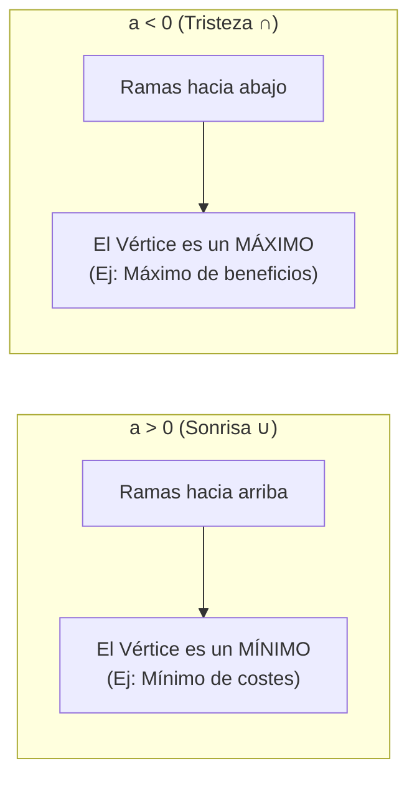

# 📖 Matemáticas para la Empresa I — Tema 0.4: Desigualdades, Rectas y Parábolas

- **Asignatura:** Matemáticas para la Empresa I (Cód. 2350)
- **Titulación:** Grado en ADE — Facultad de Economía y Empresa (Universidad de Murcia)
- **Documentos fuente:** *Presentación Desigualdades* y *Presentación Rectas y Parábolas* (Proyecto de Innovación Educativa, UMU)
- **Archivos originales:** [desigualdades_presentacion.pdf](./desigualdades_presentacion.pdf) · [Rectas+y+parabolas_presentacion.pdf](./Rectas+y+parabolas_presentacion.pdf)
- **Enfoque de este apunte:** Comprensión visual y analítica de intervalos, resolución de inecuaciones con la regla del signo negativo, cálculo de pendientes de rectas y vértice de parábolas (máximos y mínimos económicos).

---

## 1. Desigualdades, Intervalos e Inecuaciones

### 1.1. Tipos de Intervalos en la Recta Real

| Tipo | Notación | Definición en Conjunto | ¿Incluye los extremos? |
| :--- | :---: | :--- | :---: |
| **Abierto** | $(a, b)$ | $\{x \in \mathbb{R} : a < x < b\}$ | No (paréntesis) |
| **Cerrado** | $[a, b]$ | $\{x \in \mathbb{R} : a \le x \le b\}$ | Sí (corchetes) |
| **Semiabierto** | $[a, b)$ | $\{x \in \mathbb{R} : a \le x < b\}$ | Incluye $a$, pero no $b$ |
| **Infinito** | $[a, +\infty)$ | $\{x \in \mathbb{R} : x \ge a\}$ | Desde $a$ hasta el infinito |

---

### 1.2. Inecuaciones de Primer Grado: La Regla de Oro del Signo Negativo

> [!CAUTION]
> Cuando multiplicas o divides una inecuación por un número **negativo**, el signo de la desigualdad **se da la vuelta obligatoriamente**:
> $$-3x \le 12 \implies x \ge \frac{12}{-3} \implies \mathbf{x \ge -4} \implies x \in [-4, +\infty)$$

---

### 1.3. Inecuaciones de Segundo Grado (Método de los Intervalos)
**Resolver:** $x^2 - 4x + 3 < 0$
1. **Hallamos las raíces:** $x^2 - 4x + 3 = 0 \implies (x - 1)(x - 3) = 0 \implies x = 1,\; x = 3$.
2. **Dividimos la recta real en 3 tramos:** $(-\infty, 1)$, $(1, 3)$ y $(3, +\infty)$.
3. **Probamos un valor testigo en cada tramo:**
   - En $(-\infty, 1)$, probamos $x = 0$: $0^2 - 4(0) + 3 = +3 > 0$ (Positivo).
   - En $(1, 3)$, probamos $x = 2$: $2^2 - 4(2) + 3 = 4 - 8 + 3 = -1 < 0$ (Negativo).
   - En $(3, +\infty)$, probamos $x = 4$: $4^2 - 4(4) + 3 = +3 > 0$ (Positivo).
4. Como buscamos $< 0$ (negativo), la solución es el intervalo abierto:
   $$\mathbf{x \in (1, 3)}$$

---

## 2. Rectas en el Plano: Pendientes y Modelos de Mercado

### 2.1. Ecuación Explícita de la Recta
$$y = mx + n$$
* **$m$ (Pendiente):** Es la inclinación de la recta. Mide cuánto cambia la $y$ por cada unidad que avanza la $x$:
  $$m = \frac{\Delta y}{\Delta x} = \frac{y_2 - y_1}{x_2 - x_1}$$
  - $m > 0 \implies$ **Recta creciente** (ej: Curva de Oferta en ADE: $Q_s = 2P - 5$).
  - $m < 0 \implies$ **Recta decreciente** (ej: Curva de Demanda en ADE: $Q_d = 100 - 3P$).
  - $m = 0 \implies$ **Recta horizontal** (ej: Coste fijo constante).
* **$n$ (Ordenada en el origen):** El punto exacto donde la recta corta al eje vertical $Y$: $(0, n)$.

---

### 2.2. Rectas Paralelas y Perpendiculares
* **Paralelas:** Tienen la misma pendiente ($m_1 = m_2$).
* **Perpendiculares:** Sus pendientes son inversas y de signo contrario ($m_1 \cdot m_2 = -1 \iff m_2 = -\frac{1}{m_1}$).

---

## 3. Parábolas: Vértices, Máximos y Mínimos en ADE

Una parábola vertical es la gráfica de una función cuadrática:
$$y = ax^2 + bx + c$$

### 3.1. Fórmula del Vértice (El punto más alto o más bajo)
$$x_v = -\frac{b}{2a} \qquad y_v = f(x_v)$$

> [!TIP]
> ### 💡 Ejemplo Económico de Examen: Máximo Beneficio
> La función de beneficio de un producto es $B(q) = -2q^2 + 80q - 300$, donde $q$ son las unidades vendidas:
> 1. Como $a = -2 < 0$, la parábola tiene forma cóncava ($\cap$) y su vértice es un **máximo absoluto**.
> 2. Cantidad óptima que maximiza el beneficio:
>    $$q^* = x_v = -\frac{80}{2 \cdot (-2)} = -\frac{80}{-4} = \mathbf{20 \text{ unidades}}$$
> 3. Beneficio máximo alcanzado:
>    $$B(20) = -2(20)^2 + 80(20) - 300 = -800 + 1600 - 300 = \mathbf{500 \text{ u.m.}}$$
