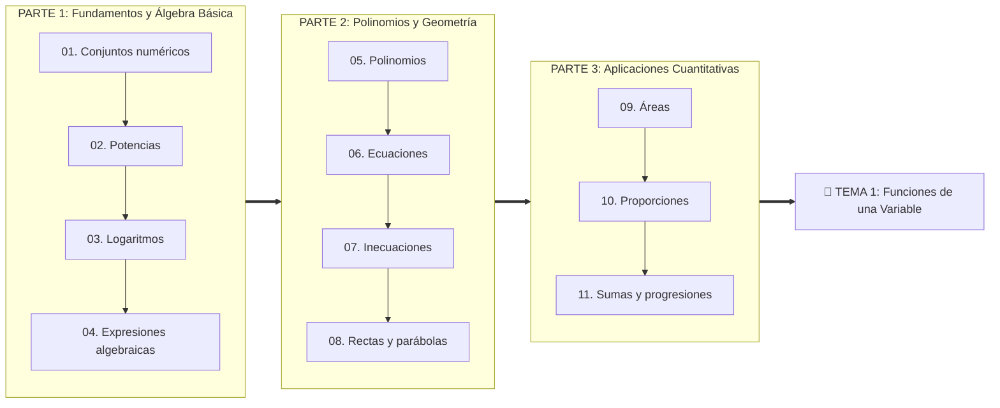

# 🧮 0 - Teoría Básica: Conceptos Básicos de Matemáticas (UMU)

- **Asignatura:** Matemáticas para la Empresa I (Cód. 2350)
- **Titulación:** Grado en ADE — Facultad de Economía y Empresa (Universidad de Murcia)
- **Profesora:** Lafuente Lechuga, Matilde
- **Fuente Oficial:** Aula Virtual UMU $\to$ *Conceptos Básicos de Matemáticas* (Proyecto de Innovación Educativa)
- **Objetivo de este módulo:** Proporcionar una base matemática sólida desde **Nivel 0 absoluto**. Estos materiales ayudan a recordar conceptos y técnicas esenciales que tendrás que usar con frecuencia en la carrera.

---

## 📋 Índice Oficial del Aula Virtual (Orden de la Profesora)

---

### 🟢 PARTE 1
| Nº | Tema Oficial | Guía de Estudio Explicada (Markdown) | Presentación Original UMU |
| :---: | :--- | :--- | :--- |
| **01** | **Conjuntos numéricos** | 📄 **[01_Conjuntos_Numericos.md](./Apuntes/01_Conjuntos_Numericos.md)** | 📕 [Conjuntos_presentacion+def.pdf](./Apuntes/Conjuntos_presentacion+def.pdf) |
| **02** | **Potencias** | 📄 **[02_Potencias.md](./Apuntes/02_Potencias.md)** | 📕 [Presentación_potencias.pdf](./Apuntes/Presentación_potencias.pdf) |
| **03** | **Logaritmos** | 📄 **[03_Logaritmos.md](./Apuntes/03_Logaritmos.md)** | 📕 [Presentación_logaritmos.pdf](./Apuntes/Presentación_logaritmos.pdf) |
| **04** | **Expresiones algebraicas** | 📄 **[04_Expresiones_Algebraicas.md](./Apuntes/04_Expresiones_Algebraicas.md)** | 📕 [Presentación_Expresiones+algebraicas.pdf](./Apuntes/Presentación_Expresiones+algebraicas.pdf) |

---

### 🟡 PARTE 2
| Nº | Tema Oficial | Guía de Estudio Explicada (Markdown) | Presentación Original UMU |
| :---: | :--- | :--- | :--- |
| **05** | **Polinomios** | 📄 **[05_Polinomios.md](./Apuntes/05_Polinomios.md)** | 📕 [Presentación_Polinomios.pdf](./Apuntes/Presentación_Polinomios.pdf) |
| **06** | **Ecuaciones** | 📄 **[06_Ecuaciones.md](./Apuntes/06_Ecuaciones.md)** | 📕 [Presentacion+Ecuaciones.pdf](./Apuntes/Presentacion+Ecuaciones.pdf) |
| **07** | **Inecuaciones** | 📄 **[07_Inecuaciones.md](./Apuntes/07_Inecuaciones.md)** | 📕 [desigualdades_presentacion.pdf](./Apuntes/desigualdades_presentacion.pdf) |
| **08** | **Rectas y parábolas** | 📄 **[08_Rectas_y_Parabolas.md](./Apuntes/08_Rectas_y_Parabolas.md)** | 📕 [Rectas+y+parabolas_presentacion.pdf](./Apuntes/Rectas+y+parabolas_presentacion.pdf) |

---

### 🔵 PARTE 3
| Nº | Tema Oficial | Guía de Estudio Explicada (Markdown) | Presentación Original UMU |
| :---: | :--- | :--- | :--- |
| **09** | **Áreas** | 📄 **[09_Areas.md](./Apuntes/09_Areas.md)** | 📊 [Area_triangulo_rectangulo.pptx](./Apuntes/Area_triangulo_rectangulo.pptx) |
| **10** | **Proporciones** | 📄 **[10_Proporciones.md](./Apuntes/10_Proporciones.md)** | 📊 [Fracciones.pptx](./Apuntes/Fracciones.pptx) |
| **11** | **Sumas y progresiones** | 📄 **[11_Sumas_y_Progresiones.md](./Apuntes/11_Sumas_y_Progresiones.md)** | 📊 [Sumas+y+progresiones.pptx](./Apuntes/Sumas+y+progresiones.pptx) |

---

## 🎨 Método de Estudio Recomendado: "Pizarra Activa con tldraw"

1. Abre **[tldraw.com](https://tldraw.com)** en otra pestaña de tu navegador.
2. Lee cada apunte en Markdown (empieza por `01_Conjuntos_Numericos.md`).
3. Resuelve los ejercicios y retos a mano alzada en tldraw antes de desplegar las soluciones.
4. Anota tus fallos en rojo para afianzar cada concepto antes de avanzar al siguiente número.
