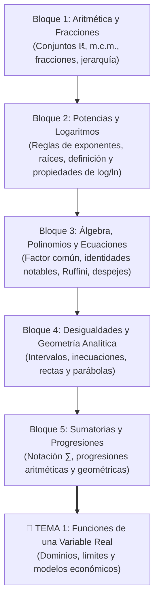

# 🧮 0 - Teoría Básica (Curso Cero / Nivelación Matemática para ADE)

- **Asignatura:** Matemáticas para la Empresa I (Cód. 2350)
- **Titulación:** Grado en ADE — Facultad de Economía y Empresa (Universidad de Murcia)
- **Objetivo de este módulo:** Proporcionar una base matemática sólida desde **Nivel 0 absoluto**. Si llevas años sin tocar una ecuación o suspendiste matemáticas en el instituto, este bloque reconstruye tus cimientos paso a paso, sin tecnicismos innecesarios, para que entres a **Tema 1 (Funciones)** y **Tema 2 (Varias Variables)** con total seguridad.

---

## 🗺️ Mapa de Ruta del Curso Cero (De Nivel 0 a Universidad)

Los documentos oficiales de la Universidad de Murcia (*Proyecto de Innovación Educativa*) han sido organizados en **5 bloques lógicos** de estudio. Cada bloque cuenta con su documento original oficial (.pdf o .pptx) y su **guía de estudio en Markdown** redactada con explicaciones claras, trucos mnemotécnicos y soluciones paso a paso:

---

## 📚 Índice de Módulos y Documentos de Estudio

| Módulo | Documentos Oficiales UMU | Guía de Estudio Explicada (Markdown) | Estado |
| :--- | :--- | :--- | :---: |
| **1. Conjuntos y Fracciones** | 📕 [Conjuntos_presentacion+def.pdf](./Apuntes/Conjuntos_presentacion+def.pdf) 📊 [Fracciones.pptx](./Apuntes/Fracciones.pptx) | 📄 **[Tema 0: Conjuntos Numéricos y Operaciones](./Apuntes/Tema_00_Conjuntos_Numericos.md)** | ✅ **Listo para estudiar** |
| **2. Potencias y Logaritmos** | 📕 [Presentación_potencias.pdf](./Apuntes/Presentación_potencias.pdf) 📕 [Presentación_logaritmos.pdf](./Apuntes/Presentación_logaritmos.pdf) | 📄 **[Tema 0.2: Potencias y Logaritmos](./Apuntes/Tema_00_Potencias_y_Logaritmos.md)** | ✅ **Listo para estudiar** |
| **3. Álgebra y Ecuaciones** | 📕 [Presentación_Expresiones+algebraicas.pdf](./Apuntes/Presentación_Expresiones+algebraicas.pdf) 📕 [Presentación_Polinomios.pdf](./Apuntes/Presentación_Polinomios.pdf) 📕 [Presentacion+Ecuaciones.pdf](./Apuntes/Presentacion+Ecuaciones.pdf) | 📄 **[Tema 0.3: Álgebra, Polinomios y Ecuaciones](./Apuntes/Tema_00_Algebra_Polinomios_y_Ecuaciones.md)** | ✅ **Listo para estudiar** |
| **4. Inecuaciones y Gráficas** | 📕 [desigualdades_presentacion.pdf](./Apuntes/desigualdades_presentacion.pdf) 📕 [Rectas+y+parabolas_presentacion.pdf](./Apuntes/Rectas+y+parabolas_presentacion.pdf) | 📄 **[Tema 0.4: Desigualdades, Rectas y Parábolas](./Apuntes/Tema_00_Desigualdades_y_Geometria_Analitica.md)** | ✅ **Listo para estudiar** |
| **5. Progresiones y Áreas** | 📊 [Sumas+y+progresiones.pptx](./Apuntes/Sumas+y+progresiones.pptx) 📊 [Area_triangulo_rectangulo.pptx](./Apuntes/Area_triangulo_rectangulo.pptx) | 📄 **[Tema 0.5: Sumatorias, Progresiones y Áreas](./Apuntes/Tema_00_Progresiones_y_Sumatorias.md)** | ✅ **Listo para estudiar** |

---

## 🎨 Método de Estudio Recomendado: "Pizarra Activa con tldraw"

No te limites a leer las fórmulas de forma pasiva; las matemáticas se aprenden con la mano:
1. Abre **[tldraw.com](https://tldraw.com)** en una pestaña del navegador o en pantalla dividida.
2. Lee cada sección del apunte en Markdown.
3. Cuando llegues a un ejemplo o al **Taller Práctico**, copia el enunciado en tldraw y escribe los pasos con el ratón o trackpad.
4. Despliega la solución para comparar tu resultado. Si te has equivocado, anota en tldraw con color rojo cuál fue el fallo (por ejemplo: *"multiplicar antes de sumar"* o *"olvidar el signo menos"*).
