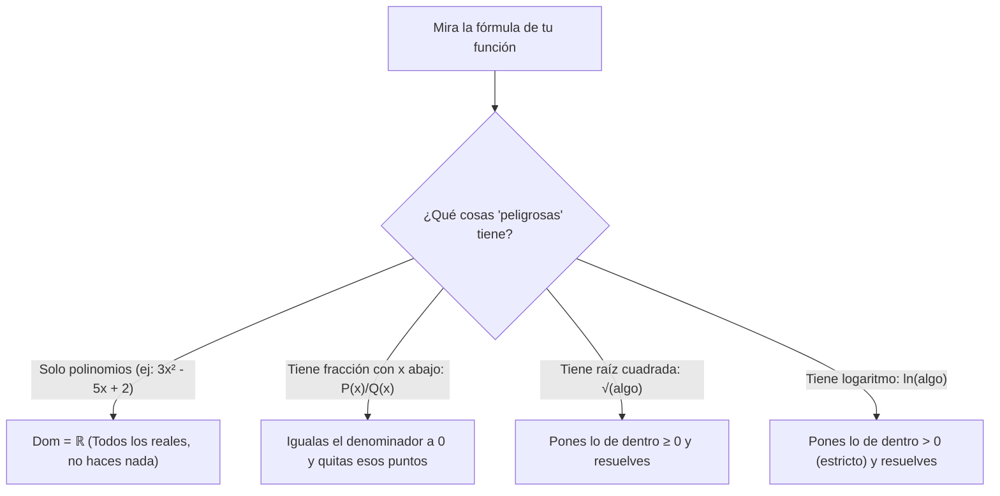

# 📈 Matemáticas para la Empresa I — Tema 1: Funciones Reales de una Variable

- **Asignatura:** Matemáticas para la Empresa I (Cód. 2350)
- **Titulación:** Grado en ADE — Facultad de Economía y Empresa (Universidad de Murcia)
- **Grupo:** Grupo 5 (Turno Tarde) · **Profesora:** Matilde Lafuente Lechuga
- **Documento fuente:** *Tema I. Funciones Reales de una Variable (Curso 2026-2027)*
- **Archivo original diapositivas:** [Tema_01_Presentacion_Oficial.pdf](./Tema_01_Presentacion_Oficial.pdf)
- **Enfoque de este apunte:** Manual de supervivencia práctico con recetas paso a paso. No solo definiciones: aquí tienes **exactamente qué hacer con el lápiz en la mano** en cada caso (dominios, composición $f \circ g$, exponenciales con $e$, infinitos e indeterminaciones).

---

## 🧭 Diccionario Rápido: De Símbolos a Lenguaje Normal

| Símbolo | Cómo se lee | Qué significa en la práctica |
| :---: | :--- | :--- |
| $x$ | Variable exógena / independiente | Lo que tú fijas o introduces (precio, unidades, horas de trabajo). |
| $y$ ó $f(x)$ | Variable endógena / dependiente | El resultado que sale de la fórmula (beneficio, coste total, demanda). |
| $\text{Dom}(f)$ | Dominio de la función | Todos los valores de $x$ que puedes meter en la fórmula sin que dé error matemático. |
| $(g \circ f)(x)$ | Composición ("$g$ compuesto con $f$") | Meter una fórmula dentro de otra como muñecas rusas: $g(f(x))$. |
| $e \approx 2,718$ | Número de Euler / Base natural | Un número fijo mayor que 1. Se usa para crecimiento continuo e interés compuesto. |
| $\lim_{x \to x_0} f(x)$ | Límite en $x_0$ | El valor al que se acerca el resultado cuando $x$ se pone muy pegadita a $x_0$. |

---

## 1. 🛠️ RECETARIO 1: ¿Qué hago si me piden calcular el Dominio?

Para calcular el dominio no tienes que inventar nada. Solo tienes que mirar tu fórmula y hacerte esta pregunta:  
***"¿Tiene fracciones con $x$ abajo, raíces pares o logaritmos?"***

---

### Caso A: Es un polinomio normal (sin fracciones ni raíces)
* **Ejemplo:** $f(x) = 3x^3 - 5x + 7$
* **¿Qué se hace?:** **NADA.** Los polinomios nunca dan error.
* **Resultado:**
  $$\text{Dom}(f) = \mathbb{R} \quad \text{ó} \quad (-\infty, +\infty)$$

---

### Caso B: Hay una fracción con $x$ en el denominador
* **Regla matemática:** Dividir entre cero es imposible (la calculadora da *Math ERROR*).
* **Receta paso a paso:**
  1. Coge únicamente lo que está **abajo** (el denominador) e iguálalo a 0.
  2. Resuelve la ecuación para ver qué números hacen que abajo dé 0.
  3. Esos números son los "prohibidos": los expulsas de $\mathbb{R}$.

> 📝 **Ejemplo resuelto:**  
> $$f(x) = \frac{2x + 1}{x^2 - 9}$$
> * **Paso 1:** Cogemos lo de abajo e igualamos a 0:
>   $$x^2 - 9 = 0 \implies x^2 = 9 \implies x = \pm\sqrt{9} = \pm 3$$
> * **Paso 2:** Los números prohibidos son el $3$ y el $-3$.
> * **Resultado final:**
>   $$\text{Dom}(f) = \mathbb{R} \setminus \{-3, 3\}$$

---

### Caso C: Hay una raíz cuadrada (o de índice par)
* **Regla matemática:** No existen las raíces de números negativos en los números reales ($\sqrt{-4}$ da error).
* **Receta paso a paso:**
  1. Coge todo lo que esté **dentro** de la raíz.
  2. Escribe una inecuación poniendo que sea **mayor o igual que cero**: $\text{dentro} \ge 0$.
  3. Despeja la $x$. El resultado se escribe con corchete $[$ porque el cero sí vale ($\sqrt{0} = 0$).

> 📝 **Ejemplo resuelto:**  
> $$f(x) = \sqrt{2x - 8}$$
> * **Paso 1:** Lo de dentro debe ser $\ge 0$:
>   $$2x - 8 \ge 0 \implies 2x \ge 8 \implies x \ge \frac{8}{2} \implies x \ge 4$$
> * **Resultado final:**
>   $$\text{Dom}(f) = [4, +\infty)$$

---

### Caso D: Hay un logaritmo neperiano ($\ln$)
* **Regla matemática:** No existe el logaritmo de cero ni de negativos ($\ln(0)$ y $\ln(-2)$ dan error).
* **Receta paso a paso:**
  1. Coge lo que esté **dentro** del paréntesis del logaritmo.
  2. Ponlo **estrictamente mayor que cero**: $\text{dentro} > 0$ *(¡ojo: sin el igual!)*.
  3. Despeja la $x$. El resultado se escribe con paréntesis $($ porque el número límite no entra.

> 📝 **Ejemplo resuelto:**  
> $$f(x) = \ln(10 - 2x)$$
> * **Paso 1:** Lo de dentro debe ser $> 0$:
>   $$10 - 2x > 0 \implies 10 > 2x \implies 5 > x \iff x < 5$$
> * **Resultado final:**
>   $$\text{Dom}(f) = (-\infty, 5)$$

---

### Caso E: Combinaciones frecuentes (¡Trampas típicas de examen!)

1. **Raíz en el denominador: $\frac{1}{\sqrt{x - 3}}$**
   * ¿Qué se hace? Debe ser $\ge 0$ por ser raíz, pero NO puede ser $0$ por estar abajo $\implies$ pones **estrictamente mayor**: $x - 3 > 0 \implies x > 3 \implies (3, +\infty)$.
2. **Contexto económico en ADE:**
   * Si $x$ son unidades producidas, clientes o precios, matemáticamente el dominio puede dar negativo, pero económicamente tienes que añadir la condición: **$x \ge 0$**.

---

## 2. 🛠️ RECETARIO 2: ¿Qué hago con la Composición ($f \circ g$ y $g \circ f$)?

La composición es lo que la gente llama *"fog"* o *"gof"*. Parece un trabalenguas, pero es solo **un juego de muñecas rusas**.

### La Regla de Oro: ¿Quién va dentro de quién?
> 💡 **La regla nemotécnica:**  
> **La función que está a la DERECHA se mete dentro de la que está a la IZQUIERDA.**
> 
> * $(f \circ g)(x) = f(g(x)) \implies$ **$g$ se mete dentro de $f$**.
> * $(g \circ f)(x) = g(f(x)) \implies$ **$f$ se mete dentro de $g$**.

---

### El Método Infalible de los 3 Pasos:
Imagina que te dan:
$$f(x) = 2x + 5 \qquad \text{y} \qquad g(x) = x^2 - 1$$

#### Queremos calcular $(f \circ g)(x) = f(g(x))$:
1. **Paso 1 (La plantilla):** Escribe la fórmula de fuera ($f$), pero en lugar de la letra $x$ pon un **paréntesis gigante vacío**:
   $$f(\quad) = 2 \cdot (\qquad) + 5$$
2. **Paso 2 (Rellenar):** Mete la fórmula de $g(x)$ dentro del paréntesis gigante:
   $$f(g(x)) = 2 \cdot \mathbf{(x^2 - 1)} + 5$$
3. **Paso 3 (Simplificar):** Multiplica y agrupa números:
   $$2(x^2 - 1) + 5 = 2x^2 - 2 + 5 = \mathbf{2x^2 + 3}$$

---

#### Ahora queremos calcular al revés: $(g \circ f)(x) = g(f(x))$:
1. **Paso 1:** Escribe la fórmula de fuera ($g$), sustituyendo su $x$ por un paréntesis gigante:
   $$g(\quad) = (\qquad)^2 - 1$$
2. **Paso 2:** Mete la fórmula entera de $f(x)$ dentro del paréntesis:
   $$g(f(x)) = \mathbf{(2x + 5)}^2 - 1$$
3. **Paso 3:** Desarrolla el cuadrado $(a+b)^2 = a^2 + 2ab + b^2$:
   $$(2x+5)^2 - 1 = (4x^2 + 20x + 25) - 1 = \mathbf{4x^2 + 20x + 24}$$

> ⚠️ **Fíjate bien:**  
> $(f \circ g)(x) = 2x^2 + 3 \ne (g \circ f)(x) = 4x^2 + 20x + 24$.  
> **La composición NO es conmutativa:** el orden cambia totalmente el resultado.

#### ¿Y si te piden evaluar en un número, como $(f \circ g)(3)$?
* Simplemente cambias la $x$ por $3$ en la fórmula que acabas de obtener:  
  $$(f \circ g)(3) = 2(3)^2 + 3 = 2(9) + 3 = 18 + 3 = \mathbf{21}$$

---

## 3. 🛠️ RECETARIO 3: ¿Qué pasa con la $e$, los logaritmos y el infinito en los Límites?

En los exámenes de ADE aparecen límites con $e^x$ o $\ln(x)$ y mucha gente entra en pánico porque no sabe qué da. Aquí tienes la explicación de **por qué pasa** y la **tabla resumen**:

### 3.1. ¿Por qué $e$ da Infinito o da Cero?
Recuerda que $e$ es simplemente un número decimal: **$e \approx 2,718$** (piensa en él como un 3 redondeado).

1. **¿Qué pasa si calculas $e^{+\infty}$?**
   * Estás multiplicando $2,718 \times 2,718 \times 2,718 \dots$ infinitas veces.
   * Obviamente el resultado se hace gigantesco:
     $$\mathbf{e^{+\infty} = +\infty}$$
2. **¿Qué pasa si calculas $e^{-\infty}$? (¡La que siempre cae en examen!)**
   * Recuerda la propiedad básica de potencias: un exponente negativo le da la vuelta al número: $a^{-n} = \frac{1}{a^n}$.
   * Por tanto:
     $$e^{-\infty} = \frac{1}{e^{+\infty}} = \frac{1}{+\infty}$$
   * Si tienes **1 pastel para repartir entre infinitas personas**, a cada persona le toca **CERO**:
     $$\mathbf{e^{-\infty} = 0}$$
3. **¿Qué pasa si calculas $e^0$?**
   * Cualquier número elevado a cero da 1:
     $$\mathbf{e^0 = 1}$$

---

### 3.2. ¿Qué pasa con el Logaritmo Neperiano ($\ln$)?
El logaritmo es lo contrario de la exponencial: responde a la pregunta *"¿a qué exponente tengo que elevar $e$ para obtener este número?"*.

1. **$\ln(+\infty) = +\infty$:** Crece despacio, pero hacia el infinito positivo.
2. **$\ln(1) = 0$:** Porque $e^0 = 1$.
3. **$\ln(0^+) = -\infty$:** Si te acercas a 0 por la derecha, el logaritmo cae en picado hacia menos infinito.
4. **$\ln(\text{negativo}) \implies$ NO EXISTE.**

---

### 📊 Tabla Salvavidas: Exponenciales y Logaritmos en Límites

| Operación | Resultado | Explicación intuitiva para no dudar |
| :---: | :---: | :--- |
| $e^{+\infty}$ | **$+\infty$** | Multiplicar un número $>1$ infinitas veces se hace enorme. |
| $e^{-\infty}$ | **$0$** | Equivale a $\frac{1}{e^{+\infty}} = \frac{1}{\infty} = 0$. |
| $e^0$ | **$1$** | Cualquier número elevado a 0 vale 1. |
| $\ln(+\infty)$ | **$+\infty$** | Crece sin límite. |
| $\ln(1)$ | **$0$** | Punto de corte con el eje horizontal. |
| $\ln(0^+)$ | **$-\infty$** | Asíntota vertical hacia abajo cuando te acercas a 0. |

---

## 4. 🛠️ RECETARIO 4: El "Álgebra del Infinito" (Operaciones rápidas)

Cuando en un límite sustituyes la $x$ y aparecen números con infinitos, usa estas reglas directas:

### Divisiones con Cero e Infinito:
* **$\frac{\text{Número}}{\infty} = 0$** *(Repartir 5 euros entre toda la población mundial $\to$ 0 euros).*
* **$\frac{\text{Número}}{0} = \pm\infty$** *(Repartir 5 euros en trocitos casi invisibles $\to$ infinitos trozos. Haz límites laterales para ver el signo).*
* **$\frac{0}{\infty} = 0$** *(Nada dividido entre mucho sigue siendo nada).*
* **$\frac{\infty}{0} = \pm\infty$** *(Muchísimo dividido entre trocitos microscópicos se dispara aún más).*

### Sumas y Productos con Infinito:
* $+\infty + +\infty = +\infty$
* $-\infty - \infty = -\infty$
* $(\pm\infty) \cdot (\pm\infty) = \pm\infty$ *(aplicas la regla normal de los signos: $+ \cdot + = +$, $+ \cdot - = -$)*
* $k \cdot (+\infty) = +\infty$ *(si $k > 0$)*
* $k \cdot (+\infty) = -\infty$ *(si $k < 0$, un número negativo cambia el signo del infinito)*

---

## 5. 🛠️ RECETARIO 5: ¿Qué hago si me sale una Indeterminación?

Si sustituyes y no sale un número directo, estás ante una **indeterminación**. Aquí tienes qué hacer según el caso:

### Caso 1: Sale $\frac{0}{0}$ en polinomios
* **Qué significa:** El número al que te acercas ($x_0$) hace que tanto arriba como abajo dé 0.
* **¿Qué hago?:**
  1. Factoriza el numerador y el denominador (sacando factor común, con ecuación de 2º grado o regla de Ruffini).
  2. Tachas el término repetido $(x - x_0)$ que está provocando el cero.
  3. Vuelves a sustituir y ya tienes el número real.

---

### Caso 2: Sale $\frac{\infty}{\infty}$ en cociente de polinomios
* **¿Qué hago?:** Aplica la **Regla de los Grados** (solo te fijas en la $x$ con el exponente más alto de arriba y de abajo):
  1. **Si el grado de arriba es MAYOR que el de abajo:** El resultado es **$\pm\infty$**.
     - Ej: $\lim_{x \to \infty} \frac{5x^3 + 2}{x^2 - 1} = +\infty$
  2. **Si el grado de abajo es MAYOR que el de arriba:** El resultado es **$0$**.
     - Ej: $\lim_{x \to \infty} \frac{3x + 1}{4x^2 + 5} = 0$
  3. **Si tienen el MISMO grado:** El resultado es la **división de los coeficientes líderes**:
     - Ej: $\lim_{x \to \infty} \frac{\mathbf{6}x^2 + 4x}{\mathbf{2}x^2 - 1} = \frac{6}{2} = \mathbf{3}$

---

### Caso 3: Sale $\infty - \infty$ con raíces cuadradas
* **¿Qué hago?:** Multiplica y divide por el **conjugado** (la misma expresión pero cambiando el signo menos del medio por un más: $(a-b)(a+b) = a^2 - b^2$) para romper la raíz.

---

## 6. Las 7 Fórmulas Económicas de Examen

En las preguntas teóricas y problemas aplicados de clase, estas son las fórmulas que tienes que saber plantear:

1. **Coste Total:** $C(x) = C_v(x) + C_F$ *(Coste variable dependiente de $x$ + Coste fijo invariable).*
2. **Ingreso Total:** $I(x) = p \cdot x$ *(Precio multiplicado por cantidad).*
3. **Beneficio:** $B(x) = I(x) - C(x)$ *(Si $B > 0$ hay ganancias; si $B < 0$ hay pérdidas).*
4. **Función de Demanda:** $Q_D = f(p)$ *(Normalmente decreciente: si el precio sube, compran menos).*
5. **Función de Oferta:** $Q_S = g(p)$ *(Normalmente creciente: si el precio sube, la empresa ofrece más).*
6. **Punto de Equilibrio de Mercado:** Se halla igualando oferta y demanda:
   $$Q_D(p) = Q_S(p)$$
7. **Producción:** $Q = f(K)$ ó $Q = f(L)$ *(Relaciona las unidades producidas con el capital $K$ o las horas de trabajo $L$).*
