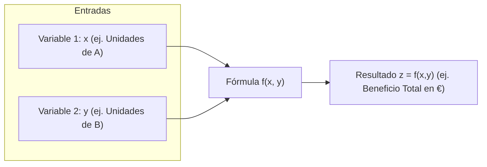

# 📐 Matemáticas para la Empresa I — Tema 2: Funciones de Varias Variables Reales, Límite y Continuidad

- **Asignatura:** Matemáticas para la Empresa I (Cód. 2350)
- **Titulación:** Grado en ADE — Facultad de Economía y Empresa (Universidad de Murcia)
- **Grupo:** Grupo 5 (Turno Tarde) · **Profesora:** Matilde Lafuente Lechuga
- **Documento fuente:** *Tema 2. Funciones de varias Variables Reales. Límite y Continuidad (Curso 2026-2027)*
- **Archivo original diapositivas:** [Tema_02_Presentacion_Oficial.pdf](./Tema_02_Presentacion_Oficial.pdf)
- **Enfoque de este apunte:** Desglosado desde cero, paso a paso, con analogías económicas y sin dar nada por sabido. Si llevas años sin tocar mates o te asustan los símbolos, esta guía te traduce cada concepto a palabras normales.

---

## 🧭 Diccionario Rápido: De Símbolos Raros a Lenguaje Humano

Cuando abres las diapositivas de la profesora y ves símbolos griegos o flechas, parece otro idioma. Aquí tienes la traducción directa a la vida real:

| Símbolo oficial | Nombre técnico | Qué significa de verdad (en lenguaje normal) |
| :---: | :--- | :--- |
| $\mathbb{R}^n$ | Espacio euclídeo de dimensión $n$ | Una lista ordenada de $n$ números. Ej: $\mathbb{R}^2$ son parejas $(x,y)$, $\mathbb{R}^3$ son ternas $(x,y,z)$. |
| $\vec{x} = (x_1, x_2, \dots, x_n)$ | Vector de $n$ componentes | Una fila de datos de un mismo elemento. Ej: cantidades compradas $(10, 5, 2)$. |
| $\vec{x} \cdot \vec{y} = \sum_{i=1}^n x_i y_i$ | Producto escalar | Multiplicar cada casilla por su pareja y sumar todos los resultados. **El resultado es un solo número, no una matriz**. |
| $\mathcal{M}_{m \times n}$ | Matriz de orden $m \times n$ | Una tabla rectangular con $m$ filas (horizontales) y $n$ columnas (verticales). Regla mnemotécnica: **F**ilas primero, **C**olumnas después (**FC** Barcelona). |
| $f: D \subseteq \mathbb{R}^n \to \mathbb{R}$ | Función real de varias variables | Una fórmula que toma varias entradas $(x,y)$ y te devuelve un solo resultado $z$. Ej: Precio y Publicidad $\to$ Beneficio. |
| $\text{Dom}(f)$ | Dominio de la función | La lista de combinaciones $(x,y)$ que la fórmula puede calcular sin romperse (sin dividir por 0 ni hacer raíces negativas). |
| $C_K = \{(x,y) / f(x,y) = K\}$ | Curva de nivel (o isolínea) | Como las líneas de altitud de un mapa de montaña: todos los puntos $(x,y)$ que dan exactamente el mismo resultado $K$. |
| $Q = A K^\alpha L^\beta$ | Función Cobb-Douglas | La fórmula reina de producción en economía: $K$ es el capital (máquinas), $L$ es el trabajo (horas de empleados). |
| $\lim_{(x,y) \to (x_0, y_0)} f(x,y)$ | Límite doble | Hacia qué valor se acerca el resultado cuando nos aproximamos al punto $(x_0, y_0)$ por cualquier camino. |

---

## 1. Vectores y Matrices en $\mathbb{R}^n$ (Las Herramientas Básicas)

Antes de hablar de curvas económicas y funciones, la profesora introduce el "alfabeto" con el que vamos a escribir todo el curso: vectores y matrices.

### 1.1. ¿Qué es un Vector?
Un vector no es más que una **lista ordenada de números entre paréntesis**:

$$\vec{x} = (x_1, x_2, \dots, x_n) \in \mathbb{R}^n$$

* **Ejemplo en ADE:** Imagina una fábrica que compra 3 tipos de materias primas: 5 toneladas de acero, 10 de madera y 2 de plástico. Tu vector de materias primas es $\vec{q} = (5, 10, 2) \in \mathbb{R}^3$.
* **Igualdad de vectores:** Dos vectores son iguales **solo si todas sus casillas coinciden una por una**. Si $\vec{u} = (2, 4)$ y $\vec{v} = (2, 5)$, no son iguales porque la segunda posición es diferente.

#### ➕ Operaciones con Vectores

1. **Suma de vectores:** Se suman los números que están en la **misma posición**:
   $$(2, 4, 1) + (3, 1, 5) = (2+3,\ 4+1,\ 1+5) = \mathbf{(5, 5, 6)}$$
   *(Solo se pueden sumar si tienen la misma cantidad de casillas).*

2. **Multiplicar un número (escalar) por un vector:** El número multiplica a **todas y cada una de las casillas**:
   $$3 \cdot (4, -2, 5) = (3 \cdot 4,\ 3 \cdot (-2),\ 3 \cdot 5) = \mathbf{(12, -6, 15)}$$

3. **Producto Escalar (¡Importantísimo en exámenes!):**
   Multiplicas la primera casilla por la primera, la segunda por la segunda, la tercera por la tercera... **y sumas todo**:
   $$\vec{x} \cdot \vec{y} = x_1 y_1 + x_2 y_2 + \dots + x_n y_n$$

> 💡 **La Intuición Económica del Producto Escalar:**  
> Imagina que vendes 3 productos. 
> - Vector de unidades vendidas: $\vec{q} = (10, 5, 2)$
> - Vector de precios unitarios: $\vec{p} = (20\text{ €}, 50\text{ €}, 100\text{ €})$
> 
> El producto escalar $\vec{q} \cdot \vec{p}$ es:
> $$\vec{q} \cdot \vec{p} = (10 \cdot 20) + (5 \cdot 50) + (2 \cdot 100) = 200 + 250 + 200 = \mathbf{650\text{ €}}$$
> ¡El producto escalar es literalmente la **Facturación Total** de la empresa! Da un único número real, no un vector.

---

### 1.2. Matrices: Tablas de Números

Una matriz es una tabla organizada en filas horizontales y columnas verticales:

$$A = \begin{pmatrix} a_{11} & a_{12} & \dots & a_{1n} \\ a_{21} & a_{22} & \dots & a_{2n} \\ \vdots & \vdots & \ddots & \vdots \\ a_{m1} & a_{m2} & \dots & a_{mn} \end{pmatrix}_{m \times n}$$

* **Dimensión u Orden ($m \times n$):** Tiene $m$ filas y $n$ columnas.
  - Una matriz $2 \times 3$ tiene **2 filas** y **3 columnas**.
* **Elemento $a_{ij}$:** El número que vive en la fila $i$ y columna $j$. Por ejemplo, $a_{21}$ es el número de la **fila 2**, **columna 1**.

#### ➕ Suma y Multiplicación por un Escalar
* **Suma de matrices:** Se hace sumando casilla por casilla (solo posible si tienen exactamente el mismo tamaño):
  $$\begin{pmatrix} 1 & 3 \\ 4 & 0 \end{pmatrix} + \begin{pmatrix} 2 & -1 \\ 5 & 6 \end{pmatrix} = \begin{pmatrix} 1+2 & 3+(-1) \\ 4+5 & 0+6 \end{pmatrix} = \begin{pmatrix} 3 & 2 \\ 9 & 6 \end{pmatrix}$$
* **Multiplicar por un número:** Multiplica cada número de la matriz:
  $$2 \cdot \begin{pmatrix} 3 & -1 \\ 4 & 5 \end{pmatrix} = \begin{pmatrix} 6 & -2 \\ 8 & 10 \end{pmatrix}$$

#### ✖️ Multiplicación de Matrices (El algoritmo "Fila por Columna")

> ⚠️ **REGLA DE ORO DE COMPATIBILIDAD:**  
> Para poder multiplicar $A \cdot B$, el número de columnas de $A$ **DEBE SER IGUAL** al número de filas de $B$.
> 
> $$(m \times \mathbf{p}) \cdot (\mathbf{p} \times n) \implies \text{Resultado de tamaño } (m \times n)$$

**Cómo se calcula cada elemento:**  
Para calcular la casilla de la fila $i$ y columna $j$ del resultado, coges la **fila $i$ entera de $A$** y la multiplicas escalarmente por la **columna $j$ entera de $B$**:

**Ejemplo resuelto paso a paso:**
Sean $A = \begin{pmatrix} 1 & 2 \\ 3 & 4 \end{pmatrix}$ y $B = \begin{pmatrix} 5 & 6 \\ 0 & 7 \end{pmatrix}$ (ambas son $2 \times 2$, luego se pueden multiplicar):

$$A \cdot B = \begin{pmatrix} (1 \cdot 5 + 2 \cdot 0) & (1 \cdot 6 + 2 \cdot 7) \\ (3 \cdot 5 + 4 \cdot 0) & (3 \cdot 6 + 4 \cdot 7) \end{pmatrix} = \begin{pmatrix} 5 + 0 & 6 + 14 \\ 15 + 0 & 18 + 28 \end{pmatrix} = \mathbf{\begin{pmatrix} 5 & 20 \\ 15 & 46 \end{pmatrix}}$$

> ⚠️ **Atención:** En matrices, el orden importa: $A \cdot B \ne B \cdot A$ (**NO es conmutativo**).

---

## 2. Funciones Reales de Varias Variables

En el instituto te enseñaban funciones de una sola variable: $y = f(x)$.  
Por ejemplo: *"Si el precio es $x$, las ventas son $y$"*.

Pero en ADE una empresa nunca depende de una sola cosa:
* El **Beneficio** de una empresa depende de:
  - $x$: unidades vendidas del producto A.
  - $y$: unidades vendidas del producto B.
  - $z$: presupuesto en marketing.
* Una **función de 2 variables** se escribe: $z = f(x, y)$. A cada pareja $(x, y)$ le asigna un número $z$.
* Una **función de $n$ variables** se escribe: $z = f(x_1, x_2, \dots, x_n)$.



---

### 2.1. El Dominio: ¿Qué números podemos meter en la máquina?

El **Dominio** $\text{Dom}(f)$ es el conjunto de puntos $(x,y)$ para los cuales la función **se puede calcular sin romper las matemáticas**:

$$\text{Dom}(f) = \{(x_1, \dots, x_n) \in \mathbb{R}^n / \exists f(x_1, \dots, x_n)\}$$

#### 🔍 Las 3 trampas típicas para encontrar el Dominio:
1. **Fracciones:** El denominador **NO puede ser 0**.
   - Si $f(x,y) = \frac{1}{x - y}$, el dominio son todos los puntos donde $x - y \ne 0 \iff x \ne y$.
2. **Raíces cuadradas (o pares):** Lo de dentro debe ser **mayor o igual que 0** ($\ge 0$).
   - Si $f(x,y) = \sqrt{9 - x^2 - y^2}$, exigimos $9 - x^2 - y^2 \ge 0 \iff x^2 + y^2 \le 9$ (un círculo de radio 3).
3. **Logaritmos:** Lo de dentro debe ser **estrictamente positivo** ($> 0$).
   - Si $f(x,y) = \ln(x + y)$, exigimos $x + y > 0 \iff y > -x$.
4. **Sentido económico:** En ADE, cantidades producidas o precios casi siempre exigen $x \ge 0$ e $y \ge 0$ (primer cuadrante).

---

### 2.2. Funciones Económicas Clave que saldrán en los Exámenes

La profesora Matilde Lafuente destaca las siguientes funciones que utilizaremos continuamente:

1. **Función de Producción Cobb-Douglas:**
   $$Q(K, L) = A \cdot K^\alpha \cdot L^\beta$$
   - $Q$: Cantidad total fabricada.
   - $K$: **Capital** (horas de maquinaria, fábricas, tecnología).
   - $L$: **Trabajo** (*Labor*, horas de mano de obra).
   - $A, \alpha, \beta$: Parámetros fijos positivos.

2. **Funciones de Costes Multiproducto:**
   $$C(x, y) = C_{\text{fijo}} + c_1 x + c_2 y$$
   Coste total de producir $x$ unidades del bien 1 e $y$ unidades del bien 2.

3. **Funciones de Beneficio:**
   $$B(x, y) = \text{Ingresos}(x, y) - \text{Costes}(x, y)$$

4. **Funciones de Utilidad del Consumidor:**
   $$U(x, y)$$
   Mide el nivel de satisfacción o bienestar que obtiene una persona al consumir $x$ bocadillos e $y$ refrescos.

---

### 2.3. Funciones Vectoriales
A veces una función no devuelve un solo número, sino **varios resultados a la vez**.  
Eso es una **función vectorial**:

$$f: D \subseteq \mathbb{R}^n \to \mathbb{R}^m$$

* **Ejemplo práctico:** Metes factores productivos $(K, L)$ (2 variables de entrada) y la fábrica obtiene dos productos a la vez: camisas y pantalones $(Q_1(K,L), Q_2(K,L))$ (vector de 2 resultados en la salida).

---

## 3. Representaciones Gráficas y Curvas de Nivel

### 3.1. ¿Cómo se dibuja una función de 2 variables?
La gráfica de $z = f(x, y)$ vive en el espacio tridimensional $\mathbb{R}^3$.  
En lugar de una curva plana, es una **superficie o montaña 3D** (como una cúpula, una silla de montar o un plano inclinado).

---

### 3.2. Curvas de Nivel (Isolíneas): El "Mapa del Tiempo"

Dibujar en 3D en un examen con lápiz y papel es un dolor de cabeza. Por eso los economistas usan **Curvas de Nivel**.

> 💡 **La Analogía del Mapa de Montaña:**  
> Imagina una montaña 3D. Si la cortas con un cuchillo horizontal a una altura fija de $100$ metros, la silueta que queda marcada en el suelo es una **curva de nivel de cota 100**. Todos los puntos de esa línea están exactamente a 100 metros de altitud.

**Definición matemática:**
$$C_K = \{(x, y) \in \text{Dom}(f) \ / \ f(x, y) = K\}$$

* **Propiedad de oro:** **Las curvas de nivel NUNCA se cortan entre sí**, porque un mismo punto $(x, y)$ no puede estar a dos alturas distintas a la vez.

```
       Eje Y ^
             |        / Curva K=300 (Mayor altura/producción)
             |       /
             |      /   / Curva K=200
             |     /   /
             |    /   /   / Curva K=100
             +---+---+---+-----> Eje X
```

---

### 3.3. Las dos Curvas de Nivel Reinas en ADE

En los exámenes de ADE siempre preguntan por dos curvas de nivel concretas:

#### 1. Las Isocuantas (Funciones de Producción)
* **¿Qué significa?:** "Iso" = igual; "cuanta" = cantidad.
* Si fijamos la producción en una cantidad constante $Q(K, L) = K_0$, una **isocuanta** es la curva que une todas las combinaciones posibles de máquinas ($K$) y trabajadores ($L$) que producen **exactamente la misma cantidad de producto**.
* **Ejemplo:** Para fabricar 1000 coches al mes, puedes usar:
  - Mucha maquinaria y pocos operarios: $(K=50, L=10)$.
  - O poca maquinaria y muchos operarios: $(K=10, L=80)$.
  Ambas combinaciones pertenecen a la **misma isocuanta de 1000 coches**.
* **Forma gráfica:** Suelen ser decrecientes y convexas (típicas de las funciones Cobb-Douglas).

#### 2. Las Curvas de Indiferencia (Funciones de Utilidad)
* **¿Qué significa?:** Si fijamos el nivel de satisfacción de un consumidor en $U(x, y) = K_0$, la curva une todas las cestas de bienes $(x, y)$ frente a las cuales el consumidor se siente **indiferente** (le da exactamente igual una que otra porque ambas le dan el mismo placer).
* Cuanto más alejada del origen esté la curva de indiferencia, mayor satisfacción tiene el consumidor (más bienes consume).

---

## 4. Límite de una Función de Varias Variables

### 4.1. Concepto intuitivo
En una variable, para acercarte a un número $x_0$ solo podías venir por la izquierda o por la derecha:

$$\lim_{x \to x_0^-} f(x) \quad \text{y} \quad \lim_{x \to x_0^+} f(x)$$

Pero en un plano de 2 variables $(x, y)$, para acercarte a un punto $(x_0, y_0)$ **hay infinitos caminos posibles** (en línea recta horizontal, vertical, en diagonal, en espiral, o en parábola).

Para que el límite exista y valga $L$, **debe dar exactamente $L$ te acerques por el camino que te acerques**:

$$\lim_{(x,y) \to (x_0, y_0)} f(x, y) = L$$

---

### 4.2. Cómo se calculan los límites en los exámenes

El procedimiento práctico tiene solo dos pasos:

#### Paso 1: Sustitución Directa
Sustituyes la $x$ por $x_0$ y la $y$ por $y_0$.
* Si da un número real finito: **¡SE ACABÓ EL PROBLEMA!** Ese número es el límite.
  
  **Ejemplo:**
  $$\lim_{(x,y) \to (1, 2)} (3x^2 + 2xy - y) = 3(1)^2 + 2(1)(2) - 2 = 3 + 4 - 2 = \mathbf{5}$$

#### Paso 2: ¿Y si sale una indeterminación como $\frac{0}{0}$?
> 📢 **Lo que dice textualmente la profesora Matilde Lafuente en la página 8:**  
> *"Si sale una indeterminación, el límite puede existir o no. En este caso, pocas veces se intenta resolver la indeterminación; la mayoría de las veces se intenta probar que el límite no existe."*

**¿Cómo se prueba que el límite NO existe?**  
Basta con acercarse al punto por dos caminos distintos (por ejemplo, por la recta $y = 0$ y por la recta $x = 0$, o por rectas $y = m x$).  
* Si por un camino da un valor y por el otro da un valor diferente $\implies$ **El límite NO existe**.

---

### 4.3. Propiedades de los Límites
Si $\lim f(x,y) = l$ y $\lim g(x,y) = m$:
1. **Suma/Resta:** $\lim (f \pm g) = l \pm m$
2. **Producto:** $\lim (f \cdot g) = l \cdot m$
3. **Cociente:** $\lim (f / g) = \frac{l}{m}$ *(si $m \ne 0$)*
4. **Constante:** $\lim (k \cdot f) = k \cdot l$
5. **Potencia:** $\lim [f(x,y)]^{g(x,y)} = l^m$ *(si $l > 0$)*
6. **Logaritmo:** $\lim \ln(f(x,y)) = \ln(l)$ *(si $l > 0$)*

---

## 5. Continuidad de Funciones de Varias Variables

### 5.1. ¿Qué significa que una función sea continua?
Intuitivamente, significa que la superficie 3D **no tiene cortes, ni agujeros, ni saltos bruscos**. Es un manto continuo y suave.

**Definición matemática:**  
Una función $f(x, y)$ es continua en un punto $(x_0, y_0)$ si y solo si:

$$\lim_{(x,y) \to (x_0, y_0)} f(x, y) = f(x_0, y_0)$$

Esto exige que se cumplan 3 condiciones a la vez:
1. **Existe la función en el punto:** El punto $(x_0, y_0)$ pertenece al dominio.
2. **Existe el límite doble:** Al acercarte al punto por cualquier dirección, los valores convergen a un número $L$.
3. **Coinciden:** Ese límite $L$ es exactamente el valor de la función $f(x_0, y_0)$.

---

### 5.2. Propiedades de Continuidad (¡Para responder preguntas teóricas al instante!)

No hace falta calcular límites complicados para la mayoría de funciones usuales. Estas reglas te salvan en el examen:
* **Polinomios:** Cualquier polinomio en varias variables (ej: $f(x,y) = x^2 y + 3x - 5y^3$) es **continuo en TODO $\mathbb{R}^2$**.
* **Operaciones:** Si $f$ y $g$ son continuas en un punto:
  - $f + g$ es continua.
  - $f \cdot g$ es continua.
  - $\alpha \cdot f$ es continua para cualquier número $\alpha$.
  - $\frac{f}{g}$ es continua **en todos los puntos donde $g(x_0, y_0) \ne 0$**.
* **Composición:** Si metes una función continua dentro de otra función continua (ej: $\ln(\text{polinomio})$ donde el polinomio es positivo), el resultado sigue siendo una **función continua**.

---

## 📋 Resumen Rápido: Lo que te van a pedir en los problemas

| Tipo de Ejercicio | Cómo se resuelve (Receta paso a paso) |
| :--- | :--- |
| **Calcular producto escalar $\vec{x} \cdot \vec{y}$** | Multiplica pareja con pareja y suma todo: $x_1 y_1 + x_2 y_2 + \dots$. Da un número. |
| **Multiplicar matrices $A \cdot B$** | Comprueba que columnas de $A$ = filas de $B$. Multiplica fila horizontal de $A$ por columna vertical de $B$. |
| **Hallar el dominio de $f(x,y)$** | Busca denominadores e iguala a 0 (para excluirlos), o busca raíces y pon lo de dentro $\ge 0$. |
| **Hallar una curva de nivel de cota $K$** | Iguala la fórmula a $K$: $f(x,y) = K$, y despeja la $y$ en función de la $x$ para ver qué curva da (recta, hipérbola, etc.). |
| **Comprobar si es isocuanta o curva de indiferencia** | Si la función es de producción $Q(K,L) = K_0$, es isocuanta. Si es de utilidad $U(x,y) = U_0$, es curva de indiferencia. |
| **Calcular un límite doble** | Primero sustituye directamente $(x_0, y_0)$. Si no sale $\frac{0}{0}$, el valor obtenido es el resultado. |
| **Comprobar continuidad** | Si es un polinomio o cociente sin denominador cero en ese punto, es continua directamente por las propiedades. |
