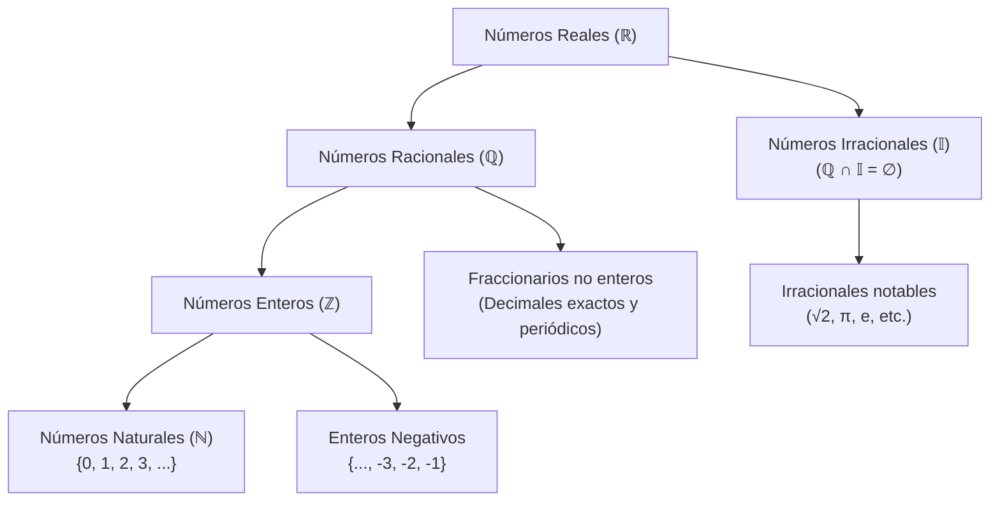

# 📖 Matemáticas para la Empresa I — Tema 0: Conjuntos Numéricos y Operaciones Básicas

- **Asignatura:** Matemáticas para la Empresa I (Cód. 2350)
- **Titulación:** Grado en ADE — Facultad de Economía y Empresa (Universidad de Murcia)
- **Documento fuente:** *Conjuntos numéricos* (Proyecto de Innovación Educativa, UMU)
- **Archivo fuente oficial:** [Conjuntos_presentacion+def.pdf](./Conjuntos_presentacion+def.pdf)
- **Bloque:** Instrumental previo / Nivelación matemática

---

## 🎯 Objetivo y Resumen Ejecutivo
> Este tema de nivelación proporciona la base aritmética y algebraica indispensable para todo el desarrollo de **Matemáticas para la Empresa I** (álgebra matricial, cálculo en varias variables y optimización). Establece la estructura de los conjuntos numéricos ($\mathbb{N}, \mathbb{Z}, \mathbb{Q}, \mathbb{I}, \mathbb{R}$), el manejo riguroso de fracciones y divisibilidad, las propiedades algebraicas fundamentales (distributiva y factor común) y la estricta jerarquía de operaciones combinadas.

---

## 🗺️ Mapa Estructural de los Conjuntos Numéricos

$$\mathbb{N} \subset \mathbb{Z} \subset \mathbb{Q} \subset \mathbb{R}$$

---

## 1. Conjuntos Numéricos Fundamentales

### 1.1. Números Naturales ($\mathbb{N}$)
- **Definición:** Conjunto utilizado para contar y ordenar elementos:
  $$\mathbb{N} = \{0, 1, 2, 3, 4, 5, \dots\}$$
- **Propiedades:**
  - El $0$ se considera formalmente incluido en $\mathbb{N}$ en este programa docente.
  - Tiene un primer elemento ($0$), pero **no tiene último elemento**.
  - Es un conjunto **infinito numerable**.
  - Es un conjunto **totalmente ordenado** (dados $a, b \in \mathbb{N}$, siempre se puede determinar si $a < b$, $a = b$ o $a > b$).

---

### 1.2. Números Enteros ($\mathbb{Z}$)
- **Definición:** Extensión de los naturales que incluye los opuestos negativos:
  $$\mathbb{Z} = \{\dots, -4, -3, -2, -1, 0, 1, 2, 3, 4, \dots\}$$
- **Propiedades:**
  - Todo número natural es entero: $\mathbb{N} \subset \mathbb{Z}$.
  - **No tiene primer elemento ni último elemento**.
  - Es infinito numerable y ordenado.

#### 🔍 Divisibilidad en $\mathbb{Z}$
1. **Divisibilidad:** Sean $a \ne 0, b \in \mathbb{Z}$, se dice que $a$ es **divisible** por $b$ si existe un número $c \in \mathbb{Z}$ que cumple:
   $$a = b \cdot c$$
2. **Número Primo:** Un entero positivo $a > 1$ es primo si solo es divisible por sí mismo y por la unidad ($1$).
3. **Número Compuesto:** Entero que puede descomponerse en producto de factores primos.
   > **Ejemplo:** Para $a = 20$:
   > - Divisores de $20$: $\{1, 2, 4, 5, 10, 20\}$.
   > - Divisores primos: $\{2, 5\}$.
   > - Descomposición factorial: $20 = 2^2 \cdot 5$.
4. **Mínimo Común Múltiplo ($\text{m.c.m.}$):** Es el menor número natural que es múltiplo simultáneo de dos o más números (comunes y no comunes al mayor exponente).
   > **Ejemplo:** $\text{m.c.m.}(18, 10)$:
   > - $18 = 2 \cdot 3^2$
   > - $10 = 2 \cdot 5$
   > - $\text{m.c.m.}(18, 10) = 2 \cdot 3^2 \cdot 5 = 2 \cdot 9 \cdot 5 = \mathbf{90}$.

---

### 1.3. Números Racionales ($\mathbb{Q}$)
- **Definición:** Conjunto de números que pueden expresarse como cociente de dos enteros con denominador no nulo:
  $$\mathbb{Q} = \left\{ \frac{a}{b} : a \in \mathbb{Z},\; b \in \mathbb{Z},\; b \ne 0 \right\}$$
  Donde $a$ es el **numerador** y $b$ es el **denominador**.
- **Expresión Decimal:**
  - **Decimal finito (exacto):** $\frac{1}{5} = 0{,}2$.
  - **Decimal periódico (infinito):** $\frac{7}{3} = 2{,}333333\dots = 2{,}\widehat{3}$.
  - Todo decimal finito o periódico puede convertirse a su **fracción generatriz**.

#### ⚖️ Fracciones Equivalentes y Simplificación
- **Equivalencia:** Dos fracciones son equivalentes si su producto cruzado coincide:
  $$\frac{a}{b} = \frac{c}{d} \iff a \cdot d = b \cdot c$$
  *Ejemplo:* $\frac{4}{5} = \frac{8}{10}$ ya que $4 \cdot 10 = 5 \cdot 8 = 40$.
- **Simplificación:** Dividir numerador y denominador por un divisor común $n \in \mathbb{N}$:
  $$\frac{25}{10} = \frac{25 : 5}{10 : 5} = \frac{5}{2}$$

#### 🔢 Criterio de Orden en $\mathbb{Q}$
1. **Mismo denominador:** $\frac{a}{b} < \frac{c}{b} \iff a < c$ (si $b > 0$).
2. **Distinto denominador:** Se reducen a común denominador mediante el $\text{m.c.m.}$:
   $$\frac{a}{b} = \frac{a \cdot d}{b \cdot d}, \quad \frac{c}{d} = \frac{c \cdot b}{b \cdot d} \implies \frac{a}{b} < \frac{c}{d} \iff a \cdot d < c \cdot b$$
3. **Signos distintos:** Todo racional negativo es menor que $0$, y $0$ es menor que cualquier racional positivo.

> [!TIP]
> ### 💡 Ejercicio Resuelto de Ordenación
> **Ordenar de menor a mayor:** $-\frac{4}{5},\; -\frac{7}{3},\; \frac{3}{7},\; \frac{20}{7}$
> 
> 1. **Positivos:** Tienen igual denominador:
>    $$\frac{3}{7} < \frac{20}{7}$$
> 2. **Negativos:** Denominadores distintos ($5$ y $3$). $\text{m.c.m.}(5, 3) = 15$:
>    $$-\frac{4}{5} = -\frac{12}{15}, \qquad -\frac{7}{3} = -\frac{35}{15}$$
>    Comparando numeradores: $-35 < -12 \implies -\frac{35}{15} < -\frac{12}{15} \implies -\frac{7}{3} < -\frac{4}{5}$.
> 3. **Resultado Global:**
>    $$-\frac{7}{3} < -\frac{4}{5} < \frac{3}{7} < \frac{20}{7}$$

---

### 1.4. Números Irracionales ($\mathbb{I}$) y Reales ($\mathbb{R}$)
- **Números Irracionales ($\mathbb{I}$):** Números con infinitas cifras decimales no periódicas que **no** pueden expresarse en forma de fracción.
  $$\mathbb{Q} \cap \mathbb{I} = \emptyset$$
  *(Ejemplos: $\sqrt{2}, \sqrt{3}, \pi, e$)*.
- **Números Reales ($\mathbb{R}$):** Unión disjunta de racionales e irracionales:
  $$\mathbb{R} = \mathbb{Q} \cup \mathbb{I}$$
- **La Recta Real:** Existe una correspondencia biunívoca entre los números reales y los puntos de una recta geométrica continua.

---

## 2. Estructura Algebraica: Operaciones en $\mathbb{R}$

En $\mathbb{R}$ (y en sus subconjuntos $\mathbb{Z}, \mathbb{Q}$) se definen dos operaciones internas fundamentales: **Suma ($+$)** y **Producto ($\cdot$)**.

### 2.1. Propiedades de la Suma y del Producto

| Propiedad | Suma ($+$) | Producto ($\cdot$) |
| :--- | :--- | :--- |
| **Asociativa** | $(a + b) + c = a + (b + c)$ | $(a \cdot b) \cdot c = a \cdot (b \cdot c)$ |
| **Conmutativa** | $a + b = b + a$ | $a \cdot b = b \cdot a$ |
| **Elemento Neutro** | $0 \implies a + 0 = a$ | $1 \implies a \cdot 1 = a$ |
| **Elemento Simétrico** | Opuesto: $-a \implies a + (-a) = 0$ | Inverso: $\frac{1}{a}$ (para $a \ne 0$) $\implies a \cdot \frac{1}{a} = 1$ |

> [!WARNING]
> **Existencia de Inverso:** En el conjunto de los enteros $\mathbb{Z}$, los únicos elementos con inverso en $\mathbb{Z}$ son $1$ y $-1$. Por ello, la división general exige trabajar en $\mathbb{Q}$ o $\mathbb{R}$.

### 2.2. Regla de los Signos
- $(+) \cdot (+) = (+)$
- $(-) \cdot (-) = (+)$
- $(+) \cdot (-) = (-)$
- $(-) \cdot (+) = (-)$

### 2.3. Propiedad Distributiva y Factor Común
Es la base del cálculo algebraico en optimización y sistemas:
$$a \cdot (b + c) = a \cdot b + a \cdot c$$
$$(a + b) \cdot c = a \cdot c + b \cdot c$$

> **Ejemplo de extracción de factor común:**
> $$-\frac{2}{7}x + 5x = \left(-\frac{2}{7} + 5\right)x = \left(\frac{-2 + 35}{7}\right)x = \mathbf{\frac{33}{7}x}$$

---

## 3. Operatoria con Fracciones

### 3.1. Suma y Resta
1. **Igual denominador:** Se suman algebraicamente los numeradores:
   $$\frac{a}{b} + \frac{c}{b} = \frac{a + c}{b} \qquad \text{Ejemplo: } -\frac{2}{7} + \frac{4}{7} = \frac{-2 + 4}{7} = \mathbf{\frac{2}{7}}$$
2. **Distinto denominador:** Se halla el $\text{m.c.m.}$ de los denominadores:
   $$\text{Ejemplo: } -\frac{3}{2} + \frac{7}{5} \implies \text{m.c.m.}(2, 5) = 10 \implies -\frac{15}{10} + \frac{14}{10} = \mathbf{-\frac{1}{10}}$$

### 3.2. Multiplicación y Fracción Inversa
- **Producto:** Multiplicación en línea recta:
  $$\frac{a}{b} \cdot \frac{c}{d} = \frac{a \cdot c}{b \cdot d}$$
- **Inverso:** Para toda fracción no nula $\frac{a}{b} \ne 0$, su inverso es $\frac{b}{a}$, verificando:
  $$\frac{a}{b} \cdot \frac{b}{a} = \frac{a \cdot b}{b \cdot a} = 1$$

---

## 4. Jerarquía de Operaciones Combinadas

> [!IMPORTANT]
> El orden de evaluación debe respetarse estrictamente para evitar errores de cálculo en derivadas y matrices.

### Caso 1: Expresión SIN Paréntesis
1. **1.º:** Potencias y raíces.
2. **2.º:** Multiplicaciones y divisiones (de izquierda a derecha).
3. **3.º:** Sumas y restas (de izquierda a derecha).

$$\frac{4}{5} + \frac{7}{2} \cdot \frac{4}{3}$$
- ❌ **ERROR CRÍTICO:** Realizar primero la suma $\frac{4}{5} + \frac{7}{2}$.
- ✔️ **CORRECTO:** Realizar primero el producto:
  $$\frac{7}{2} \cdot \frac{4}{3} = \frac{28}{6} = \frac{14}{3}$$
- A continuación, sumar:
  $$\frac{4}{5} + \frac{14}{3} = \frac{12 + 70}{15} = \mathbf{\frac{82}{15}}$$

---

### Caso 2: Expresión CON Paréntesis
1. **1.º:** Operaciones internas dentro del paréntesis respetando la jerarquía interna.
2. **2.º:** Operaciones exteriores según el Caso 1.

$$\left(\frac{4}{5} + \frac{7}{2}\right) \cdot \frac{4}{3}$$
- Primero se resuelve la suma entre paréntesis:
  $$\frac{4}{5} + \frac{7}{2} = \frac{8 + 35}{10} = \frac{43}{10}$$
- Luego se multiplica por el factor exterior:
  $$\frac{43}{10} \cdot \frac{4}{3} = \frac{172}{30} = \mathbf{\frac{86}{15}}$$

---

## ⚠️ Errores Típicos a Evitar en ADE
- [ ] **Confundir signos en fracciones negativas:** $-\frac{a}{b} = \frac{-a}{b} = \frac{a}{-b} \ne \frac{-a}{-b}$.
- [ ] **Cancelar sumandos en simplificaciones:** $\frac{a + b}{a} \ne 1 + b$ (solo se simplifican factores multiplicativos comunes).
- [ ] **Invertir sumas en lugar de términos individuales:** El inverso de $(a + b)$ es $\frac{1}{a+b}$, jamás $\frac{1}{a} + \frac{1}{b}$.
- [ ] **Olvidar la prioridad del producto:** Efectuar sumas previas antes de resolver multiplicaciones asociadas a variables o parámetros.
