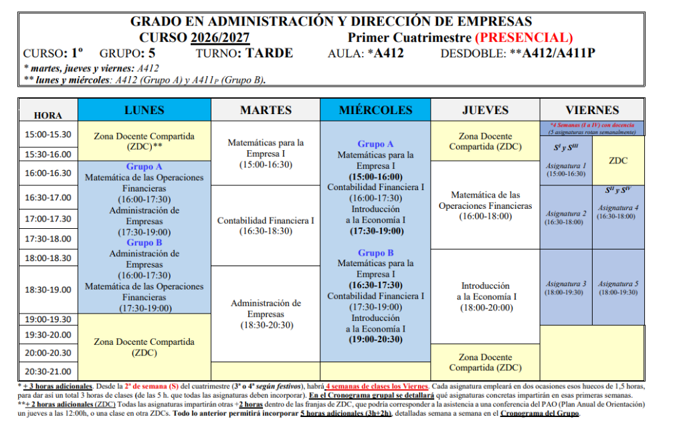

# 🎓 Grado en Administración y Dirección de Empresas (ADE)
### 🏛️ Universidad de Murcia (UM) — Facultad de Economía y Empresa

Repositorio oficial y centralizado de apuntes, prácticas, ejercicios resueltos y preparación de exámenes para el **1.º Curso del Grado en ADE (Plan 2009)**.

---

## 👤 Expediente y Datos Académicos

| Campo | Información Oficial |
| :--- | :--- |
| **Estudiante** | **Santiago Pérez Guerrero** |
| **Correo UMU** | [s.perezguerrero@um.es](mailto:s.perezguerrero@um.es) |
| **Titulación** | **(231) Grado en Administración y Dirección de Empresas** (Plan 2009) |
| **Centro** | Facultad de Economía y Empresa (Campus de Espinardo) |
| **Rama de Conocimiento** | Ciencias Sociales y Jurídicas |
| **Curso Académico** | **2026 / 2027** |
| **Curso y Turno** | **1.º Curso — Turno de TARDE** |
| **Grupo Asignado** | **Grupo 5 — Subgrupo B (5B)** |
| **Aulas de Docencia** | **Aula A412** (Teoría M, J, V) · **Aula A411P** (Prácticas Subgrupo B en L/X) |
| **Coordinadora de Grupo** | **Matilde Lafuente Lechuga** ([mati@um.es](mailto:mati@um.es)) |
| **Régimen de Dedicación** | Tiempo Completo (**60 ECTS** matriculados) |
| **Estado Matrícula** | Formalizada |

---

## 🕒 Horario Semanal — Grupo 5 (Turno Tarde · 1.er Cuatrimestre)



> ⚠️ **Aviso de Festivos / No lectivos:**  
> - **Jueves 24 de septiembre:** **NO HAY CLASE** por el *Acto de Apertura del Curso Académico*.  
> - **Lunes 5 de octubre:** Festivo (*Día del Patrón de Veterinaria*).  
> - **Lunes 12 de octubre:** Festivo nacional (*Fiesta Nacional*).

---

## 👨‍🏫 Profesorado del Grupo 5 (1.er Cuatrimestre 2026/2027)

| Cód. | Asignatura | Profesorado | Correo Electrónico |
| :---: | :--- | :--- | :--- |
| **2350** | **Matemáticas para la Empresa I** *(Coordinación)* | **Lafuente Lechuga, Matilde** *(Coordinadora de Grupo)* | [mati@um.es](mailto:mati@um.es) |
| **2343** | **Introducción a la Economía I** | Sancho Portero, Israel<br>Siles López, David | [israelsp@um.es](mailto:israelsp@um.es)<br>[david.siles@um.es](mailto:david.siles@um.es) |
| **2344** | **Contabilidad Financiera I** | García Hernández, Begoña<br>Gil Jara, Juan<br>García, Jesús | [bgarcia@um.es](mailto:bgarcia@um.es)<br>—<br>[jesus.garcia@um.es](mailto:jesus.garcia@um.es) |
| **2345** | **Administración de Empresas** | Monllor Domínguez, Jorge | [jmonllor@um.es](mailto:jmonllor@um.es) |
| **2346** | **Matemática de las Operaciones Financieras** | Hernández Carreño, Mª del Rosario<br>Hernández Nicolás, Carmen María | [mrhc@um.es](mailto:mrhc@um.es)<br>[cm.hernandeznicolas@um.es](mailto:cm.hernandeznicolas@um.es) |

---

## 📚 Asignaturas Matriculadas (1.º Curso — 60 ECTS)

### 🍂 Primer Cuatrimestre — C1 (28,5 ECTS)

| Cód. | Asignatura | ECTS | Tipo | Aula Principal | Carpeta |
| :---: | :--- | :---: | :---: | :---: | :--- |
| **2343** | Introducción a la Economía I | 6,0 | Formación Básica | A412 / A411P | [📁 Ver Asignatura](./Introducción%20a%20la%20Economía%20I) |
| **2344** | Contabilidad Financiera I | 6,0 | Formación Básica | A412 / A411P | [📁 Ver Asignatura](./Contabilidad%20Financiera%20I) |
| **2345** | Administración de Empresas | 6,0 | Formación Básica | A412 / A411P | [📁 Ver Asignatura](./Administración%20de%20Empresas) |
| **2346** | Matemática de las Operaciones Financieras | 6,0 | Formación Básica | A412 / A411P | [📁 Ver Asignatura](./Matemática%20de%20las%20Operaciones%20Financieras) |
| **2350** | Matemáticas para la Empresa I | 4,5 | Obligatoria | A412 / A411P | [📁 Ver Asignatura](./Matemáticas%20para%20la%20Empresa%20I) |

---

### 🌸 Segundo Cuatrimestre — C2 (31,5 ECTS)

| Cód. | Asignatura | ECTS | Tipo | Grupo | Carpeta |
| :---: | :--- | :---: | :---: | :---: | :--- |
| **2347** | Introducción a la Economía II | 6,0 | Formación Básica | Grupo 5 | [📁 Ver Asignatura](./Introducción%20a%20la%20Economía%20II) |
| **2348** | Estadística para la Empresa I | 6,0 | Formación Básica | Grupo 5 | [📁 Ver Asignatura](./Estadística%20para%20la%20Empresa%20I) |
| **2349** | Introducción al Marketing | 6,0 | Formación Básica | Grupo 5 | [📁 Ver Asignatura](./Introducción%20al%20Marketing) |
| **2351** | Contabilidad Financiera II | 4,5 | Obligatoria | Grupo 5 | [📁 Ver Asignatura](./Contabilidad%20Financiera%20II) |
| **2352** | Derecho Civil | 4,5 | Obligatoria | Grupo 5 | [📁 Ver Asignatura](./Derecho%20Civil) |
| **2353** | Matemáticas para la Empresa II | 4,5 | Obligatoria | Grupo 5 | [📁 Ver Asignatura](./Matemáticas%20para%20la%20Empresa%20II) |

---

## 🗂️ Estructura Estándar por Asignatura

Cada asignatura se organiza de manera modular por bloques temáticos numerados:

```text
Nombre_Asignatura/
├── README.md                 # Ficha técnica, profesorado, horario de clases, temario e índice
├── 0 - Teoria Basica/        # Repaso y nivelación previa
│   ├── Apuntes/              # Guías teóricas explicadas paso a paso y PDFs oficiales
│   └── Prácticas/            # Boletines y supuestos prácticos
├── 1 - Nombre del Tema/      # Bloques de contenidos oficiales
│   ├── Apuntes/
│   └── Prácticas/
└── Exámenes/                 # Exámenes parciales, finales y autoevaluaciones globales
```

---

## 🛠️ Herramientas Digitales de Estudio (Lienzos y Cálculo)

Recursos clave para trabajar y operar cómodamente desde Mac o PC de sobremesa:

- 🎨 **[tldraw](https://tldraw.com)** — **Lienzo Digital Principal:** Pizarra infinita con suavizado de trazo (*perfect-freehand*). Permite dibujar operaciones a mano alzada con el ratón o trackpad con total fluidez, pegar capturas de los ejercicios de clase con `Ctrl+V` / `Cmd+V` y resolverlos directamente encima con rotulador y colores.
- 📐 **[GeoGebra Calculadora](https://www.geogebra.org/calculator)** / **[GeoGebra 3D](https://www.geogebra.org/3d)** — Software interactivo para graficar funciones polinómicas, rectas presupuestarias, curvas de nivel 3D e isocuantas de producción.
- 🧮 **[Symbolab](https://es.symbolab.com/)** — Solucionador paso a paso para verificar operaciones de matrices, determinantes, sistemas de ecuaciones lineales y derivadas.
- 📊 **[Desmos](https://www.desmos.com/calculator?lang=es)** — Graficadora rápida en 2D para modelos económicos (equilibrio de mercado, costes y beneficios).
- 📝 **[Obsidian](https://obsidian.md/)** — Gestor de conocimiento en Markdown que permite abrir este repositorio como bóveda y utilizar **Obsidian Canvas** para conectar apuntes y PDFs visualmente.

---

## 🔗 Portales y Servicios Oficiales de la UM

- 💻 **[Aula Virtual UM (Sakai)](https://aulavirtual.um.es/)** — Acceso diario a contenidos docentes, tareas y calificaciones.
- 📱 **[MiCampus UM](https://micampus.um.es/)** — Portal del estudiante, resguardo definitivo, horarios y expediente académico.
- 📑 **[Sede Electrónica — Carpeta Ciudadana](https://sede.um.es/carpeta)** — Notificaciones electrónicas y trámites administrativos.
- 🔍 **[Validador de Documentos UMU](https://sede.um.es/validador/)** — Cotejo de autenticidad de resguardos y certificados con CSV.
- 🏛️ **[Facultad de Economía y Empresa](https://www.um.es/web/economiayempresa/)** — Noticias, calendarios de exámenes y secretaría del centro.
- 📋 **[Plan de Estudios y Guías Docentes](./PLAN_ESTUDIOS_UM.md)** — Consulta íntegra de la estructura del título.